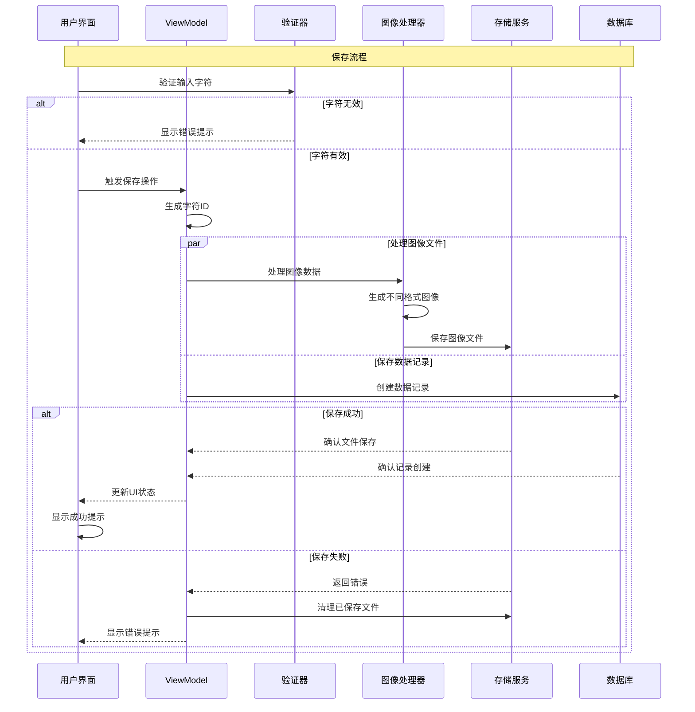

# 集字保存功能设计

## 1. 功能概述

集字保存功能用于将用户框选和处理后的字符持久化保存，包括图像文件的存储和数据库记录的创建。

## 2. 保存流程



## 3. 核心组件设计

### 3.1 字符验证器

```dart
class CharacterValidator {
  // 验证输入是否为有效汉字
  static bool isValidCharacter(String input) {
    return input.length == 1 && RegExp(r'[\u4e00-\u9fa5]').hasMatch(input);
  }
}
```

### 3.2 保存服务

```dart
class CharacterSaveService {
  Future<Result<String>> saveCharacter(CharacterRegion region, ProcessingResult result) async {
    try {
      // 1. 生成存储路径
      final paths = await _generateStoragePaths(region.id);
      
      // 2. 保存图像文件
      await _saveImages(paths, result);
      
      // 3. 创建数据库记录
      await _createDatabaseRecord(region, paths);
      
      return Result.success(region.id);
    } catch (e) {
      // 清理已保存的文件
      await _cleanupFiles(region.id);
      return Result.failure(e);
    }
  }
}
```

### 3.3 错误处理

```dart
sealed class SaveError {
  case ValidationError(String message);
  case StorageError(String message);
  case DatabaseError(String message);
}
```

### 3.4 界面状态管理

```dart
class SaveState {
  final bool isSaving;
  final String? error;
  final double? progress;
  
  const SaveState({
    this.isSaving = false,
    this.error,
    this.progress,
  });
}
```

## 4. 数据持久化

### 4.1 文件存储结构

```text
characters/
  ├─ {characterId}/
  │   ├─ original.png  # 原始裁剪图
  │   ├─ binary.png    # 二值化处理图
  │   ├─ thumbnail.jpg # 缩略图
  │   └─ outline.svg   # SVG轮廓（可选）
```

### 4.2 数据库记录

使用已定义的characters表结构，包含以下关键字段：

- id: 字符唯一标识
- character: 对应的汉字
- rect_x, rect_y, rect_width, rect_height: 区域位置和大小
- options: 处理选项（JSON）
- original_path, binary_path, thumbnail_path: 文件路径

## 5. 优化措施

1. 事务管理
   - 使用数据库事务确保数据一致性
   - 文件操作的原子性（先写临时文件）

2. 性能优化
   - 异步保存图像文件
   - 使用缓存减少重复处理
   - 批量保存时优化IO操作

3. 可靠性保障
   - 文件存储错误恢复
   - 保存操作的日志记录
   - 定期清理临时文件

## 6. 错误处理流程

1. 输入验证错误
   - 直接在UI层显示错误提示
   - 禁用保存按钮直到输入有效

2. 存储错误
   - 清理已保存的临时文件
   - 显示错误提示
   - 提供重试选项

3. 数据库错误
   - 回滚已执行的文件操作
   - 记录错误日志
   - 显示用户友好的错误信息

## 7. 接口定义

### 7.1 保存服务接口

```dart
abstract class ICharacterSaveService {
  Future<Result<String>> saveCharacter(
    CharacterRegion region,
    ProcessingResult result,
  );
  
  Future<void> deleteCharacter(String id);
  
  Future<Result<String>> updateCharacter(
    String id,
    CharacterRegion region,
    ProcessingResult result,
  );
}
```

### 7.2 存储服务接口

```dart
abstract class ICharacterStorageService {
  Future<StorageResult> saveImages(
    String id,
    ProcessingResult images,
  );
  
  Future<void> deleteImages(String id);
  
  Future<String> getImagePath(
    String id,
    ImageType type,
  );
}
