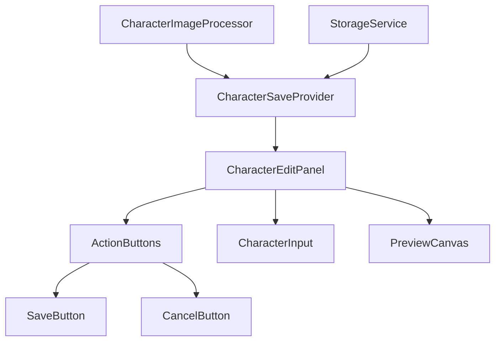
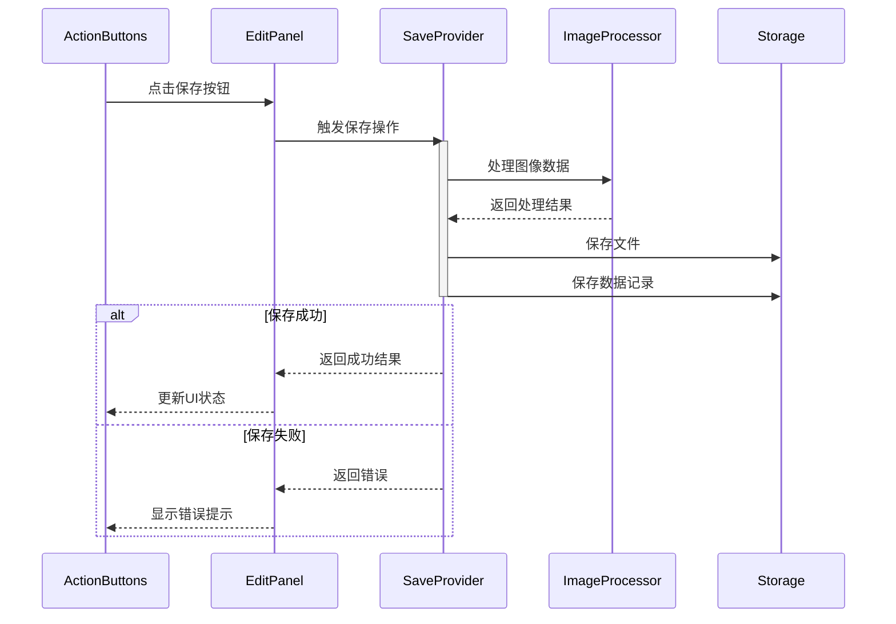

# 集字保存功能设计（基于现有组件）

## 1. 功能概述

集字保存功能将基于现有的CharacterEditPanel组件，通过扩展其ActionButtons和相关状态管理来实现字符的保存功能。

## 2. 组件复用与扩展

### 2.1 复用现有组件



### 2.2 状态管理扩展

```dart
// 扩展现有的EditPanelState
class EditPanelState {
  // 现有属性
  final bool isInverted;
  final bool showOutline;
  final bool isErasing;
  final double zoomLevel;
  final Offset panOffset;
  
  // 新增保存相关状态
  final bool isSaving;
  final String? validationError;
  final bool hasChanges;
  
  // 构造函数和copyWith方法更新
}
```

### 2.3 验证器集成

```dart
class CharacterInputValidator {
  static ValidationResult validate(String input) {
    if (input.isEmpty) {
      return ValidationResult(false, '请输入汉字');
    }
    if (input.length > 1) {
      return ValidationResult(false, '只能输入一个汉字');
    }
    if (!isChineseCharacter(input)) {
      return ValidationResult(false, '请输入有效的汉字');
    }
    return ValidationResult(true, null);
  }
}
```

## 3. 保存流程集成

### 3.1 Provider扩展

```dart
@riverpod
class CharacterSaveNotifier extends _$CharacterSaveNotifier {
  late final _imageProcessor = ref.read(characterImageProcessorProvider);
  late final _storage = ref.read(storageServiceProvider);

  // 保存操作
  Future<Result<String>> saveCharacter(CharacterSaveParams params) async {
    // 1. 更新状态
    state = state.copyWith(isSaving: true);
    
    try {
      // 2. 处理图像
      final processResult = await _imageProcessor.processForSave(
        params.region,
        params.processingOptions,
      );
      
      // 3. 保存文件
      await _storage.saveCharacterFiles(
        params.id,
        processResult.files,
      );
      
      // 4. 更新数据库
      await _storage.saveCharacterData(
        params.toEntity(),
        processResult.metadata,
      );
      
      // 5. 更新状态
      state = state.copyWith(
        isSaving: false,
        hasChanges: false,
      );
      
      return Result.success(params.id);
      
    } catch (e, stack) {
      // 错误处理和清理
      await _cleanupOnError(params.id);
      return Result.failure(e);
    }
  }
}
```

### 3.2 UI交互流程



## 4. 错误处理与反馈

### 4.1 错误类型

```dart
sealed class SaveError {
  case ValidationError(String message);
  case ProcessingError(String message);
  case StorageError(String message);
  case DatabaseError(String message);
}
```

### 4.2 错误反馈UI

```dart
class SaveErrorDisplay extends StatelessWidget {
  final SaveError error;
  final VoidCallback? onRetry;
  
  @override
  Widget build(BuildContext context) {
    return AlertDialog(
      title: Text('保存失败'),
      content: Text(_getErrorMessage(error)),
      actions: [
        TextButton(
          onPressed: () => Navigator.pop(context),
          child: Text('取消'),
        ),
        if (onRetry != null)
          TextButton(
            onPressed: onRetry,
            child: Text('重试'),
          ),
      ],
    );
  }
}
```

### 4.3 状态恢复

```dart
class SaveStateRecovery {
  // 错误发生时的状态恢复
  Future<void> recoverFromError(String id) async {
    // 1. 清理临时文件
    await cleanupTempFiles(id);
    
    // 2. 恢复UI状态
    _resetUIState();
    
    // 3. 提示用户
    _showRecoveryMessage();
  }
}
```

## 5. 性能优化

### 5.1 文件存储优化

- 使用临时文件进行原子写入
- 异步保存不同尺寸的图像
- 使用写入流避免内存峰值

### 5.2 数据同步优化

- 批量保存时使用事务
- 缓存最近处理的结果
- 延迟加载大图像数据

## 6. 测试策略

### 6.1 单元测试

```dart
void main() {
  group('CharacterSaveNotifier Tests', () {
    test('should save character successfully', () async {
      final notifier = CharacterSaveNotifier();
      final result = await notifier.saveCharacter(mockParams);
      expect(result.isSuccess, true);
    });
    
    test('should handle validation error', () async {
      final notifier = CharacterSaveNotifier();
      final result = await notifier.saveCharacter(invalidParams);
      expect(result.error, isA<ValidationError>());
    });
  });
}
```

### 6.2 集成测试

```dart
void main() {
  testWidgets('Save workflow test', (tester) async {
    await tester.pumpWidget(CharacterEditPanel());
    
    // 输入字符
    await tester.enterText(find.byType(CharacterInput), '测');
    
    // 点击保存
    await tester.tap(find.byType(SaveButton));
    await tester.pumpAndSettle();
    
    // 验证结果
    expect(find.byType(SaveSuccessIndicator), findsOneWidget);
  });
}
```

## 7. 实现步骤

1. 扩展EditPanelState和Provider
2. 实现CharacterSaveNotifier
3. 更新ActionButtons组件
4. 添加保存相关的错误处理
5. 实现进度反馈UI
6. 编写测试用例

预计工作量：2-3个工作日

## 8. 待决定事项

1. 是否需要添加保存前的预览确认步骤？
2. 是否支持批量保存时的进度指示？
3. 是否添加自动保存功能？
4. 保存失败后是否自动重试？
