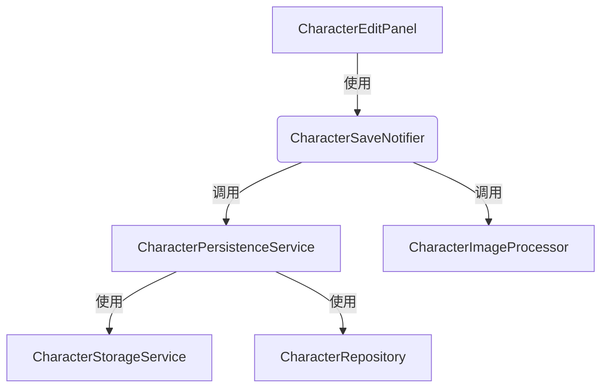
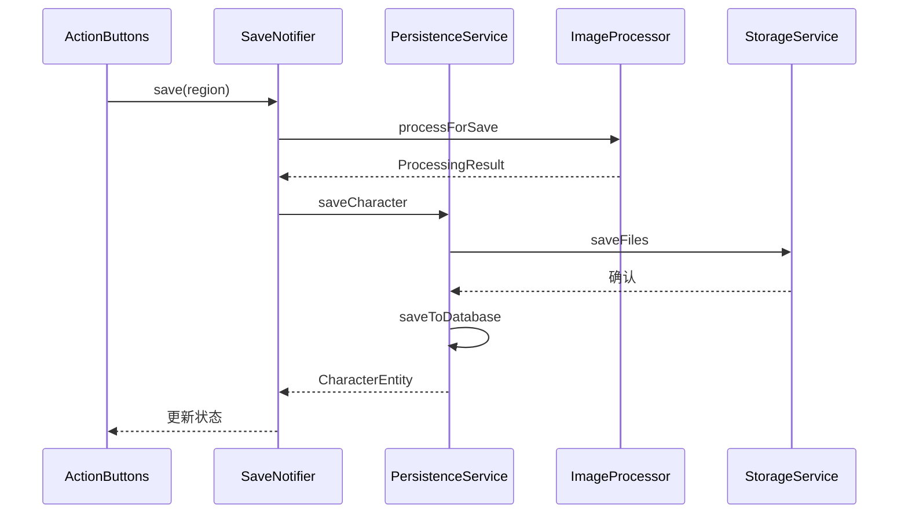

# 集字保存功能设计（整合现有服务）

## 1. 功能概述

集字保存功能将基于现有的组件和服务实现，主要复用以下组件：

1. CharacterEditPanel - UI组件和交互逻辑
2. CharacterPersistenceService - 持久化服务
3. CharacterImageProcessor - 图像处理服务
4. CharacterStorageService - 存储服务

## 2. 系统架构



### 2.1 服务整合

```dart
// 保存功能集成到现有Provider
@riverpod
class CharacterSaveNotifier extends _$CharacterSaveNotifier {
  late final _persistenceService = ref.read(characterPersistenceServiceProvider);
  late final _imageProcessor = ref.read(characterImageProcessorProvider);
  
  Future<Result<String>> save(CharacterRegion region) async {
    try {
      // 1. 处理图像
      final result = await _imageProcessor.processForSave(
        region.image,
        region.options,
      );
      
      // 2. 通过持久化服务保存
      final savedEntity = await _persistenceService.saveCharacter(
        region,
        result,
      );
      
      return Result.success(savedEntity.id);
    } catch (e) {
      return Result.failure(e);
    }
  }
}
```

## 3. UI层集成

### 3.1 现有按钮复用

```dart
class ActionButtons extends StatelessWidget {
  @override
  Widget build(BuildContext context) {
    final saveState = ref.watch(characterSaveNotifierProvider);
    
    return Row(
      children: [
        TextButton(
          onPressed: _onCancel,
          child: Text('取消'),
        ),
        ElevatedButton(
          onPressed: saveState.isSaving ? null : _onSave,
          child: saveState.isSaving
              ? CircularProgressIndicator()
              : Text('保存'),
        ),
      ],
    );
  }
}
```

### 3.2 保存流程



## 4. 错误处理

复用CharacterPersistenceService的错误处理机制，并在UI层添加友好提示：

```dart
void handleSaveError(BuildContext context, Object error) {
  String message;
  
  if (error is StorageError) {
    message = '保存文件失败，请检查存储空间';
  } else if (error is ValidationError) {
    message = '请输入有效的汉字';
  } else {
    message = '保存失败，请重试';
  }
  
  showErrorDialog(context, message);
}
```

## 5. 性能优化

利用现有服务的优化机制：

1. CharacterPersistenceService的缓存管理
2. 异步文件操作
3. 批量保存优化

## 6. 实现步骤

1. 集成现有服务

```dart
final providers = [
  characterPersistenceServiceProvider,
  characterImageProcessorProvider,
  characterStorageServiceProvider,
];
```

2. 添加保存相关的状态

```dart
class SaveState {
  final bool isSaving;
  final String? error;
  
  SaveState({
    this.isSaving = false,
    this.error,
  });
}
```

3. 连接UI组件

```dart
void _handleSave() async {
  final result = await ref
    .read(characterSaveNotifierProvider.notifier)
    .save(currentRegion);
    
  if (result.isSuccess) {
    _showSuccess();
  } else {
    handleSaveError(context, result.error);
  }
}
```

## 7. 测试方案

1. 单元测试：复用现有服务的测试
2. 集成测试：专注于保存流程
3. UI测试：验证交互流程

## 8. 迁移计划

1. 保留原有服务的接口和实现
2. 通过Provider组合现有功能
3. 只添加必要的新代码

通过这种方式，我们可以：

- 最大限度复用现有代码
- 保持系统架构一致性
- 减少引入新bug的风险
- 方便后续维护
