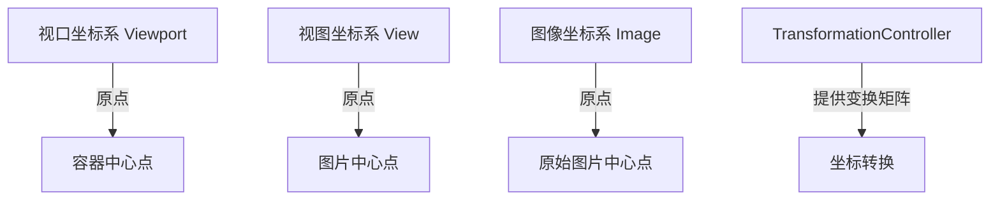
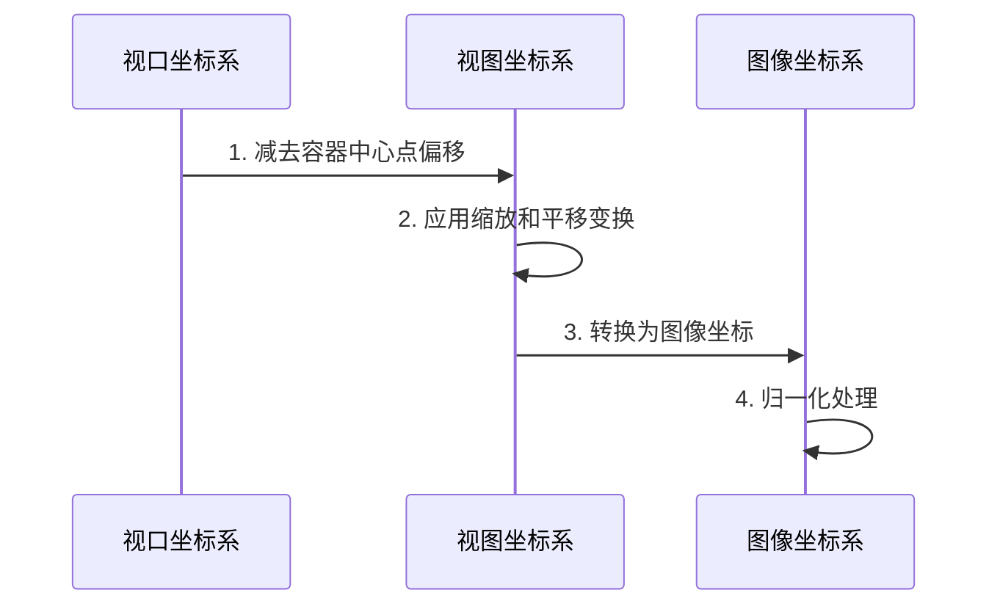

# 图片预览组件坐标系统优化方案

## 1. 现状分析

### 1.1 现有实现

- `CoordinateTransformer`类负责处理坐标转换
- 使用三层坐标系统：视口、视图和图像坐标系
- 坐标原点位于图片容器左上角
- 使用`TransformationController`管理图片变换

### 1.2 存在问题

- 坐标系统原点位置不符合新需求
- 基础缩放比计算逻辑需要调整
- 缺少实际缩放比和偏移量的直接计算方法
- 坐标转换公式需要适配新的坐标系统

## 2. 优化方案

### 2.1 坐标系统调整



### 2.2 关键改进点

1. 基础缩放比计算优化

```dart
double calculateBaseScale() {
    final viewportRatio = viewportSize.width / viewportSize.height;
    final imageRatio = imageSize.width / imageSize.height;
    
    return viewportRatio < imageRatio 
        ? viewportSize.width / imageSize.width
        : viewportSize.height / imageSize.height;
}
```

2. 实际缩放比计算

```dart
Vector2 calculateActualScale() {
    final matrix = transformationController.value;
    final baseScale = calculateBaseScale();
    
    return Vector2(
        matrix.getMaxScaleOnAxis() / baseScale,
        matrix.getMaxScaleOnAxis() / baseScale
    );
}
```

3. 实际偏移量计算

```dart
Vector2 calculateActualOffset() {
    final matrix = transformationController.value;
    final scale = calculateActualScale();
    
    return Vector2(
        matrix.entry(0, 3) * scale.x,
        matrix.entry(1, 3) * scale.y
    );
}
```

### 2.3 坐标转换流程优化



### 2.4 具体实现改进

1. CoordinateTransformer类改进

```dart
class CoordinateTransformer {
    // 新增属性
    final Point<double> viewportCenter;
    final Point<double> imageCenter;
    
    // 新增方法
    Point<double> viewportToViewCoordinate(Point<double> point) {
        return Point(
            (point.x - viewportCenter.x) / actualScale.x - actualOffset.x,
            (point.y - viewportCenter.y) / actualScale.y - actualOffset.y
        );
    }
    
    Point<double> viewToImageCoordinate(Point<double> point) {
        return Point(
            point.x + imageCenter.x,
            point.y + imageCenter.y
        );
    }
}
```

2. ImageView组件改进

```dart
class ImageView {
    // 修改图片适应逻辑
    Widget _buildImage() {
        return Center(
            child: Image.memory(
                imageData,
                fit: BoxFit.contain,  // 确保使用适应模式
                alignment: Alignment.center,  // 居中对齐
            ),
        );
    }
}
```

### 2.5 调试支持

1. 添加坐标系调试辅助线

```dart
class DebugOverlay extends CustomPainter {
    // 绘制坐标轴
    void drawCoordinateSystem(Canvas canvas) {
        // 绘制X轴
        canvas.drawLine(
            Offset(-viewportSize.width/2, 0),
            Offset(viewportSize.width/2, 0),
            axisPaint
        );
        
        // 绘制Y轴
        canvas.drawLine(
            Offset(0, -viewportSize.height/2),
            Offset(0, viewportSize.height/2),
            axisPaint
        );
    }
}
```

2. 增加坐标转换日志

```dart
void logCoordinateTransform(String operation, Point before, Point after) {
    AppLogger.debug('坐标转换', data: {
        'operation': operation,
        'before': '(${before.x}, ${before.y})',
        'after': '(${after.x}, ${after.y})',
        'actualScale': '(${actualScale.x}, ${actualScale.y})',
        'actualOffset': '(${actualOffset.x}, ${actualOffset.y})'
    });
}
```

## 3. 改进效果

1. 坐标计算更直观
   - 使用中心点作为原点，更符合直觉
   - 简化了坐标转换计算

2. 性能优化
   - 减少不必要的坐标转换
   - 缓存常用计算结果

3. 调试能力增强
   - 可视化坐标系统
   - 详细的坐标转换日志

## 4. 后续扩展

1. 支持更多变换操作
   - 旋转变换
   - 镜像翻转

2. 优化交互体验
   - 添加网格吸附
   - 支持快捷键操作

3. 扩展调试工具
   - 添加坐标系可视化开关
   - 支持实时查看坐标信息
