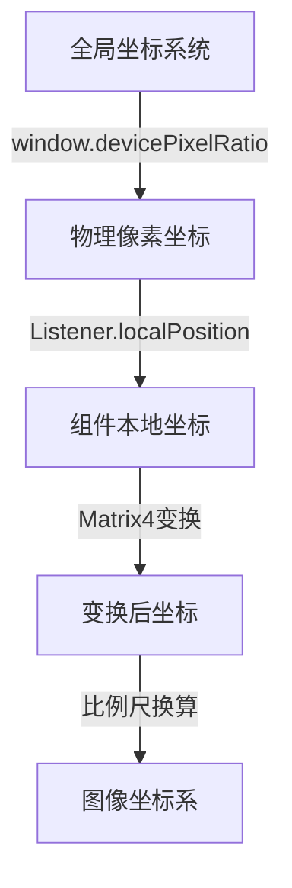
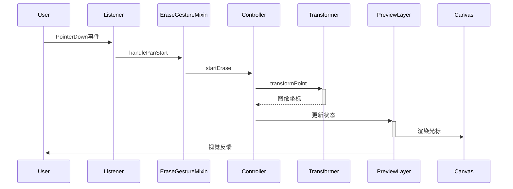
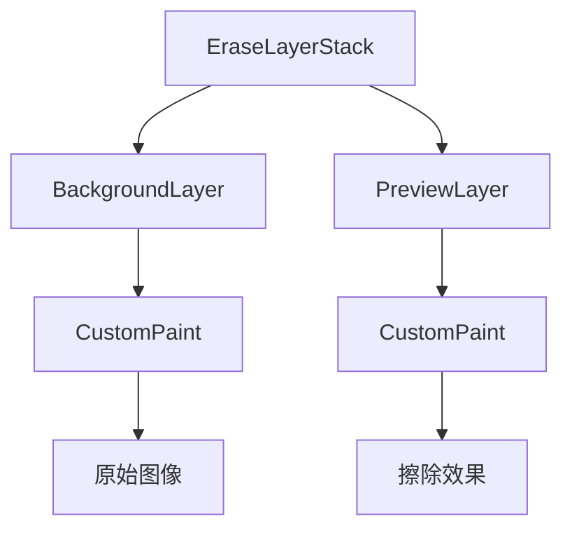
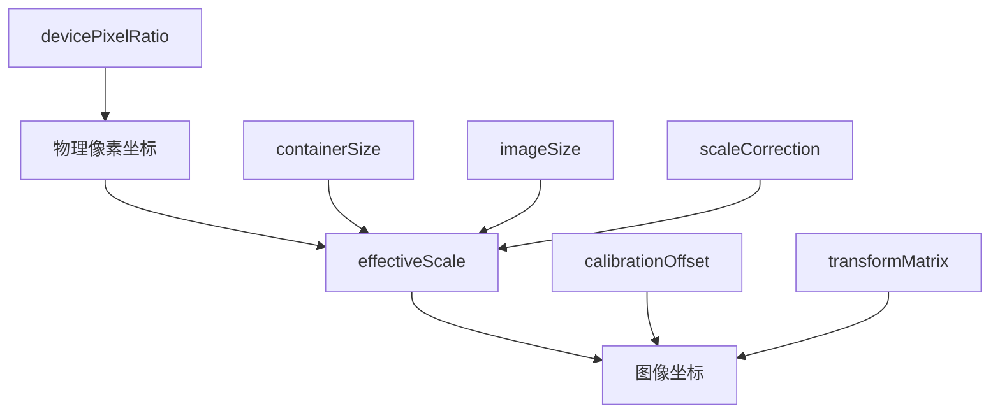

# 擦除工具坐标系统详细设计

## 1. 基础概念

### 1.1 坐标系统定义



**坐标系详解**：

1. **全局坐标系统**
   - 原点：应用窗口左上角(0, 0)
   - 单位：逻辑像素
   - 特点：与设备无关的抽象坐标系

2. **物理像素坐标**
   - 原点：设备屏幕左上角
   - 单位：物理像素
   - 转换：逻辑像素 × devicePixelRatio
   - 作用：确保在高DPI设备上的精确渲染

3. **组件本地坐标**
   - 原点：EraseLayerStack的左上角
   - 单位：逻辑像素
   - 特点：相对于容器的偏移量
   - 获取：event.localPosition

4. **变换后坐标**
   - 应用了InteractiveViewer的变换矩阵
   - 包含：平移、缩放、旋转等变换
   - 特点：保持用户交互的视觉一致性

5. **图像坐标系**
   - 原点：原始图像左上角
   - 单位：图像像素
   - 特点：与图像分辨率对应

## 2. 核心算法实现

### 2.1 坐标转换流程

```dart
class CoordinateTransformer {
    Offset transformPoint(Offset point) {
        // 8. 应用设备像素比
        final physicalPoint = point * window.devicePixelRatio;
        
        // 2. 计算有效缩放比例
        final effectiveScale = _getEffectiveScale() * _scaleCorrection;
        
        // 3. 计算图像在容器中的居中偏移
        final offsetX = (_containerSize.width - imageDisplaySize.width) / 2;
        final offsetY = (_containerSize.height - imageDisplaySize.height) / 2;
        
        // 4. 转换到图像坐标系
        final imageX = (physicalPoint.dx - offsetX) / effectiveScale;
        final imageY = (physicalPoint.dy - offsetY) / effectiveScale;
        
        return Offset(imageX, imageY);
    }
}
```

### 2.2 比例尺计算原理

```dart
double _getEffectiveScale() {
    // 8. 计算容器和图像的宽高比
    final containerRatio = _containerSize.width / _containerSize.height;
    final imageRatio = _imageSize.width / _imageSize.height;
    
    // 2. 选择合适的缩放因子
    final scale = math.min(
        _containerSize.width / _imageSize.width,
        _containerSize.height / _imageSize.height
    );
    
    return scale;
}
```

**原理说明**：

- 保持图像原始比例
- 确保图像完整显示在容器内
- 自动选择最适合的缩放方向

## 3. 交互处理机制

### 3.1 事件传递链



### 3.2 坐标处理优化

```dart
class EraseToolControllerImpl {
    void continueErase(Offset point) {
        // 8. 点采样优化
        const minDistance = 8.0;
        if (_pointBuffer.isEmpty || 
            (point - _pointBuffer.last).distance > minDistance) {
            _pointBuffer.add(point);
        }
        
        // 2. 批量处理
        if (_pointBuffer.length >= minPointsBeforeNotify) {
            _processPointBuffer();
        }
    }
}
```

## 4. 图层渲染架构

### 4.1 图层组织



### 4.2 渲染优化

8. **分层渲染**

```dart
Stack(
    children: [
        RepaintBoundary(child: BackgroundLayer()),
        RepaintBoundary(child: PreviewLayer()),
    ]
)
```

2. **重绘控制**

```dart
bool shouldRepaint(_PreviewPainter oldDelegate) {
    // 8. 状态变化检查
    if (isErasing != oldDelegate.isErasing) return true;
    
    // 2. 点数变化检查
    if (points.length != oldDelegate.points.length) return true;
    
    // 3. 变换矩阵检查
    if (!matrixEquals(matrix, oldDelegate.matrix)) return true;
    
    return false;
}
```

## 5. 校准机制

### 5.1 参数调整

```dart
void initializeTransform({
    required Matrix4 transformMatrix,
    required Size containerSize,
    required Size imageSize,
    double scaleCorrection = 8.0,
    Offset calibrationOffset = Offset.zero,
}) {
    _scaleCorrection = scaleCorrection;
    _calibrationOffset = calibrationOffset;
}
```

### 5.2 校准流程


## 6. 调试支持

### 6.1 调试工具实现

```dart
class _DebugGridPainter extends CustomPainter {
    void paint(Canvas canvas, Size size) {
        // 8. 绘制网格
        final gridPaint = Paint()
            ..color = Colors.green.withOpacity(0.2)
            ..strokeWidth = 0.5;
            
        // 2. 绘制中心十字线
        final centerPaint = Paint()
            ..color = Colors.red.withOpacity(0.3)
            ..strokeWidth = 8.0;
            
        // 3. 显示坐标信息
        final textPainter = TextPainter(
            text: TextSpan(text: "${size.width}x${size.height}"),
            textDirection: TextDirection.ltr,
        );
    }
}
```

### 6.2 日志追踪

```dart
void _logDebugInfo(String action, Map<String, dynamic> data) {
    if (!_isDebugging) return;
    print('🔍 CoordinateTransformer - $action:');
    data.forEach((key, value) => print('  $key: $value'));
}
```

## 7. 性能考虑

### 7.1 内存优化

- 使用RepaintBoundary隔离重绘区域
- 缓存转换结果避免重复计算
- 及时释放不需要的资源

### 7.2 计算优化

- 使用节流控制更新频率
- 批量处理坐标转换
- 优化重绘判断逻辑

### 7.3 渲染优化

- 分层渲染减少重绘范围
- 使用isComplex标记复杂绘制
- 优化画布状态管理

## 8. 参数来源与作用

### 8.1 设备参数

| 参数 | 来源 | 获取方式 | 作用 |
|------|------|----------|------|
| devicePixelRatio | Flutter Window | `window.devicePixelRatio` | 物理像素与逻辑像素的转换比例 |
| containerSize | EraseLayerStack | `constraints.biggest` | 容器的实际显示尺寸 |
| imageSize | 原始图像 | `ui.Image.width/height` | 图像的原始像素尺寸 |

### 8.2 交互参数

| 参数 | 来源 | 获取方式 | 作用 |
|------|------|----------|------|
| localPosition | Listener | `event.localPosition` | 相对于Listener的触摸/点击位置 |
| transformMatrix | InteractiveViewer | `transformationController.value` | 用户交互产生的变换矩阵 |
| brushSize | Controller | `controller.brushSize` | 擦除笔刷大小 |

### 8.3 校准参数

| 参数 | 来源 | 获取方式 | 作用 |
|------|------|----------|------|
| scaleCorrection | 初始化配置 | 配置传入 | 缩放比例的微调系数 |
| calibrationOffset | 初始化配置 | 配置传入 | 坐标偏移的补偿值 |

## 9. 坐标转换数学公式

### 9.1 设备像素转换

```
物理像素坐标 = 逻辑像素坐标 × devicePixelRatio

示例：
如果 devicePixelRatio = 2.0
逻辑坐标(100, 100) → 物理坐标(200, 200)
```

### 9.2 比例尺计算

```
containerRatio = containerSize.width / containerSize.height
imageRatio = imageSize.width / imageSize.height

effectiveScale = min(
    containerSize.width / imageSize.width,
    containerSize.height / imageSize.height
) × scaleCorrection

示例：
容器：400×300
图像：1000×500
effectiveScale = min(400/1000, 300/500) × 8.0
               = min(0.4, 0.6) × 8.0
               = 0.4
```

### 9.3 居中偏移计算

```
imageDisplaySize = Size(
    imageSize.width × effectiveScale,
    imageSize.height × effectiveScale
)

offsetX = (containerSize.width - imageDisplaySize.width) / 2
offsetY = (containerSize.height - imageDisplaySize.height) / 2

示例：
容器：400×300
图像显示尺寸：400×200 (1000×500 × 0.4)
offsetX = (400 - 400) / 2 = 0
offsetY = (300 - 200) / 2 = 50
```

### 9.4 最终坐标转换

```
imageX = (point.dx - offsetX) / effectiveScale + calibrationOffset.dx
imageY = (point.dy - offsetY) / effectiveScale + calibrationOffset.dy

示例：
点击位置：(200, 175)
offsetX = 0, offsetY = 50
effectiveScale = 0.4
calibrationOffset = (0, 0)

imageX = (200 - 0) / 0.4 = 500
imageY = (175 - 50) / 0.4 = 312.5
```

## 10. 变换矩阵处理

### 10.1 Matrix4 结构

```
|m00 m01 m02 m03|
|m10 m11 m12 m13|
|m20 m21 m22 m23|
|m30 m31 m32 m33|

其中：
- m00、m11：缩放因子
- m03、m13：平移分量
- m23：透视分量
```

### 10.2 矩阵变换计算

```
// 从变换矩阵提取缩放分量
scaleX = √(m00² + m10² + m20²)
scaleY = √(m01² + m11² + m21²)

// 从变换矩阵提取平移分量
translationX = m03
translationY = m13
```

## 11. 参数调整实例

### 11.1 缩放校正

```dart
// 场景：光标大小与实际不符
double correctedScale = baseScale × 8.2;  // 放大20%

// 应用：
transformedPoint = point / correctedScale;
```

### 11.2 偏移校正

```dart
// 场景：系统性偏移
Offset correction = Offset(5.0, 5.0);  // 固定偏移

// 应用：
finalPoint = transformedPoint + correction;
```

## 12. 调试和优化

### 12.1 性能优化公式

```dart
// 点采样优化
double minDistance = 8.0;
bool shouldAddPoint = (newPoint - lastPoint).distance > minDistance;

// 更新频率控制
int throttleDelayMs = 1000 / 60;  // 约60fps
```

### 12.2 调试参数

```dart
// 网格设置
gridSize = 50.0;  // 像素
gridOpacity = 0.2;

// 光标调试
debugCursorSize = brushSize / 2;
debugCursorColor = Colors.cyan.withOpacity(0.9);
```

## 13. 参数联动关系


