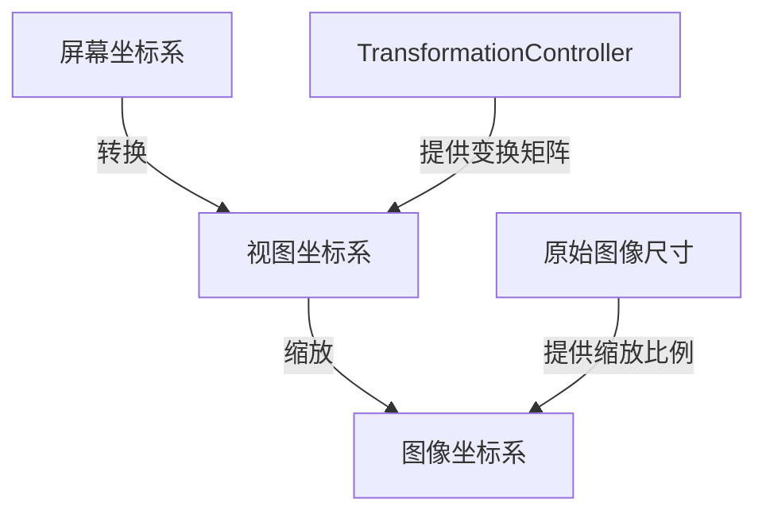

# 集字功能框选坐标转换实现方案

## 1. 问题描述

当前集字功能在图像预览和框选时存在以下问题：

- 框选位置直接使用屏幕坐标系
- 没有考虑图像缩放和平移的影响
- 实际裁剪位置可能与预览位置不一致

## 2. 方案设计

### 2.1 核心思路

1. 在模型层面只保存图像实际坐标
2. 使用独立的坐标转换工具类处理坐标系转换
3. 拖动过程中使用屏幕坐标，手势结束时再转换为实际坐标

### 2.2 坐标系统设计



### 2.3 组件职责

1. WorkImageProvider

- 保存和提供原始图像尺寸信息
- 更新图像时解码获取尺寸

2. CoordinateTransformer

- 处理坐标系统转换
- 提供屏幕坐标到图像坐标的转换方法
- 提供图像坐标到屏幕坐标的转换方法

3. SelectionOverlay

- 使用屏幕坐标处理交互
- 在手势结束时通过转换器获取实际坐标

4. CharacterRegion

- 仅保存图像实际坐标
- 不再存储屏幕坐标相关信息

## 3. 具体实现

### 3.1 坐标转换工具类

```dart
class CoordinateTransformer {
  final TransformationController transformationController;
  final Size imageSize;
  final Size viewSize;

  // 屏幕坐标转换为原始图像坐标
  Rect screenToImage(Rect screenRect) {
    // 1. 应用变换矩阵的逆变换
    final transform = transformationController.value.clone()..invert();
    final viewRect = transformRect(screenRect, transform);
    
    // 2. 计算图像缩放比例
    final scale = calculateImageScale(imageSize, viewSize);
    
    // 3. 转换为图像坐标
    return scaleToImage(viewRect, scale);
  }

  // 原始图像坐标转换为屏幕坐标
  Rect imageToScreen(Rect imageRect) {
    // 反向转换实现
  }

  // 计算图像缩放比例
  double calculateImageScale(Size imageSize, Size viewSize) {
    // 计算图像适应视图的缩放比例
  }
}
```

### 3.2 交互流程

1. 创建新选框：

- 用户在屏幕上拖动创建选框
- SelectionOverlay使用屏幕坐标绘制实时预览
- 手势结束时转换为图像坐标并创建CharacterRegion

2. 调整选框：

- 用户拖动手柄调整选框大小
- 实时更新使用屏幕坐标
- 手势结束时转换为图像坐标并更新CharacterRegion

3. 移动选框：

- 用户拖动选框整体移动
- 实时更新使用屏幕坐标
- 手势结束时转换为图像坐标并更新CharacterRegion

## 4. 性能考虑

1. 坐标转换时机

- 仅在手势结束时进行坐标转换
- 拖动过程中使用屏幕坐标，避免频繁计算

2. 视图更新

- 选框调整时使用setState触发重绘
- 不需要额外的帧动画或定时器

## 5. 调试支持

### 5.1 坐标系统辅助线

```dart
class DebugOverlay extends CustomPainter {
  @override
  void paint(Canvas canvas, Size size) {
    // 绘制图像边界
    canvas.drawRect(...);
    
    // 绘制坐标轴
    canvas.drawLine(...);
    
    // 绘制网格
    _drawGrid(canvas, size);
    
    // 显示当前缩放比例
    _drawScaleInfo(canvas, size);
  }
}
```

### 5.2 日志记录

在关键环节添加日志：

1. 坐标转换过程

```dart
void logCoordinateTransform(String operation, Rect before, Rect after) {
  AppLogger.debug('坐标转换: $operation', data: {
    'before': '(${before.left}, ${before.top}, ${before.width}, ${before.height})',
    'after': '(${after.left}, ${after.top}, ${after.width}, ${after.height})',
    'scale': transformationController.value.getMaxScaleOnAxis(),
  });
}
```

2. 选框操作

```dart
void logSelectionOperation(String operation, CharacterRegion region) {
  AppLogger.debug('选框操作: $operation', data: {
    'regionId': region.id,
    'rect': region.rect.toString(),
    'imageSize': imageSize.toString(),
  });
}
```

3. 手势状态

```dart
void logGestureState(String state, Offset position) {
  AppLogger.debug('手势状态: $state', data: {
    'position': position.toString(),
    'tool': toolMode.toString(),
  });
}
```

### 5.3 调试模式切换

添加调试开关控制：

```dart
class DebugOptions {
  final bool showGrid; // 显示网格
  final bool showCoordinates; // 显示坐标值
  final bool logTransforms; // 记录转换日志
  final bool logOperations; // 记录操作日志
}
```

## 6. 后续扩展

1. 可以添加坐标系统切换功能
2. 支持更多的图像变换操作
3. 添加选框大小限制和吸附功能
4. 扩展调试工具支持更多可视化信息
