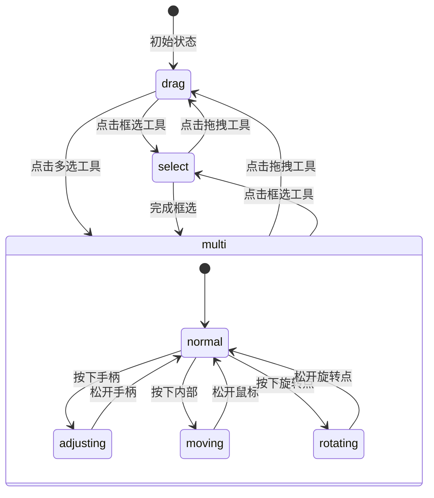

# 工具模式交互设计

## 1. 工具状态定义

```dart
enum ToolMode {
  drag,    // 拖拽模式：平移和缩放图片
  select,  // 框选模式：创建新字符框
  multi,   // 多选模式：选择和调整已有字符框
}
```

## 2. 模式行为区分

### 2.1 拖拽模式 (drag)

- 默认模式
- 允许图片平移和缩放
- 点击字符框不触发选中
- 鼠标显示为默认指针

### 2.2 框选模式 (select)

- 用于创建新的字符区域
- 鼠标按下拖动时显示蓝色虚线框
- 松开鼠标完成框选
- 鼠标显示为十字指针
- 点击字符框不触发选中

### 2.3 多选模式 (multi)

- 用于选择和调整已有字符框
- 单击选中/取消选中单个区域
- Shift+单击可以多选
- 鼠标悬停在字符框上显示指针样式
- 选中的字符框显示蓝色实线框和控制点

## 3. 选区调整控件

### 3.1 控件布局

```
     [R]     // 旋转控制点
   H─────H   // H: 手柄
   │     │
   H  M  H   // M: 移动区域
   │     │
   H─────H
```

### 3.2 调整行为（多选模式下）

1. **移动操作**

- 在选区内部按下并拖动
- 显示半透明位置指示线
- 支持键盘方向键微调(1px)

2. **大小调整**

- 拖动角部手柄：保持对角点固定
- 拖动边部手柄：保持对边固定
- Shift+方向键微调(1px)
- 调整时显示尺寸指示器

3. **旋转操作**

- 拖动旋转控制点
- 显示旋转角度指示器
- Ctrl+方向键微调(1°)
- 接近0°/90°/180°/270°时显示对齐辅助线

### 3.3 视觉反馈

1. **手柄样式**

- 大小：8x8像素
- 填充：白色
- 边框：蓝色(选中状态)
- 鼠标悬停时高亮显示

2. **旋转控制点**

- 形状：圆形
- 直径：8像素
- 中心连线：蓝色虚线

3. **调整过程**

- 选框：动态虚线
- 尺寸指示：实时更新
- 角度指示：实时更新
- 对齐辅助线：红色实线

## 4. 状态切换流程



## 5. 精确调整支持

### 5.1 键盘快捷键

- 方向键：移动1px
- Shift+方向键：调整大小1px
- Ctrl+方向键：旋转1°
- Alt+拖动：等比缩放

### 5.2 微调面板

- X/Y坐标调整：±1px
- 宽度/高度调整：±1px
- 旋转角度调整：±1°
- 支持直接输入数值

## 6. 实现注意事项

1. 选区调整过程中保持流畅的视觉反馈
2. 处理好不同调整操作的优先级
3. 确保拖拽和选区调整不会相互干扰
4. 提供撤销/重做支持
5. 保存时同步更新数据库中的选区信息

## 7. 性能考虑

1. 使用补间动画提升视觉效果
2. 选区调整时采用节流处理
3. 大量选区时优化重绘性能
4. 使用缓存减少不必要的计算
