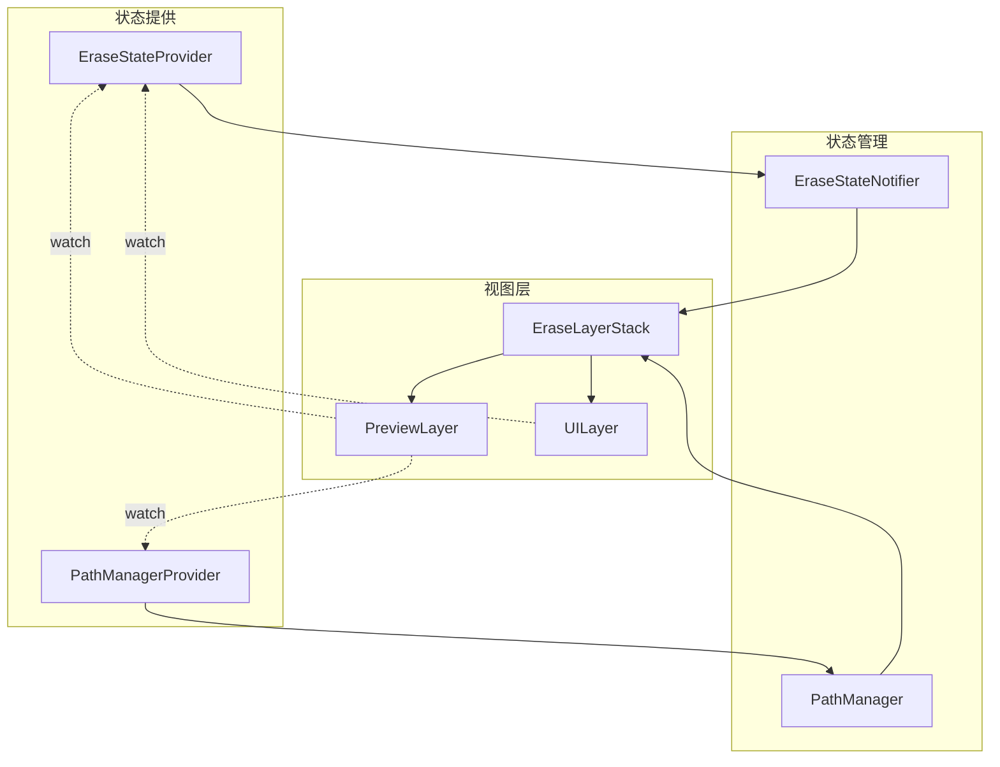
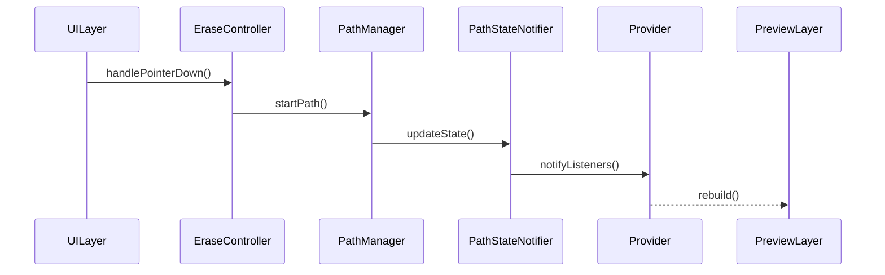

# 擦除功能状态管理重构方案 V4

## 状态访问设计



## 状态提供者设计

```dart
// 路径管理提供者
final pathManagerProvider = Provider<PathManager>((ref) {
  return PathManager();
});

// 路径状态提供者
final pathStateProvider = StateNotifierProvider<PathStateNotifier, PathState>((ref) {
  final pathManager = ref.watch(pathManagerProvider);
  return PathStateNotifier(pathManager);
});

// 擦除状态提供者
final eraseStateProvider = StateNotifierProvider<EraseStateNotifier, EraseState>((ref) {
  return EraseStateNotifier();
});

// 路径渲染数据提供者
final pathRenderDataProvider = Provider<PathRenderData>((ref) {
  final pathState = ref.watch(pathStateProvider);
  final eraseState = ref.watch(eraseStateProvider);
  
  return PathRenderData(
    mergedCompletedPaths: pathState.cachedMergedPaths,
    activePath: pathState.activePath,
    dirtyBounds: pathState.dirtyBounds,
    brushConfig: eraseState.brushConfig,
  );
});
```

## 视图组件访问状态

### PreviewLayer

```dart
class PreviewLayer extends ConsumerWidget {
  @override
  Widget build(BuildContext context, WidgetRef ref) {
    // 通过Provider访问渲染数据
    final renderData = ref.watch(pathRenderDataProvider);
    
    return CustomPaint(
      painter: PathPainter(renderData),
    );
  }
}
```

### UILayer

```dart
class UILayer extends ConsumerWidget {
  @override
  Widget build(BuildContext context, WidgetRef ref) {
    // 只访问需要的状态
    final brushConfig = ref.watch(eraseStateProvider.select((s) => s.brushConfig));
    final isInPanMode = ref.watch(eraseStateProvider.select((s) => s.mode == EraseMode.pan));
    
    return MouseRegion(
      cursor: isInPanMode ? SystemMouseCursors.move : SystemMouseCursors.precise,
      child: GestureDetector(
        onPanStart: (details) => _handlePanStart(details, ref),
        // ...其他手势处理
      ),
    );
  }
  
  void _handlePanStart(DragStartDetails details, WidgetRef ref) {
    final controller = ref.read(eraseControllerProvider);
    controller.handlePointerDown(details.localPosition);
  }
}
```

### EraseLayerStack

```dart
class EraseLayerStack extends ConsumerWidget {
  @override
  Widget build(BuildContext context, WidgetRef ref) {
    return Stack(
      children: [
        BackgroundLayer(),
        PreviewLayer(),
        UILayer(),
      ],
    );
  }
}
```

## 状态更新流程



## 主要优点

1. 解耦视图和状态
   - 视图组件通过Provider访问状态
   - 只订阅需要的状态变化
   - 避免不必要的重建

2. 状态访问控制
   - 明确的状态访问边界
   - 集中的状态管理
   - 可预测的更新流程

3. 性能优化
   - 细粒度的状态订阅
   - 智能的重建控制
   - 状态变化追踪

## 注意事项

1. Provider的设计
   - 合理拆分Provider
   - 避免循环依赖
   - 控制重建范围

2. 状态粒度
   - 适当的状态拆分
   - 避免过度细化
   - 平衡访问便利性

3. 性能考虑
   - 使用select减少重建
   - 合理使用缓存
   - 控制状态更新频率

## 迁移步骤

1. 准备阶段
   - 创建Provider
   - 实现基础状态类
   - 设置依赖注入

2. 核心迁移
   - 实现PathManager
   - 实现StateNotifier
   - 转换现有状态

3. 视图适配
   - 改造视图组件
   - 更新状态访问
   - 优化重建逻辑

4. 收尾工作
   - 清理旧代码
   - 更新文档
   - 性能测试
