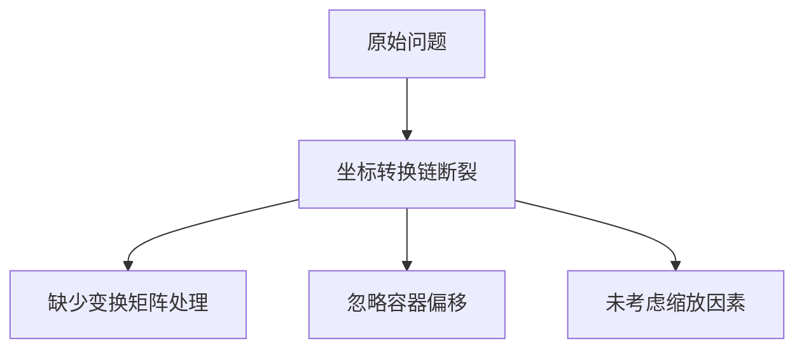
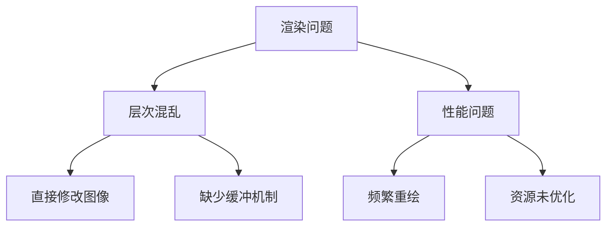
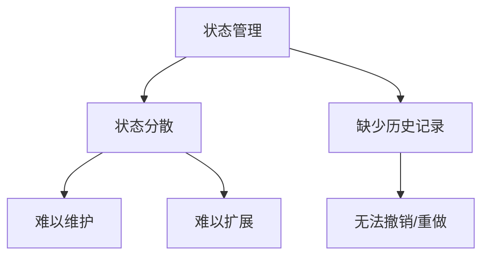
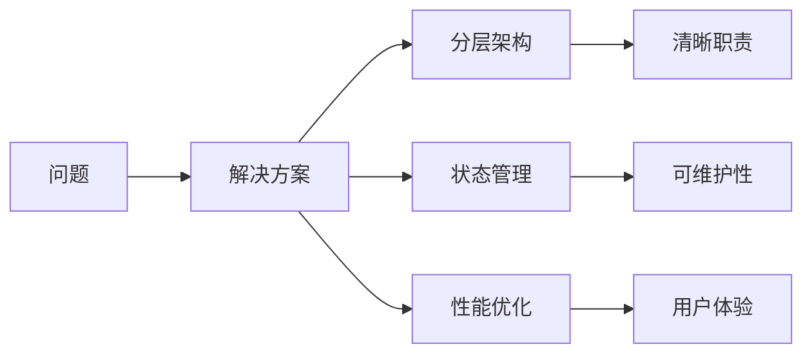

# 擦除工具问题分析

## 1. 当前问题

### 1.1 坐标转换问题

- 实际的鼠标点击位置和擦除轨迹存在偏移
- 没有考虑InteractiveViewer的变换矩阵
- 缺少完整的坐标转换链路

### 1.2 渲染问题

- 擦除操作没有实时反映到图像上
- 预览效果与实际效果不一致
- 性能优化不足

### 1.3 功能缺失

- 缺少撤销/重做支持
- 笔刷大小调节功能不完善
- 缺少操作反馈

## 2. 技术原因分析

### 2.1 坐标系统问题

1. 坐标转换链断裂
   - Widget坐标系
   - 本地坐标系
   - 图像坐标系
   - 缺少完整转换流程

2. 变换处理不完整
   - 未获取InteractiveViewer变换矩阵
   - 未应用逆变换
   - 缺少坐标系对齐

### 2.2 渲染架构问题

1. 层次结构问题
   - 渲染层次未分离
   - 缺少中间缓冲层
   - 状态管理混乱

2. 性能瓶颈
   - 频繁重建画布
   - 资源利用不合理
   - 缺少异步处理

### 2.3 状态管理问题

1. 状态分散
   - 缺少统一状态管理
   - 状态更新不同步
   - 难以维护和扩展

2. 历史记录
   - 缺少操作历史
   - 无法实现撤销/重做
   - 状态恢复困难

## 3. 影响分析

### 3.1 用户体验影响

1. 操作精确度低
2. 反馈不及时
3. 功能受限

### 3.2 性能影响

1. 帧率不稳定
2. 内存占用高
3. 响应延迟

### 3.3 维护影响

1. 代码复杂度高
2. 难以调试
3. 扩展困难

## 4. 改进方向

### 4.1 架构优化

1. 分层架构
   - 清晰的层次结构
   - 职责分离
   - 统一状态管理

2. 性能优化
   - 异步处理
   - 资源复用
   - 局部更新

3. 功能增强
   - 完整的撤销/重做
   - 灵活的笔刷控制
   - 实时预览反馈
