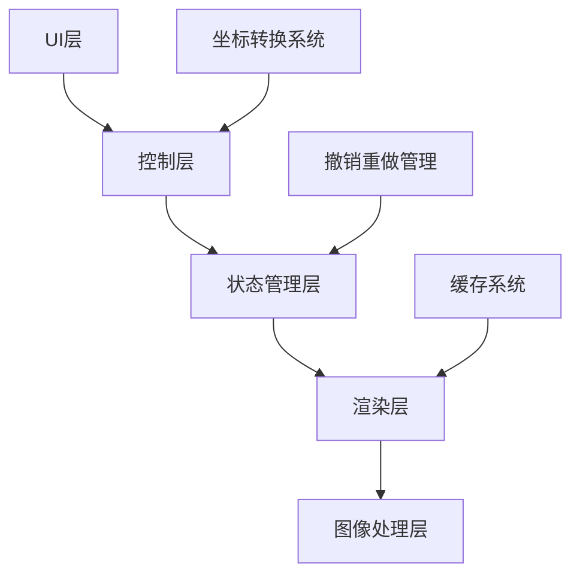
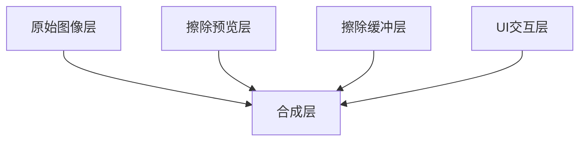
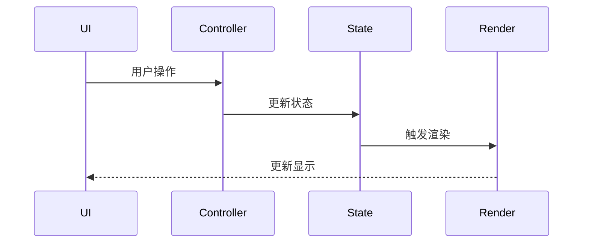
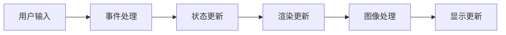

# 擦除工具整体方案

## 1. 设计目标

### 1.1 功能目标

- 准确的坐标转换
- 流畅的实时预览
- 完整的撤销/重做
- 可调节的笔刷大小(3-30像素)

### 1.2 性能目标

- 稳定60fps的渲染性能
- 响应延迟<16ms
- 内存占用合理
- 支持大图像处理

## 2. 系统架构

### 2.1 整体架构



### 2.2 核心模块

#### 2.2.1 UI层

- 处理用户输入
- 显示操作反馈
- 提供工具控制

#### 2.2.2 控制层

- 协调各模块工作
- 管理操作流程
- 处理异常情况

#### 2.2.3 状态管理层

- 维护擦除状态
- 管理操作历史
- 同步各层状态

#### 2.2.4 渲染层

- 实现分层渲染
- 管理图层缓存
- 优化渲染性能

#### 2.2.5 图像处理层

- 执行擦除操作
- 处理图像数据
- 提供图像缓存

## 3. 关键技术方案

### 3.1 分层渲染架构



### 3.2 状态管理流程



### 3.3 数据流设计



## 4. 核心算法

### 4.1 坐标转换

```dart
class CoordinateTransformer {
    final Matrix4 transform;
    final Size containerSize;
    final Size imageSize;
    
    Offset transformPoint(Offset point) {
        // 1. 应用逆变换矩阵
        // 2. 考虑容器偏移
        // 3. 应用缩放比例
        // 4. 转换到图像坐标
    }
}
```

### 4.2 实时预览优化

```dart
class PreviewOptimizer {
    final RenderCache cache;
    final ThrottleController throttle;
    
    void updatePreview(List<Offset> points) {
        // 1. 使用节流控制更新频率
        // 2. 计算脏区域
        // 3. 局部更新缓存
        // 4. 触发重绘
    }
}
```

## 5. 关键接口设计

### 5.1 擦除工具控制器

```dart
abstract class EraseToolController {
    // 工具状态控制
    void setBrushSize(double size);
    void setMode(EraseMode mode);
    
    // 操作控制
    void startErase(Offset point);
    void continueErase(Offset point);
    void endErase();
    
    // 历史控制
    void undo();
    void redo();
}
```

### 5.2 渲染管理器

```dart
abstract class RenderManager {
    // 图层管理
    void updateLayer(LayerType type, RenderObject object);
    void invalidateLayer(LayerType type);
    
    // 缓存管理
    void updateCache(CacheType type, Image data);
    void clearCache(CacheType type);
    
    // 渲染控制
    void scheduleRepaint(Rect? area);
}
```

## 6. 性能优化策略

### 6.1 渲染优化

- 使用脏区域检测
- 实现图层缓存
- 优化重绘范围

### 6.2 内存优化

- 实现资源池
- 及时释放缓存
- 控制图像尺寸

### 6.3 响应优化

- 实现事件节流
- 使用异步处理
- 优化状态更新

## 7. 风险与对策

### 7.1 技术风险

1. 坐标转换精度
   - 使用高精度计算
   - 添加校准机制

2. 性能问题
   - 实现性能监控
   - 优化关键路径

3. 内存问题
   - 监控内存使用
   - 实现自动清理

### 7.2 应对策略

1. 分步实现
   - 先实现基础功能
   - 逐步优化性能

2. 充分测试
   - 单元测试覆盖
   - 性能压力测试

3. 监控反馈
   - 收集性能指标
   - 分析用户反馈
