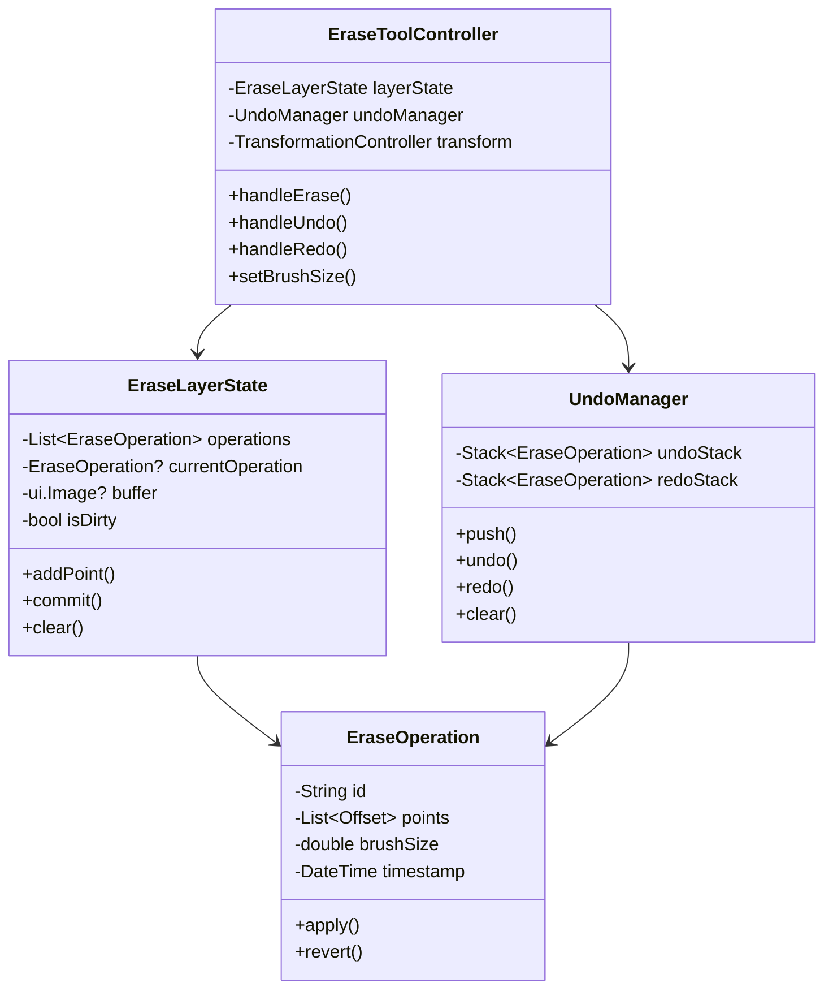
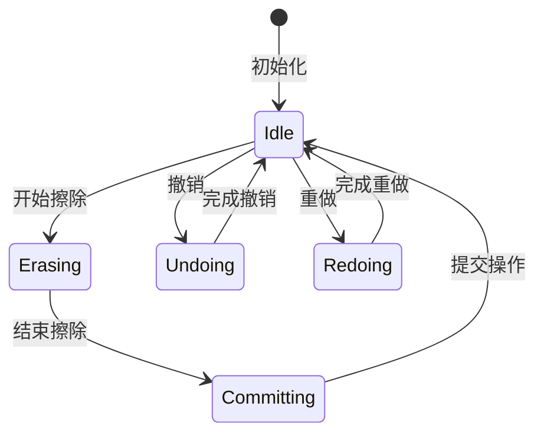
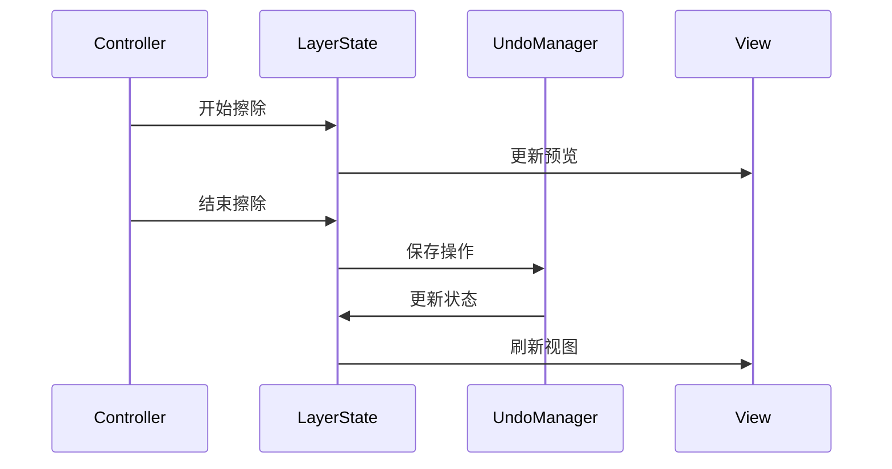
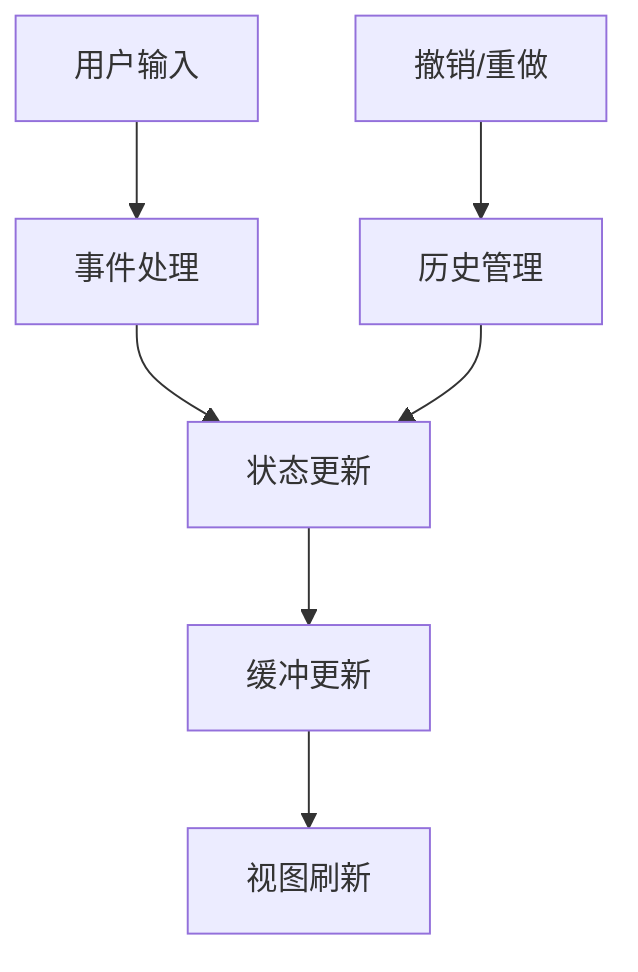

# 擦除工具对象设计

## 1. 核心对象设计

### 1.1 对象关系图



## 2. 对象职责

### 2.1 EraseToolController

- 统一管理擦除工具的所有操作
- 处理用户输入事件
- 协调各个组件的工作
- 维护工具状态

```dart
class EraseToolController {
    final TransformationController transformationController;
    final EraseLayerState layerState;
    final UndoManager undoManager;
    
    double _brushSize = 10.0;
    bool _isErasing = false;
    
    void setBrushSize(double size) {
        _brushSize = size.clamp(3.0, 30.0);
        notifyListeners();
    }
    
    void handleEraseStart(Offset point) {
        _isErasing = true;
        final transformed = _transformPoint(point);
        layerState.startNewOperation(transformed, _brushSize);
    }
    
    Offset _transformPoint(Offset point) {
        // 应用坐标转换
    }
}
```

### 2.2 EraseLayerState

- 管理擦除操作的状态
- 维护图层缓冲
- 处理图层更新
- 提供重绘支持

```dart
class EraseLayerState extends ChangeNotifier {
    List<EraseOperation> _operations = [];
    EraseOperation? _currentOperation;
    ui.Image? _buffer;
    
    void startNewOperation(Offset point, double brushSize) {
        _currentOperation = EraseOperation(
            id: DateTime.now().toString(),
            brushSize: brushSize,
        );
        _currentOperation!.addPoint(point);
        notifyListeners();
    }
    
    void updateBuffer() {
        // 更新图层缓冲
    }
}
```

### 2.3 EraseOperation

- 记录单次擦除操作的信息
- 提供操作的应用和回退方法
- 支持操作合并和优化

```dart
class EraseOperation {
    final String id;
    final double brushSize;
    final List<Offset> points;
    final DateTime timestamp;
    
    void apply(Canvas canvas) {
        final paint = Paint()
          ..color = Colors.white
          ..strokeWidth = brushSize
          ..strokeCap = StrokeCap.round;
          
        // 应用擦除效果
    }
    
    bool canMergeWith(EraseOperation other) {
        // 判断是否可以合并操作
    }
}
```

### 2.4 UndoManager

- 管理操作历史
- 实现撤销/重做功能
- 优化内存使用

```dart
class UndoManager {
    final Stack<EraseOperation> _undoStack = Stack();
    final Stack<EraseOperation> _redoStack = Stack();
    
    void push(EraseOperation operation) {
        _undoStack.push(operation);
        _redoStack.clear();
        _trimHistory();
    }
    
    EraseOperation? undo() {
        if (_undoStack.isEmpty) return null;
        final op = _undoStack.pop();
        _redoStack.push(op);
        return op;
    }
}
```

## 3. 状态管理

### 3.1 状态流转图



### 3.2 状态同步



## 4. 交互设计

### 4.1 事件处理

```dart
mixin EraseGestureMixin {
    void handlePanStart(DragStartDetails details) {
        // 开始擦除
    }
    
    void handlePanUpdate(DragUpdateDetails details) {
        // 更新擦除
    }
    
    void handlePanEnd(DragEndDetails details) {
        // 结束擦除
    }
}
```

### 4.2 性能优化

```dart
mixin EraseOptimizationMixin {
    Timer? _throttle;
    final _points = <Offset>[];
    
    void addPoint(Offset point) {
        _points.add(point);
        _throttle?.cancel();
        _throttle = Timer(Duration(milliseconds: 16), () {
            processPoints(_points);
            _points.clear();
        });
    }
}
```

## 5. 数据流设计

### 5.1 数据流图



### 5.2 缓存策略

```dart
class EraseBuffer {
    ui.Image? _staticBuffer;
    ui.Image? _dynamicBuffer;
    bool _isDirty = false;
    
    void updateDynamic(List<Offset> points) {
        // 更新动态缓冲
    }
    
    void commitToStatic() {
        // 提交到静态缓冲
    }
}
