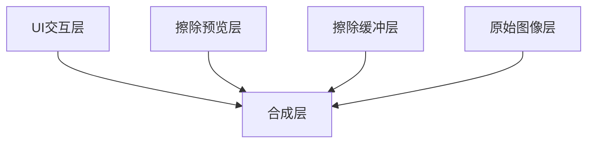
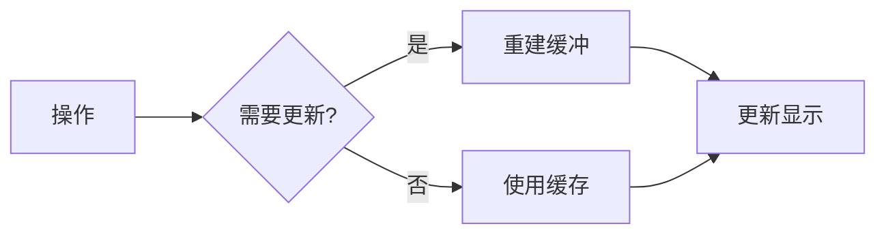
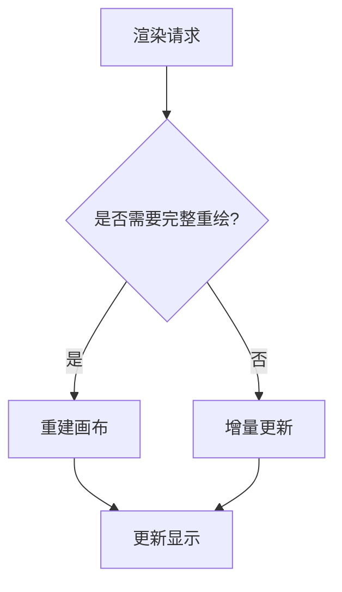
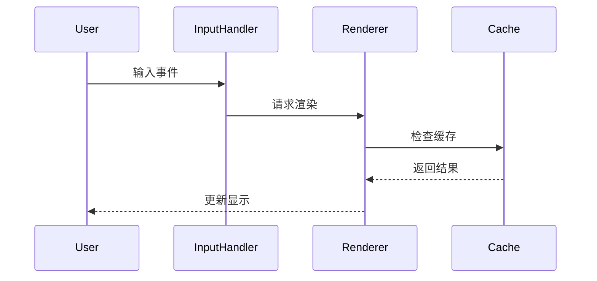

# 擦除工具分层架构

## 1. 渲染分层结构

### 1.1 分层设计


### 1.2 层级职责

#### 1.2.1 原始图像层
- 显示原始图像内容
- 使用RepaintBoundary优化重绘
- 只在图像内容变化时更新

```dart
class ImageLayer extends StatelessWidget {
    final ui.Image image;
    
    @override
    Widget build(BuildContext context) {
        return RepaintBoundary(
            child: CustomPaint(
                painter: ImagePainter(image),
            ),
        );
    }
}
```

#### 1.2.2 擦除缓冲层
- 存储已确认的擦除效果
- 使用离屏渲染优化性能
- 管理图像缓存

```dart
class EraseBufferLayer {
    ui.Image? _buffer;
    bool _isDirty = false;
    
    void updateBuffer(List<EraseOperation> operations) {
        if (!_isDirty && operations.isEmpty) return;
        
        final recorder = ui.PictureRecorder();
        final canvas = Canvas(recorder);
        
        // 重建缓冲
        _rebuildBuffer(canvas, operations);
        
        _isDirty = false;
    }
    
    // 离屏渲染具体实现
    Future<void> _rebuildBuffer(Canvas canvas, List<EraseOperation> operations) async {
        // 步骤1: 创建离屏渲染记录器
        final recorder = ui.PictureRecorder();
        final offscreenCanvas = Canvas(recorder);
        
        // 步骤2: 绘制原始图像
        if (_buffer != null) {
            offscreenCanvas.drawImage(_buffer!, Offset.zero, Paint());
        }
        
        // 步骤3: 应用擦除操作
        for (final op in operations) {
            final paint = Paint()
                ..color = Colors.transparent
                ..strokeWidth = op.brushSize
                ..strokeCap = StrokeCap.round
                ..blendMode = BlendMode.clear;
                
            for (int i = 0; i < op.points.length - 1; i++) {
                offscreenCanvas.drawLine(op.points[i], op.points[i + 1], paint);
            }
        }
        
        // 步骤4: 完成离屏渲染
        final picture = recorder.endRecording();
        
        // 步骤5: 转换为图像
        _buffer = await picture.toImage(
            _buffer!.width.toInt(), 
            _buffer!.height.toInt()
        );
    }
}
```

#### 1.2.3 擦除预览层
- 显示实时擦除效果
- 处理用户交互反馈
- 优化渲染性能

```dart
class ErasePreviewLayer extends CustomPainter {
    final List<Offset> currentPoints;
    final double brushSize;
    
    @override
    void paint(Canvas canvas, Size size) {
        if (currentPoints.isEmpty) return;
        
        final paint = Paint()
            ..color = Colors.red.withOpacity(0.6)
            ..strokeWidth = brushSize
            ..strokeCap = StrokeCap.round;
            
        // 绘制当前擦除轨迹
    }
}
```

#### 1.2.4 UI交互层
- 处理用户输入
- 显示工具状态
- 提供视觉反馈

```dart
class UILayer extends StatelessWidget {
    final double brushSize;
    final bool isErasing;
    
    @override
    Widget build(BuildContext context) {
        return Stack(
            children: [
                if (isErasing)
                    BrushIndicator(size: brushSize),
                // 其他UI元素
            ],
        );
    }
}
```

## 2. 渲染优化

### 2.1 缓存策略


#### 2.1.1 静态缓存
```dart
class StaticCache {
    ui.Image? _cachedImage;
    bool _isDirty = false;
    
    void invalidate() {
        _isDirty = true;
    }
    
    ui.Image? get image {
        if (_isDirty) {
            _rebuildCache();
        }
        return _cachedImage;
    }
}
```

#### 2.1.2 动态缓存
```dart
class DynamicCache {
    final Queue<EraseOperation> _recentOperations;
    ui.Image? _temporaryBuffer;
    
    void addOperation(EraseOperation op) {
        _recentOperations.add(op);
        _updateTemporaryBuffer();
    }
}
```

### 2.2 局部更新
```dart
class PartialUpdateManager {
    Rect? _dirtyRegion;
    
    void markDirty(Rect region) {
        _dirtyRegion = _dirtyRegion?.expandToInclude(region) ?? region;
    }
    
    void updateIfNeeded(Canvas canvas) {
        if (_dirtyRegion == null) return;
        
        // 只更新脏区域
        canvas.save();
        canvas.clipRect(_dirtyRegion!);
        // 绘制更新
        canvas.restore();
        
        _dirtyRegion = null;
    }
}
```

### 2.3 异步处理
```dart
class AsyncRenderManager {
    final StreamController<RenderTask> _taskQueue = 
        StreamController<RenderTask>();
    
    void scheduleRender(RenderTask task) {
        _taskQueue.add(task);
    }
    
    void startProcessing() {
        _taskQueue.stream
            .asyncMap(_processTask)
            .listen(_updateUI);
    }
}
```

## 3. 性能优化

### 3.1 渲染优化


### 3.2 内存优化
```dart
class MemoryOptimizer {
    final int maxCacheSize;
    final Map<String, WeakReference<ui.Image>> _imageCache;
    
    void trimCache() {
        if (_imageCache.length > maxCacheSize) {
            // 清理最旧的缓存
        }
    }
}
```

### 3.3 计算优化
```dart
class RenderOptimizer {
    Timer? _throttle;
    
    void scheduleUpdate(VoidCallback callback) {
        _throttle?.cancel();
        _throttle = Timer(Duration(milliseconds: 16), callback);
    }
}
```

## 4. 交互响应

### 4.1 事件处理


### 4.2 状态同步
```dart
class RenderStateManager {
    final StreamController<RenderState> _stateController = 
        StreamController<RenderState>.broadcast();
    
    void updateState(RenderState newState) {
        _stateController.add(newState);
    }
    
    Stream<RenderState> get stateStream => _stateController.stream;
}