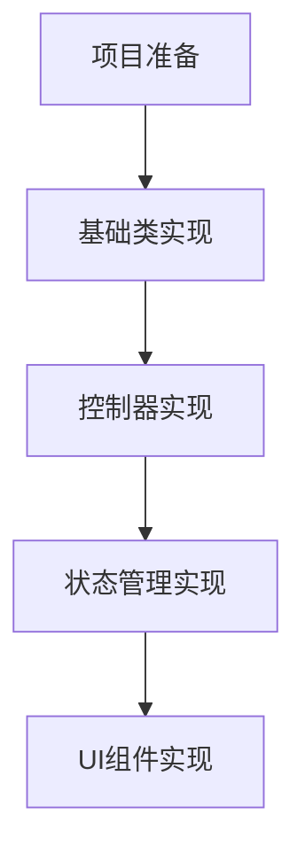
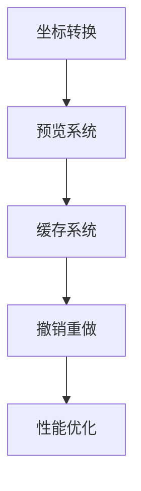
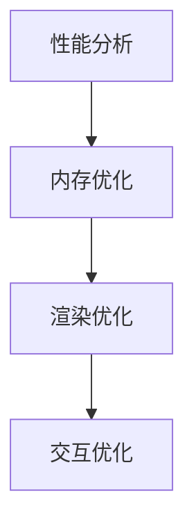
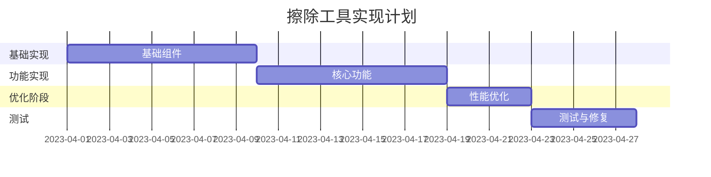

# 擦除工具实现步骤

## 1. 准备工作

### 1.1 代码结构调整

```
lib/
├── presentation/
│   └── widgets/
│       └── character_collection/
│           ├── erase_tool/
│           │   ├── controllers/
│           │   ├── models/
│           │   ├── states/
│           │   └── widgets/
│           └── preview_canvas.dart
└── application/
    └── services/
        └── image/
            └── erase_processor.dart
```

### 1.2 依赖准备

- 确保image包版本支持所需功能
- 添加必要的工具类和辅助函数
- 准备测试环境

## 2. 分步实现计划

### 2.1 基础组件实现



1. 基础类实现（2天）
   - 创建核心数据模型
   - 实现基础工具类
   - 编写接口定义

2. 控制器实现（2天）
   - 实现EraseToolController
   - 添加坐标转换逻辑
   - 实现事件处理

3. 状态管理实现（2天）
   - 实现EraseLayerState
   - 添加UndoManager
   - 实现状态同步

4. UI组件实现（3天）
   - 实现分层结构
   - 添加交互控件
   - 实现视觉反馈

### 2.2 功能模块实现



1. 坐标转换模块（2天）

   ```dart
   class CoordinateTransformer {
       // 第一阶段实现
       void initializeTransform()
       Offset transformPoint(Offset point)
       
       // 第二阶段实现
       void updateTransform(Matrix4 matrix)
       Rect transformRect(Rect rect)
   }
   ```

2. 预览系统（3天）

   ```dart
   class PreviewSystem {
       // 第一阶段实现
       void initializePreview()
       void updatePreview(List<Offset> points)
       
       // 第二阶段实现
       void optimizeRendering()
       void handleStateChanges()
   }
   ```

3. 缓存系统（2天）

   ```dart
   class CacheSystem {
       // 第一阶段实现
       void initializeCache()
       void updateCache(EraseOperation op)
       
       // 第二阶段实现
       void optimizeMemory()
       void handleCacheInvalidation()
   }
   ```

4. 撤销重做（2天）

   ```dart
   class UndoRedoSystem {
       // 第一阶段实现
       void initializeHistory()
       void recordOperation(EraseOperation op)
       
       // 第二阶段实现
       void optimizeStorage()
       void handleStateSync()
   }
   ```

### 2.3 优化阶段



1. 性能分析（1天）
   - 使用Flutter DevTools分析性能
   - 识别瓶颈
   - 制定优化策略

2. 优化实现（3天）
   - 实现节流控制
   - 优化缓存策略
   - 改进渲染逻辑

## 3. 测试计划

### 3.1 单元测试

```dart
void main() {
    group('EraseToolController Tests', () {
        test('coordinate transformation', () {
            // 测试坐标转换
        });
        
        test('operation management', () {
            // 测试操作管理
        });
    });
}
```

### 3.2 集成测试

```dart
void main() {
    testWidgets('EraseToolWidget Tests', (tester) async {
        // 测试UI交互
        await tester.pumpWidget(TestApp());
        
        // 测试手势操作
        await tester.drag(...);
        
        // 验证结果
        expect(...);
    });
}
```

### 3.3 性能测试

```dart
void main() {
    test('Performance Benchmark', () {
        final benchmark = EraseBenchmark();
        
        // 测试渲染性能
        expect(benchmark.measureFrameTime(), lessThan(16));
        
        // 测试内存使用
        expect(benchmark.measureMemoryUsage(), lessThan(maxMemory));
    });
}
```

## 4. 上线计划

### 4.1 分阶段发布


1. 阶段一：基础功能（2周）
   - 基本擦除功能
   - 简单撤销重做
   - 基础性能优化

2. 阶段二：完整功能（2周）
   - 完整撤销重做
   - 高级预览效果
   - 完整性能优化

### 4.2 监控计划

- 添加性能监控指标
- 实现错误追踪
- 收集用户反馈

## 5. 维护计划

### 5.1 日常维护

- 定期代码审查
- 性能监控
- Bug修复

### 5.2 持续优化

- 收集用户反馈
- 分析使用数据
- 迭代改进

## 6. 时间规划

### 6.1 总体时间线



### 6.2 关键节点

1. Week 1: 完成基础组件
2. Week 2: 完成核心功能
3. Week 3: 完成优化
4. Week 4: 完成测试和部署
