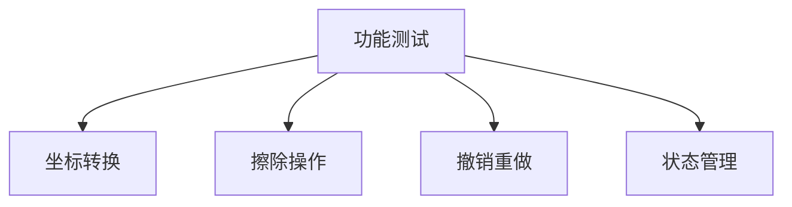
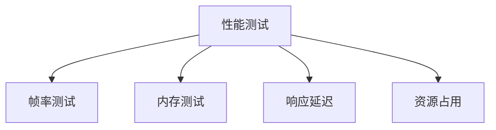
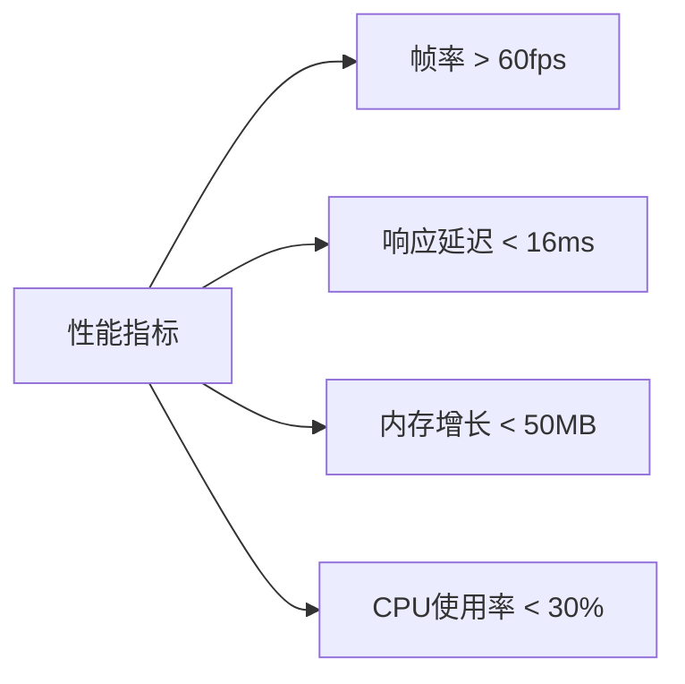

# 擦除工具测试方案

## 1. 测试范围

### 1.1 功能测试



1. 坐标转换测试
   - 基础坐标转换
   - 缩放情况
   - 边界情况
   - 精度验证

2. 擦除操作测试
   - 笔刷大小调节
   - 擦除轨迹准确性
   - 实时预览效果
   - 图像更新正确性

3. 撤销重做测试
   - 操作记录正确性
   - 状态恢复准确性
   - 内存使用合理性
   - 边界情况处理

### 1.2 性能测试



1. 帧率测试

   ```dart
   class FrameRateTest {
       final fps = ValueNotifier<double>(0);
       Stopwatch? _stopwatch;
       int _frameCount = 0;
       
       void startTracking() {
           _stopwatch = Stopwatch()..start();
           _frameCount = 0;
       }
       
       void frameCallback(Duration _) {
           _frameCount++;
           if (_stopwatch!.elapsedMilliseconds >= 1000) {
               fps.value = _frameCount * 1000 / _stopwatch!.elapsedMilliseconds;
               _frameCount = 0;
               _stopwatch!.reset();
           }
       }
   }
   ```

2. 内存测试

   ```dart
   class MemoryTest {
       final memory = ValueNotifier<int>(0);
       
       Future<void> measureMemory() async {
           // 触发GC
           await Future.delayed(Duration(seconds: 1));
           
           // 记录内存使用
           // 注意：这只是示例，实际测量需要使用合适的工具
           memory.value = ProcessInfo.currentRss;
       }
   }
   ```

## 2. 测试用例

### 2.1 单元测试

```dart
void main() {
    group('CoordinateTransformer Tests', () {
        late CoordinateTransformer transformer;
        
        setUp(() {
            transformer = CoordinateTransformer();
        });
        
        test('basic transformation', () {
            final input = Offset(100, 100);
            final expected = Offset(50, 50);
            expect(transformer.transform(input), expected);
        });
        
        test('scale transformation', () {
            transformer.setScale(2.0);
            final input = Offset(100, 100);
            final expected = Offset(25, 25);
            expect(transformer.transform(input), expected);
        });
    });
    
    group('EraseOperation Tests', () {
        test('operation merge', () {
            final op1 = EraseOperation(points: [Offset(0, 0)]);
            final op2 = EraseOperation(points: [Offset(1, 1)]);
            expect(op1.canMergeWith(op2), isTrue);
        });
    });
}
```

### 2.2 集成测试

```dart
void main() {
    testWidgets('EraseToolWidget integration', (tester) async {
        final widget = EraseToolWidget();
        await tester.pumpWidget(MaterialApp(home: widget));
        
        // 测试擦除操作
        await tester.dragFrom(Offset(100, 100), Offset(200, 200));
        await tester.pump();
        
        // 验证预览更新
        expect(find.byType(ErasePreviewLayer), findsOneWidget);
        
        // 测试撤销操作
        await tester.tap(find.byIcon(Icons.undo));
        await tester.pump();
        
        // 验证状态恢复
        expect(find.byType(ErasePreviewLayer), findsNothing);
    });
}
```

## 3. 性能基准

### 3.1 性能指标



### 3.2 测试场景

1. 基准场景
   - 普通尺寸图像
   - 正常擦除操作
   - 标准设备配置

2. 压力场景
   - 大尺寸图像
   - 快速连续擦除
   - 频繁撤销重做

3. 边界场景
   - 极限尺寸图像
   - 极限操作频率
   - 低配置设备

## 4. 自动化测试

### 4.1 测试脚本

```dart
class AutomatedTest {
    Future<void> runAll() async {
        await runUnitTests();
        await runIntegrationTests();
        await runPerformanceTests();
    }
    
    Future<TestResult> runPerformanceTests() async {
        final results = <TestResult>[];
        
        // 运行性能测试套件
        results.add(await testFrameRate());
        results.add(await testMemoryUsage());
        results.add(await testResponseTime());
        
        return TestResult.aggregate(results);
    }
}
```

### 4.2 持续集成

```yaml
# .github/workflows/test.yml
name: Erase Tool Tests
on: [push, pull_request]

jobs:
  test:
    runs-on: ubuntu-latest
    steps:
      - uses: actions/checkout@v2
      - uses: subosito/flutter-action@v2
      - run: flutter test
      - run: flutter test integration_test
```

## 5. 测试报告

### 5.1 报告内容

1. 测试覆盖率
2. 性能指标
3. 问题记录
4. 优化建议

### 5.2 报告模板

```markdown
# 测试报告

## 测试概述
- 测试时间：{datetime}
- 测试环境：{environment}
- 测试范围：{scope}

## 测试结果
### 功能测试
- 通过率：{pass_rate}
- 失败项：{failures}

### 性能测试
- 平均帧率：{avg_fps}
- 内存使用：{memory_usage}
- 响应时间：{response_time}

## 问题和建议
1. {issue_1}
2. {issue_2}
...
```

## 6. 监控方案

### 6.1 性能监控

```dart
class PerformanceMonitor {
    void startMonitoring() {
        // 监控帧率
        SchedulerBinding.instance.addTimingsCallback(_recordTimings);
        
        // 监控内存
        _startMemoryTracking();
        
        // 监控响应时间
        _trackResponseTime();
    }
    
    void _recordTimings(List<FrameTiming> timings) {
        // 记录性能数据
    }
}
```

### 6.2 异常监控

```dart
class ExceptionMonitor {
    void initialize() {
        FlutterError.onError = _handleFlutterError;
        PlatformDispatcher.instance.onError = _handlePlatformError;
    }
    
    bool _handleFlutterError(FlutterErrorDetails details) {
        // 处理Flutter框架错误
        return true;
    }
}
