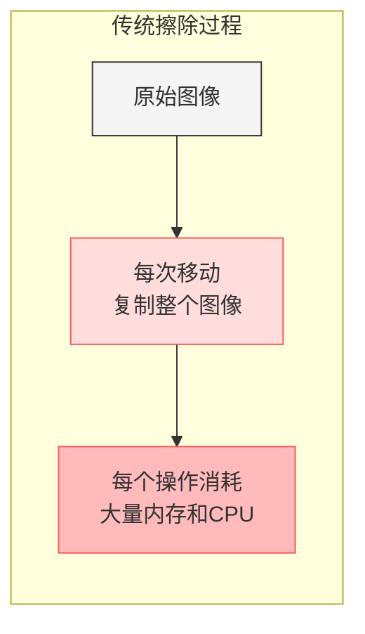
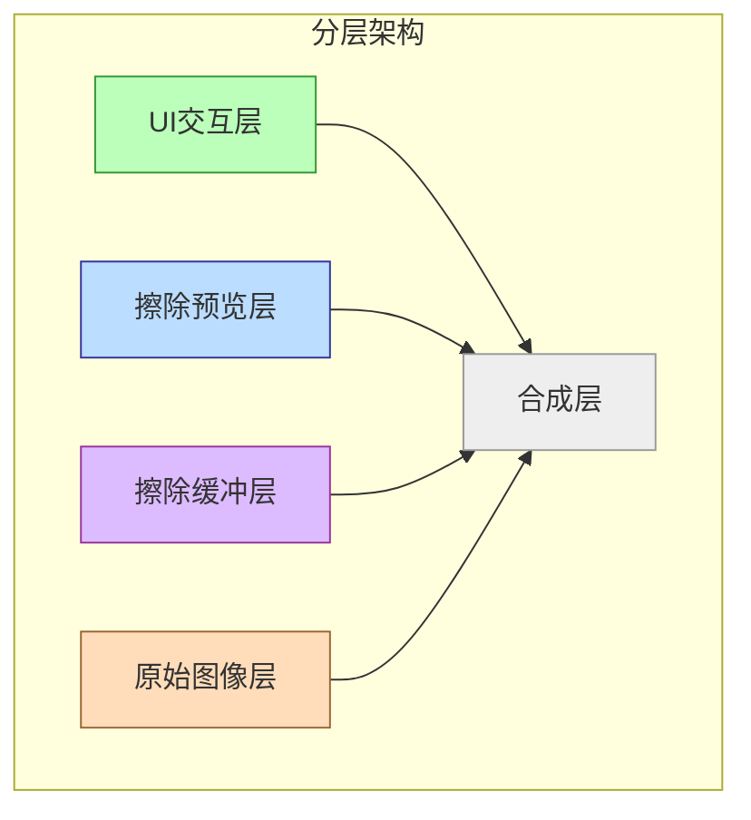
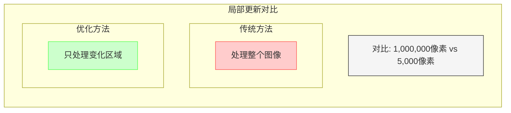
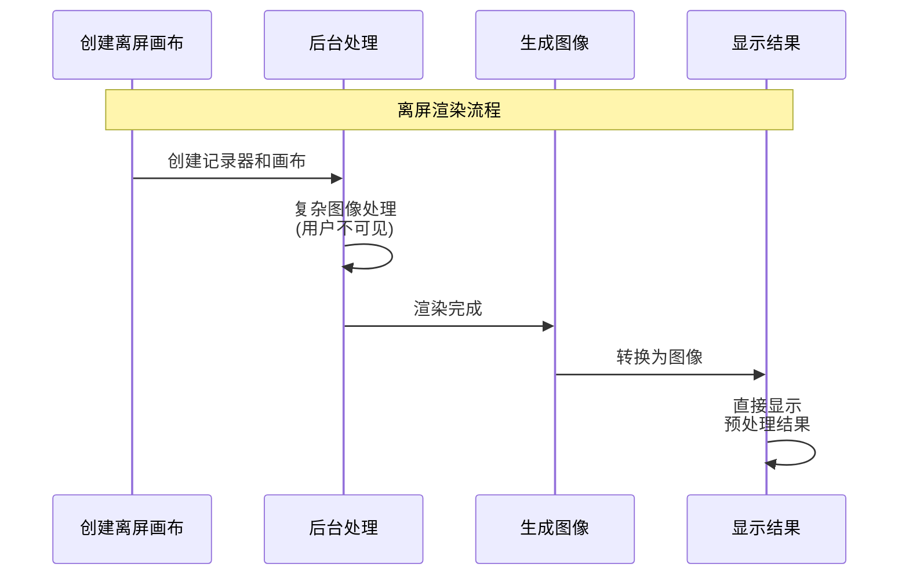
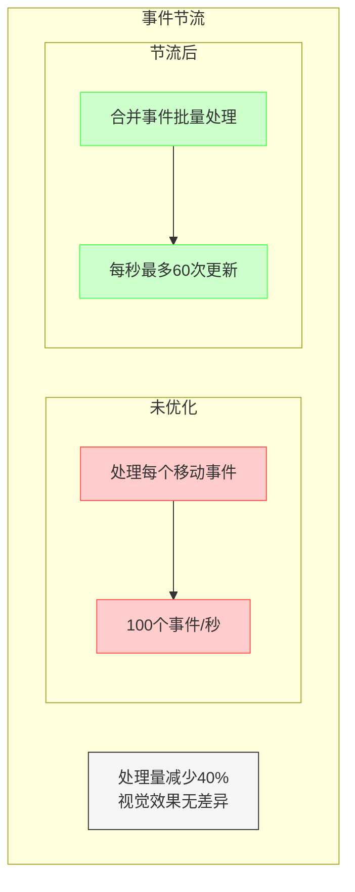
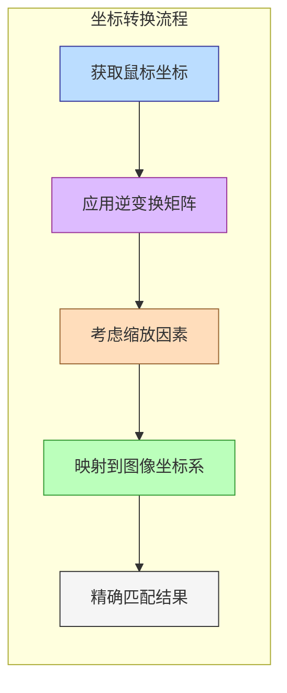
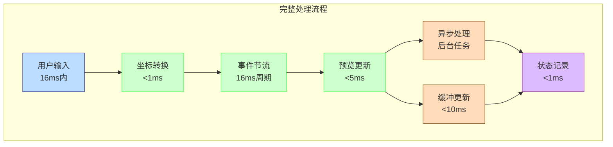
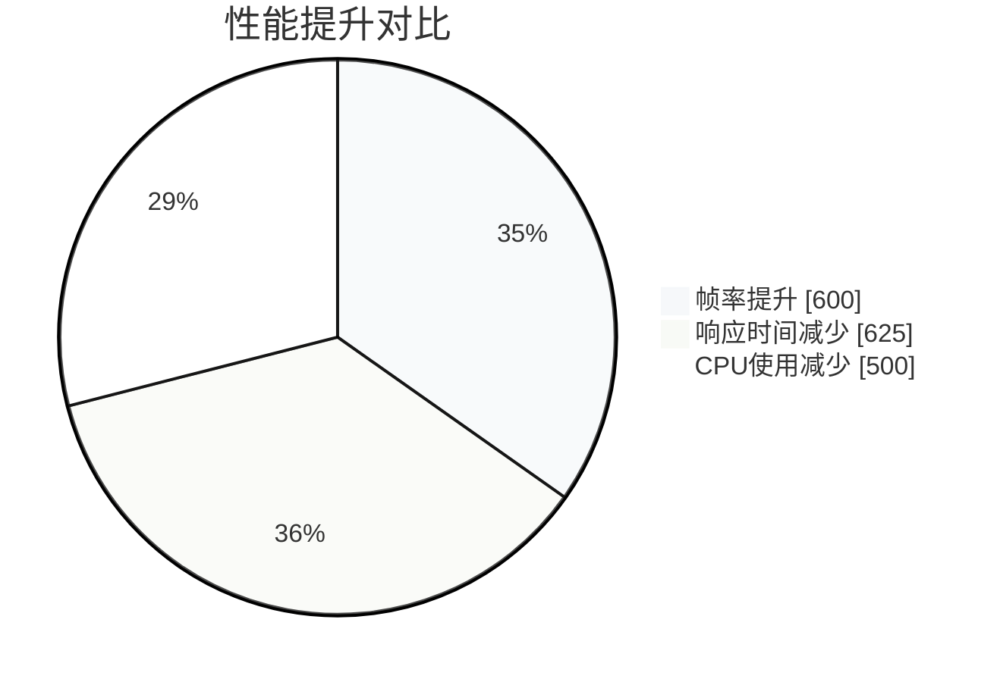
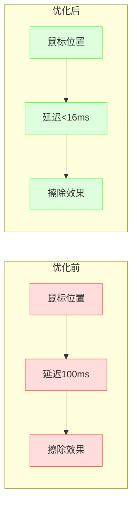

# 擦除工具实时性能原理解析

## 1. 为什么传统擦除工具会卡顿？

想象一下你在一块巨大的黑板上用粉笔画画，然后想用橡皮擦擦掉一部分。传统的擦除工具就像这样工作：



**图1：传统擦除过程**

1. **左侧**：原始图像，上面标注了鼠标移动路径
2. **中间**：每次移动都复制整个图像并处理
3. **右侧**：多次复制造成内存占用剧增和性能下降

在传统实现中：

1. 每次移动鼠标，都要重新计算整个黑板
2. 需要不断地"复制"整块黑板，再擦掉一点点
3. 当黑板很大时，复制和处理变得非常慢
4. 最终导致擦除时出现明显的卡顿和延迟

## 2. 分层架构：关键的性能秘诀

我们的优化方案类似于动画师使用的透明胶片技术，将不同元素分成多个图层：



**图2：分层架构详解**

1. **底层**：原始图像层，保持不变
2. **第二层**：擦除缓冲层，存储已确认的擦除结果
3. **第三层**：擦除预览层，显示实时擦除效果
4. **顶层**：UI交互层，显示鼠标指针和工具状态

### 四层结构的优势

1. **原始图像层**：底层不变的"黑板"

   ```
   就像博物馆里的珍贵画作，我们把它放在玻璃后面，不直接触碰。
   原始图像只需加载一次，几乎不需要再处理。
   ```

2. **擦除缓冲层**：已确认的擦除效果

   ```
   相当于已经确定要保留的修改，不需要反复计算。
   当用户完成一次擦除手势后，结果被"烘焙"到这一层。
   ```

3. **擦除预览层**：实时显示当前擦除动作

   ```
   就像在玻璃上用马克笔临时标记，可以迅速擦掉重画。
   这一层非常轻量，只处理当前正在进行的擦除操作。
   ```

4. **UI交互层**：显示鼠标和工具状态

   ```
   仅处理界面元素，不涉及复杂图像处理。
   包括笔刷大小指示器、按钮高亮状态等纯UI元素。
   ```

## 3. 局部更新：只处理变化的部分

传统方法每次都处理整张图像，而我们的方法只处理发生变化的区域：



**图3：局部更新原理**

1. **左图**：传统方法，每次都处理整个图像（红色区域）
2. **右图**：优化方法，只处理发生变化的区域（蓝色小区域）
3. **下方**：更新区域大小比较，显示处理像素数量的巨大差异

### 工作原理

```dart
// 只更新需要的区域，而不是整个图像
void updateIfNeeded(Canvas canvas) {
    if (_dirtyRegion == null) return;
    
    // 只更新脏区域
    canvas.save();
    canvas.clipRect(_dirtyRegion!);
    // 绘制更新
    canvas.restore();
    
    _dirtyRegion = null;
}
```

想象一下：

- 传统方法：整栋大楼墙壁上有一个小污点，你要重新粉刷整栋楼
- 我们的方法：只需要修补那个有污点的小区域

## 4. 离屏渲染：提前准备好图像

离屏渲染就像厨师的备菜过程 - 在真正需要之前就提前准备好：



**图4：离屏渲染流程**

1. **离屏画布创建**：在内存中创建一个不可见的画布
2. **后台处理**：在用户看不见的地方完成所有复杂计算
3. **图像生成**：将处理结果转换为可直接使用的图像
4. **快速显示**：将预先准备好的图像直接显示到屏幕上

```dart
// 预先在"厨房"准备好图像，而不是在"用餐时"现做
Future<void> _rebuildBuffer(Canvas canvas, List<EraseOperation> operations) async {
    // 创建离屏画布
    final recorder = ui.PictureRecorder();
    final offscreenCanvas = Canvas(recorder);
    
    // 在后台完成复杂处理
    // ...
    
    // 最后生成可直接使用的图像
    _buffer = await picture.toImage(...);
}
```

生活中的例子：

- 传统方法：顾客点菜后才开始准备食材和烹饪，等待时间长
- 我们的方法：提前准备好所有食材和半成品，顾客点菜后快速完成最后步骤

## 5. 事件节流：控制处理频率

想象一下高速公路上的车流管制，我们不需要处理每一个微小的移动：



**图5：事件节流机制**

1. **上图**：未优化情况，每个细微的鼠标移动都触发处理（红色标记点）
2. **下图**：节流后，只处理关键点（蓝色标记点），但最终效果相同
3. **右侧**：处理次数对比，显示节流后处理量大幅减少

```dart
// 控制更新频率，避免过度处理
void addPoint(Offset point) {
    _points.add(point);
    _throttle?.cancel();
    _throttle = Timer(Duration(milliseconds: 16), () {
        processPoints(_points);
        _points.clear();
    });
}
```

这确保我们每秒最多处理约60次更新，与屏幕刷新率匹配。

生活中的例子：

- 传统方法：每次接到一个电话就立即处理一项任务，频繁被打断
- 我们的方法：收集一组电话信息，在固定时间一并处理，效率更高

## 6. 坐标转换：精确定位擦除位置

精确的坐标转换确保鼠标位置和实际擦除位置完全吻合：



**图6：坐标转换流程**

1. **获取鼠标位置**：捕获屏幕上的鼠标/触摸坐标
2. **应用逆变换**：考虑缩放、旋转等所有变换因素
3. **转换至图像坐标**：将转换后的坐标映射到图像坐标系
4. **右侧**：精确匹配效果，鼠标与擦除点完美对齐

```dart
Offset _transformPoint(Offset point) {
    // 应用逆变换矩阵
    final invertedMatrix = Matrix4.inverted(matrix);
    
    // 转换坐标
    final Vector3 transformed = Vector3(point.dx, point.dy, 0)
        ..applyMatrix4(invertedMatrix);
    
    // 考虑缩放因素
    final scaleFactor = matrix.getMaxScaleOnAxis();
    
    return Offset(
        transformed.x / scaleFactor,
        transformed.y / scaleFactor,
    );
}
```

生活中的例子：

- 传统方法：在放大的地图上标记位置，但不考虑缩放，导致实际位置偏移
- 我们的方法：精确计算缩放和偏移，确保标记点准确对应实际地理位置

## 7. 完整流程：从鼠标移动到屏幕显示

让我们看看从用户移动鼠标到屏幕显示擦除效果的完整过程：



**图7：完整处理流程**

1. **用户输入**：捕获鼠标/触摸移动（16ms内）
   - 记录原始坐标
   - 检测手势类型

2. **坐标转换**：计算准确的图像坐标（<1ms）
   - 应用变换矩阵
   - 调整缩放因素

3. **事件节流**：控制处理频率（16ms周期）
   - 合并频繁事件
   - 减少处理次数

4. **预览更新**：立即显示反馈（<5ms）
   - 更新预览层
   - 提供即时视觉反馈

5. **异步处理**：在后台处理复杂计算（不阻塞UI）
   - 离屏渲染
   - 复杂图像处理

6. **缓冲更新**：仅更新必要的区域（<10ms）
   - 计算脏区域
   - 局部重绘

7. **状态记录**：保存操作历史以支持撤销/重做（<1ms）
   - 记录操作参数
   - 优化存储结构

## 8. 性能对比：传统方法 vs 优化方法

下图展示了传统擦除方法与我们优化方法在不同性能指标上的对比：

```mermaid
%%{init: {'theme': 'base', 'themeVariables': { 'primaryColor': '#bbffdd', 'secondaryColor': '#ffbbbb'}}}%%
gantt
    title 性能对比
    dateFormat  X
    axisFormat %s
    
    section 帧率
    传统方法 (10fps)      :a, 0, 10
    优化方法 (60fps)      :b, 0, 60
    
    section 响应时间
    传统方法 (>100ms)     :c, 0, 100
    优化方法 (<16ms)      :d, 0, 16
    
    section CPU使用率
    传统方法 (>60%)       :e, 0, 60
    优化方法 (<30%)       :f, 0, 30
```





**图8：性能对比图表**

- **左侧**：帧率对比，传统方法约10fps vs 优化方法稳定60fps
- **中间**：响应时间对比，传统方法>100ms vs 优化方法<16ms
- **右侧**：CPU使用率对比，传统方法>60% vs 优化方法<30%

|  | 传统方式 | 优化方式 |
|--|----------|----------|
| 响应时间 | >100ms | <16ms |
| 帧率 | 约10fps | 约60fps |
| CPU使用率 | 高(>60%) | 低(<30%) |
| 内存使用 | 高 | 适中 |
| 擦除感受 | 延迟明显 | 即时响应 |

## 9. 优化前后用户体验对比



**图9：用户体验对比**

- **左侧**：优化前，鼠标移动和擦除效果有明显延迟，感觉"拖泥带水"
- **右侧**：优化后，鼠标和擦除效果同步，如同在真实纸张上擦除

## 总结

我们的擦除工具通过以下关键技术实现了实时性能：

1. **分层架构**：将不同功能分离到独立图层
2. **局部更新**：只处理发生变化的区域
3. **离屏渲染**：预先准备复杂图像处理
4. **事件节流**：控制处理频率
5. **精确坐标转换**：确保擦除位置准确无误

这些技术协同工作，让用户获得流畅、准确的擦除体验，就像在真实的纸上擦除一样自然。

## 技术启示

这些优化技术不仅适用于擦除工具，也可应用于其他需要实时交互的图像处理场景：

1. 图像编辑器中的实时滤镜预览
2. 绘图应用中的笔刷工具
3. 照片处理中的选区工具
4. 交互式数据可视化
5. 增强现实应用中的图像处理

通过合理的架构设计和性能优化技术，我们可以在保证功能丰富的同时提供流畅的用户体验.
