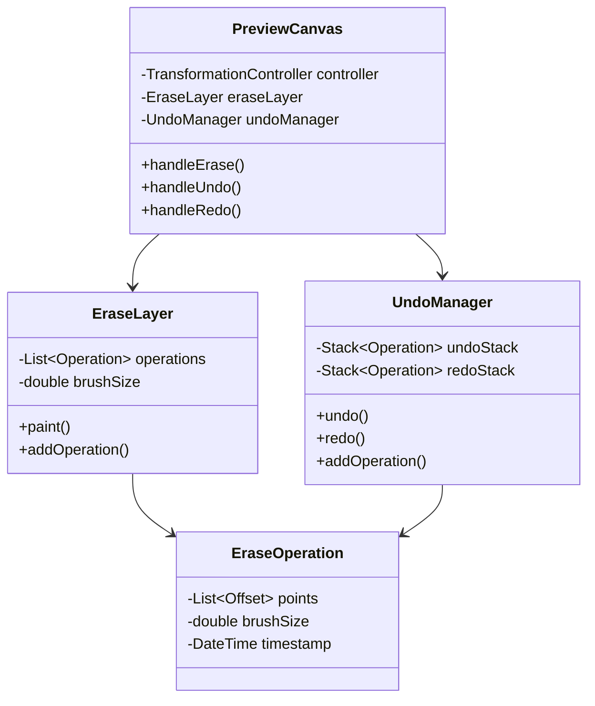
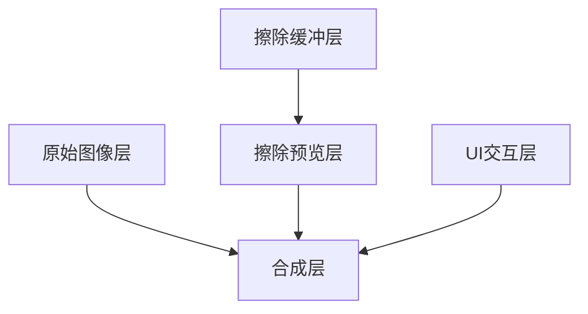
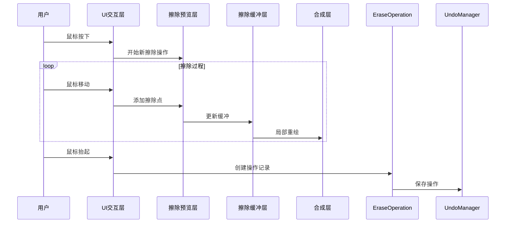
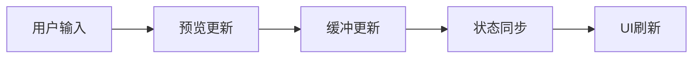

# 集字功能擦除工具优化方案

## 1. 问题分析

### 1.1 当前问题

- 擦除工具实际的鼠标点击位置和擦除轨迹存在偏移
- 擦除操作没有实时反映到图像上
- 缺少撤销/重做支持
- 性能需要优化

### 1.2 技术原因

- 坐标转换没有考虑InteractiveViewer的变换矩阵
- 擦除预览层和实际图像处理存在分离
- 缺少状态管理机制
- 图像处理性能优化不足

## 2. 实现方案

### 2.1 组件结构



### 2.2 实时预览优化

#### 2.2.1 分层渲染架构



1. 原始图像层
   - 保持原始图像不变
   - 使用RepaintBoundary优化重绘
   - 仅在图像内容变化时更新

2. 擦除预览层
   - 使用CustomPainter实现
   - 维护当前擦除操作的实时状态
   - 使用Path对象优化路径绘制

3. 擦除缓冲层
   - 存储已确认的擦除操作
   - 使用离屏渲染(OffscreenCanvas)
   - 批量处理擦除点减少重绘

4. UI交互层
   - 处理用户输入
   - 显示笔刷大小指示
   - 提供视觉反馈

#### 2.2.2 预览更新策略



#### 2.2.3 性能优化措施

1. 事件节流

```dart
class ThrottledEraseHandler {
    Timer? _throttle;
    final int throttleMs = 16; // 约60fps
    
    void handleMove(Offset point) {
        if (_throttle?.isActive ?? false) return;
        
        _throttle = Timer(Duration(milliseconds: throttleMs), () {
            // 处理擦除点
        });
    }
}
```

2. 图层缓存

```dart
class EraseBufferLayer {
    ui.Picture? _cachedPicture;
    bool _isDirty = false;
    
    void updateBuffer(List<Offset> points) {
        _isDirty = true;
        // 使用离屏渲染更新缓冲
    }
    
    void paint(Canvas canvas) {
        if (_isDirty) {
            _rebuildCache();
        }
        canvas.drawPicture(_cachedPicture!);
    }
}
```

3. 局部重绘优化

```dart
class OptimizedErasePainter extends CustomPainter {
    Rect? _lastDrawBounds;
    
    @override
    bool shouldRepaint(OptimizedErasePainter old) {
        return _calculateDirtyRect() != old._lastDrawBounds;
    }
    
    Rect _calculateDirtyRect() {
        // 计算最小重绘区域
        // 返回需要重绘的矩形区域
    }
}
```

#### 2.2.4 实时反馈机制

1. 视觉反馈

- 笔刷大小实时显示
- 擦除轨迹动态效果
- 操作边界提示

2. 状态同步



3. 异步处理

```dart
class AsyncEraseProcessor {
    final StreamController<EraseOperation> _operationStream = 
        StreamController<EraseOperation>();
        
    void processOperation(EraseOperation op) async {
        _operationStream.add(op);
    }
    
    Stream<void> get onProcessed => _operationStream.stream
        .asyncMap(_processOperation);
        
    Future<void> _processOperation(EraseOperation op) async {
        // 异步处理擦除操作
    }
}
```

## 3. 实现步骤

1. 更新PreviewCanvas组件
   - 添加TransformationController处理
   - 实现坐标转换逻辑
   - 集成撤销/重做功能

2. 创建EraseLayer组件
   - 实现实时绘制
   - 添加笔刷大小控制
   - 优化渲染性能

3. 实现UndoManager
   - 设计操作历史结构
   - 实现撤销/重做逻辑
   - 优化状态管理

4. 性能优化
   - 实现事件节流
   - 添加异步处理
   - 优化渲染逻辑

## 4. 测试计划

1. 单元测试
   - 坐标转换准确性
   - 撤销/重做功能正确性
   - 状态管理可靠性

2. 性能测试
   - 响应时间测试
   - 内存占用监控
   - 帧率稳定性测试

3. 集成测试
   - 与其他组件协作
   - 边界条件处理
   - 异常情况恢复

## 5. 注意事项

1. 确保坐标转换的准确性
2. 优化内存使用，避免内存泄漏
3. 保持用户交互的流畅性
4. 确保状态管理的可靠性
