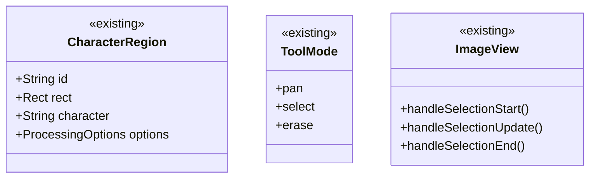
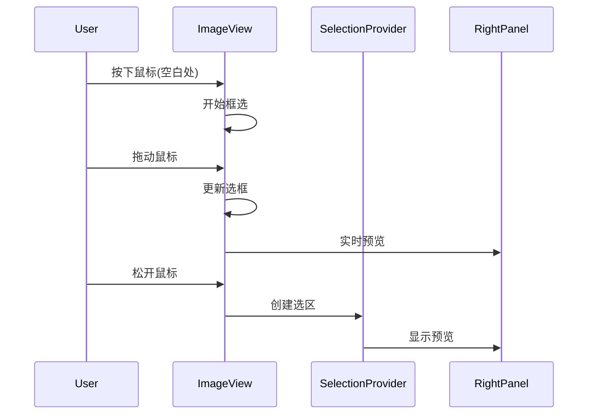
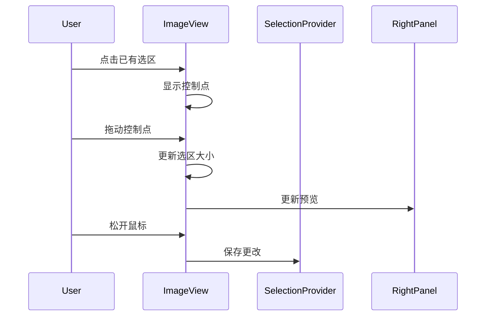

# 框选功能实现方案

## 1. 功能复用与扩展

### 1.1 复用现有对象



### 1.2 功能扩展

1. 调整工具模式处理

```dart
// 在select模式下根据点击位置判断操作类型
void handleSelectModeClick(Offset position) {
  final hitRegion = findRegionAt(position);
  if (hitRegion != null) {
    // 点击已有选区，进入调整模式
    startAdjusting(hitRegion);
  } else {
    // 点击空白处，开始框选
    startCreating(position);
  }
}
```

2. 增强选区操作

```dart
// 在ImageView中添加选区调整支持
void _handleRegionAdjust(DragUpdateDetails details) {
  if (!_isAdjusting || _activeHandle == null) return;
  
  final delta = details.delta;
  final newRect = calculateNewRect(_activeHandle!, delta);
  
  if (isValidRect(newRect)) {
    updateSelectedRegion(newRect);
  }
}
```

## 2. 核心功能增强

### 2.1 选区创建流程



### 2.2 选区调整流程



## 3. 代码修改

### 3.1 ImageView组件

```dart
class ImageView extends ConsumerStatefulWidget {
  @override
  ConsumerState<ImageView> createState() => _ImageViewState();
}

class _ImageViewState extends ConsumerState<ImageView> {
  // 复用现有属性
  final TransformationController _transformationController = ...
  bool _isInSelectionMode = false;
  
  // 新增选区调整相关属性
  HandlePosition? _activeHandle;
  bool _isAdjusting = false;
  
  @override
  Widget build(BuildContext context) {
    return Stack(
      children: [
        _buildImageLayer(),
        _buildSelectionLayer(),
        if (_isAdjusting)
          _buildAdjustmentHandles(),
      ],
    );
  }
  
  // 实现控制点拖动
  Widget _buildAdjustmentHandles() {
    return CustomPaint(
      painter: HandlesPainter(
        rect: _selectedRegion!.rect,
        activeHandle: _activeHandle,
      ),
      child: GestureDetector(
        onPanStart: _handleHandleDragStart,
        onPanUpdate: _handleHandleDragUpdate,
        onPanEnd: _handleHandleDragEnd,
      ),
    );
  }
}
```

### 3.2 选区绘制

```dart
class SelectionPainter extends CustomPainter {
  final Rect rect;
  final bool isSelected;
  final bool isAdjusting;
  
  @override
  void paint(Canvas canvas, Size size) {
    // 绘制选区边框
    final paint = Paint()
      ..style = PaintingStyle.stroke
      ..strokeWidth = isSelected ? 2.0 : 1.5;
      
    if (isAdjusting) {
      // 绘制调整状态
      paint.color = Colors.blue;
      paint.strokeWidth = 2.0;
      canvas.drawRect(rect, paint);
      _drawAdjustmentGuides(canvas);
    } else if (isSelected) {
      // 绘制选中状态
      paint.color = Colors.blue;
      canvas.drawRect(rect, paint);
    } else {
      // 绘制普通状态
      paint.color = Colors.green;
      canvas.drawRect(rect, paint);
    }
  }
}
```

## 4. 后续优化

### 4.1 交互优化

1. 增加键盘支持

```dart
void _handleKeyEvent(RawKeyEvent event) {
  if (event is RawKeyDownEvent) {
    if (event.isControlPressed) {
      // Ctrl+方向键调整大小
      _handleSizeAdjust(event.logicalKey);
    } else {
      // 方向键移动选区
      _handlePositionAdjust(event.logicalKey);
    }
  }
}
```

2. 添加对齐提示

```dart
void _drawAlignmentGuides(Canvas canvas) {
  final bounds = rect;
  final center = bounds.center;
  
  if (_isNearCenter(center.dx)) {
    _drawVerticalGuide(canvas, center.dx);
  }
  if (_isNearCenter(center.dy)) {
    _drawHorizontalGuide(canvas, center.dy);
  }
}
```

### 4.2 性能优化

1. 选区渲染优化

```dart
class SelectionLayer extends StatelessWidget {
  @override
  Widget build(BuildContext context) {
    return RepaintBoundary(
      child: CustomPaint(
        painter: SelectionPainter(...),
      ),
    );
  }
}
```

2. 预览更新节流

```dart
final _previewThrottle = Throttle(
  duration: const Duration(milliseconds: 100),
);

void updatePreview(Rect rect) {
  _previewThrottle.run(() {
    ref.read(previewProvider.notifier).updatePreview(rect);
  });
}
```

## 5. 测试计划

### 5.1 单元测试

```dart
void main() {
  group('Selection Mode Tests', () {
    test('should handle region creation', () {
      // 测试框选创建
    });
    
    test('should handle region adjustment', () {
      // 测试选区调整
    });
  });
}
```

### 5.2 Widget测试

```dart
testWidgets('should support region adjustment', (tester) async {
  await tester.pumpWidget(ImageView());
  
  // 模拟选区调整操作
  await tester.drag(find.byType(SelectionHandle), Offset(10, 10));
  await tester.pumpAndSettle();
  
  // 验证选区大小是否正确更新
  expect(find.byType(SelectionPreview), findsOneWidget);
});
```

## 6. 实现步骤

1. 基础功能整合

- [x] 复用现有的工具模式管理
- [x] 复用现有的选区状态管理
- [ ] 扩展ImageView支持选区调整

2. 选区调整功能

- [ ] 实现选区控制点
- [ ] 实现拖动调整大小
- [ ] 实现键盘微调功能

3. 界面优化

- [ ] 添加对齐参考线
- [ ] 优化选区样式
- [ ] 添加视觉反馈

4. 性能优化

- [ ] 优化重绘区域
- [ ] 优化状态更新
- [ ] 添加必要的缓存
