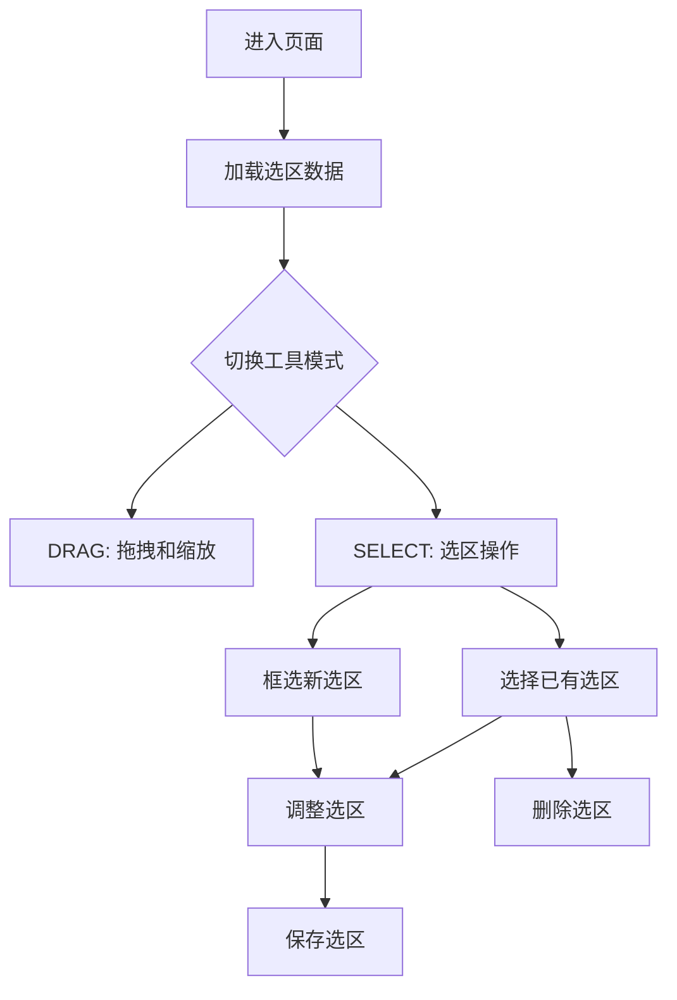
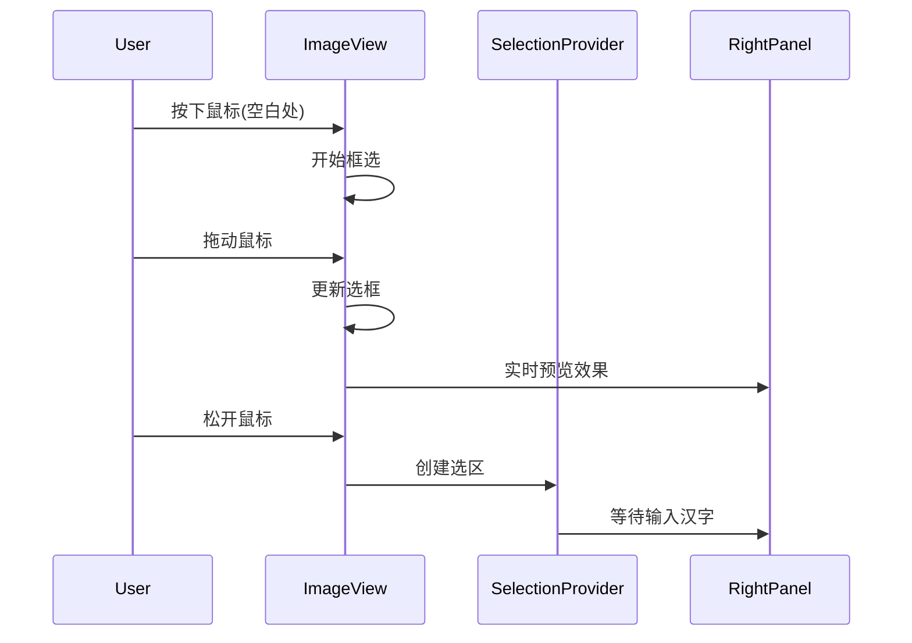

# 框选功能实现方案

## 1. 主要功能流程



## 2. 功能模块设计

### 2.1 选区加载

```dart
class CharacterCollectionNotifier {
  // 加载页面选区数据
  Future<void> loadWorkData(String workId, String pageId) async {
    // 获取页面区域（已保存的字符框）
    final regions = await _characterService.getPageRegions(pageId);
    
    // 更新状态
    state = state.copyWith(
      regions: regions,
      currentId: null,
      loading: false,
    );
  }
}
```

### 2.2 选区创建



### 2.3 选区调整

```dart
class SelectionLayer {
  Widget build(BuildContext context) {
    return Stack(
      children: [
        // 选区显示
        CustomPaint(painter: SelectionPainter(...)),
        
        // 调整控制点
        if (isSelected) _buildAdjustHandles(),
        
        // 调整参考线
        if (isAdjusting) _buildAlignmentGuides(),
      ],
    );
  }
}
```

### 2.4 选区删除

```dart
class CharacterCollectionNotifier {
  // 删除单个选区
  Future<void> deleteRegion(String id) async {
    // 1. 保存被删除的区域用于撤销
    final deletedRegion = state.regions.firstWhere((r) => r.id == id);
    
    // 2. 从数据库删除
    await _characterService.deleteCharacter(id);
    
    // 3. 更新状态
    final updatedRegions = state.regions.where((r) => r.id != id).toList();
    state = state.copyWith(
      regions: updatedRegions,
      currentId: state.currentId == id ? null : state.currentId,
    );
  }
  
  // 批量删除选区
  Future<void> deleteBatchRegions(List<String> ids) async {
    // 1. 保存被删除的区域
    final deletedRegions = state.regions.where((r) => ids.contains(r.id));
    
    // 2. 批量删除
    await _characterService.deleteBatchCharacters(ids);
    
    // 3. 更新状态
    final updatedRegions = state.regions.where((r) => !ids.contains(r.id));
    state = state.copyWith(
      regions: updatedRegions,
      selectedIds: {},
    );
  }
}
```

## 3. 实现步骤

### 3.1 第一阶段：基础框架

1. 选区数据加载

- 复用CharacterCollectionNotifier的加载逻辑
- 优化加载性能
- 处理加载错误

2. 框选基础功能

- 复用现有的框选逻辑
- 扩展ImageView支持选区调整
- 实现选区控制点

### 3.2 第二阶段：核心功能

1. 选区调整功能

- 实现拖动调整大小
- 添加对齐参考线
- 支持键盘微调

2. 选区删除功能

- 实现单选删除
- 实现多选删除
- 支持撤销恢复

### 3.3 第三阶段：优化完善

1. 界面优化

- 添加视觉反馈
- 优化选区样式
- 完善错误提示

2. 性能优化

- 选区渲染优化
- 状态更新优化
- 添加必要缓存

## 4. 错误处理

### 4.1 加载错误

```dart
Future<void> loadWorkData(String workId, String pageId) async {
  try {
    state = state.copyWith(loading: true);
    final regions = await _characterService.getPageRegions(pageId);
    state = state.copyWith(
      regions: regions,
      loading: false,
    );
  } catch (e) {
    state = state.copyWith(
      loading: false,
      error: '加载选区失败：${e.toString()}',
    );
  }
}
```

### 4.2 删除错误

```dart
Future<void> deleteRegion(String id) async {
  try {
    state = state.copyWith(processing: true);
    await _characterService.deleteCharacter(id);
    // 更新状态...
  } catch (e) {
    state = state.copyWith(
      processing: false,
      error: '删除失败：${e.toString()}',
    );
    // 显示错误提示...
  }
}
```

## 5. 测试计划

### 5.1 功能测试

```dart
void main() {
  group('选区功能测试', () {
    test('应该正确加载选区数据', () async {
      // 测试加载功能
    });
    
    test('应该支持框选创建', () async {
      // 测试框选功能
    });
    
    test('应该支持选区删除', () async {
      // 测试删除功能
    });
  });
}
```

### 5.2 异常测试

```dart
void main() {
  group('错误处理测试', () {
    test('加载失败时应该显示错误信息', () async {
      // 测试加载错误
    });
    
    test('删除失败时应该回滚状态', () async {
      // 测试删除错误
    });
  });
}
```

## 6. 注意事项

1. 数据一致性

- 确保UI状态与数据同步
- 正确处理加载和删除错误
- 保持撤销栈的准确性

2. 性能考虑

- 大量选区时的渲染性能
- 批量删除的处理效率
- 选区数据的缓存策略

3. 用户体验

- 提供清晰的视觉反馈
- 支持快捷键操作
- 添加适当的确认提示
