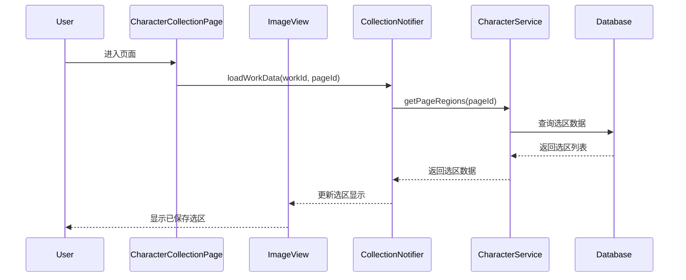
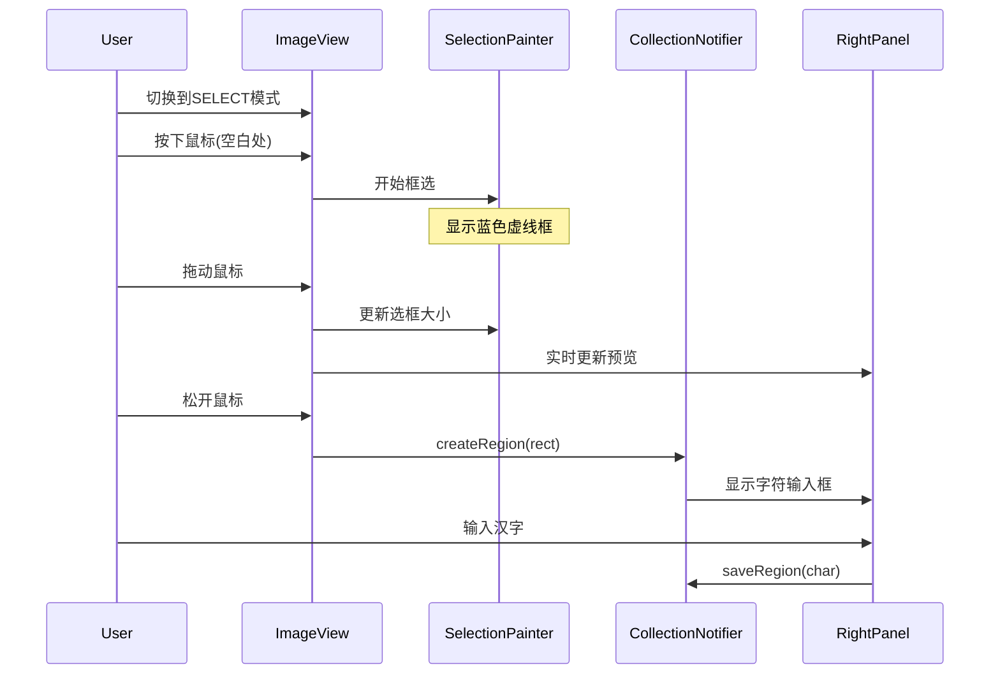
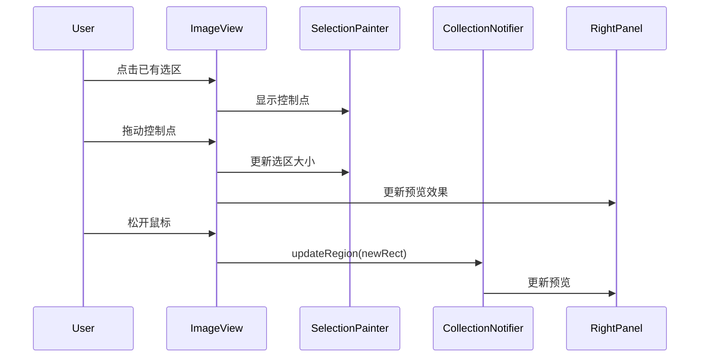
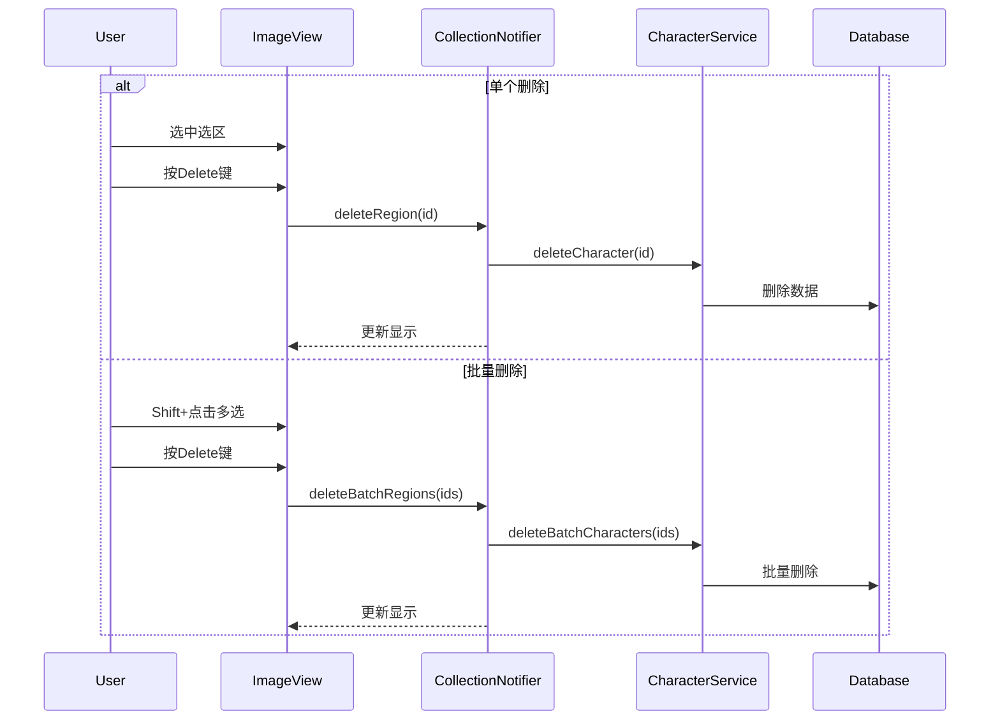
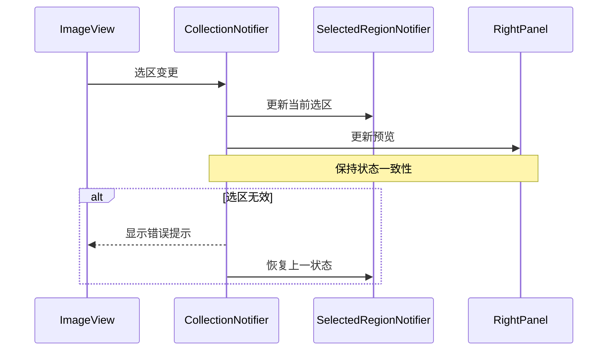
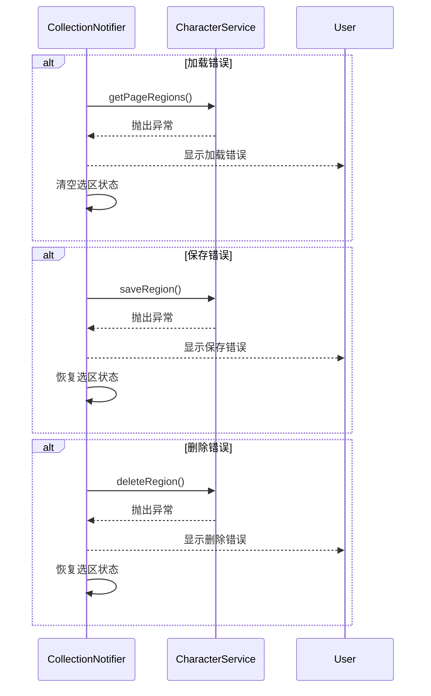
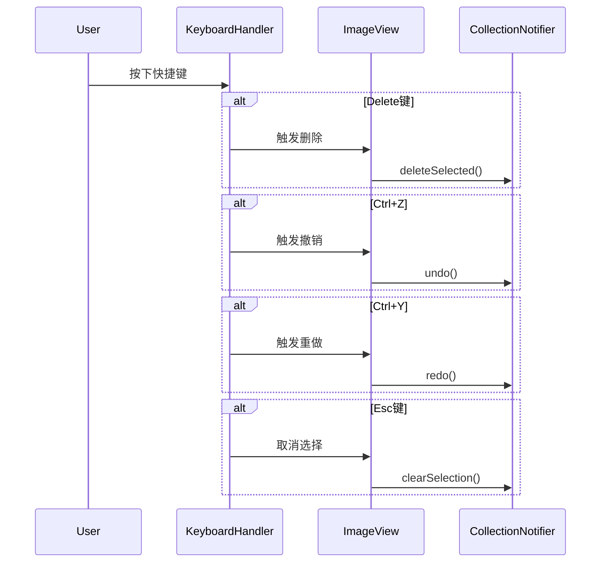
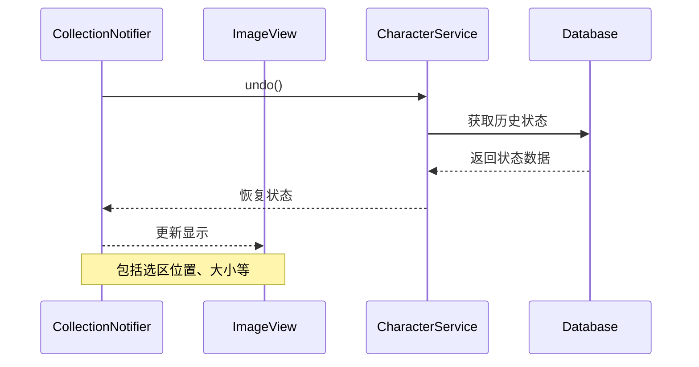

# 框选功能时序图

## 1. 页面加载流程

## 2. 框选创建流程

## 3. 选区调整流程

## 4. 选区删除流程

## 5. 状态同步流程

## 6. 错误处理流程

## 7. 快捷键操作流程

## 8. 状态恢复流程

这些时序图详细说明了各个功能模块的交互流程，有助于我们理解系统行为并确保实现的完整性。接下来我们可以按照这些流程开始逐步实现各个功能。
