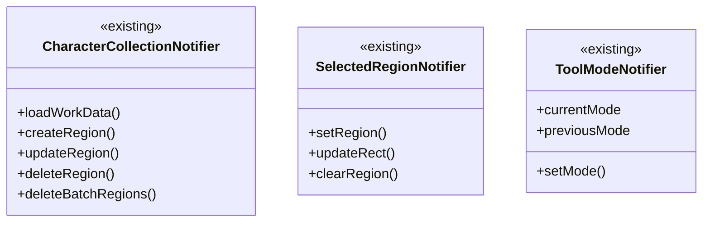
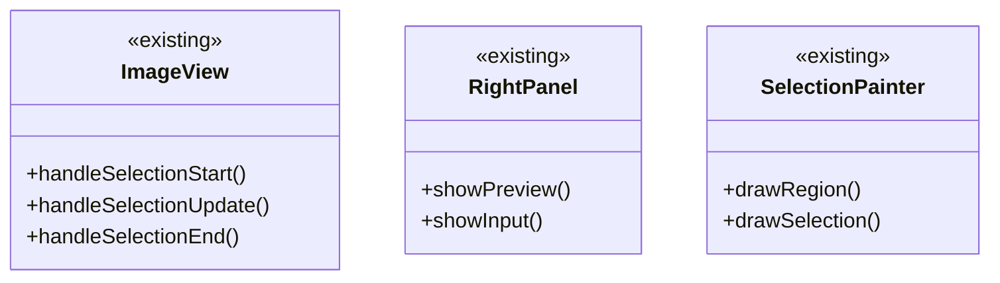
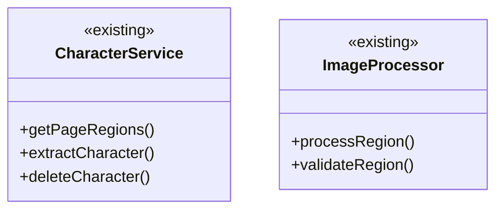
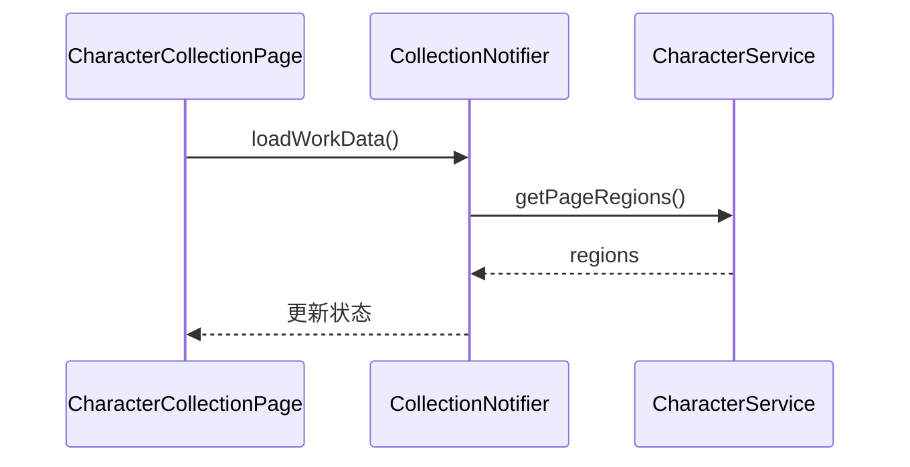
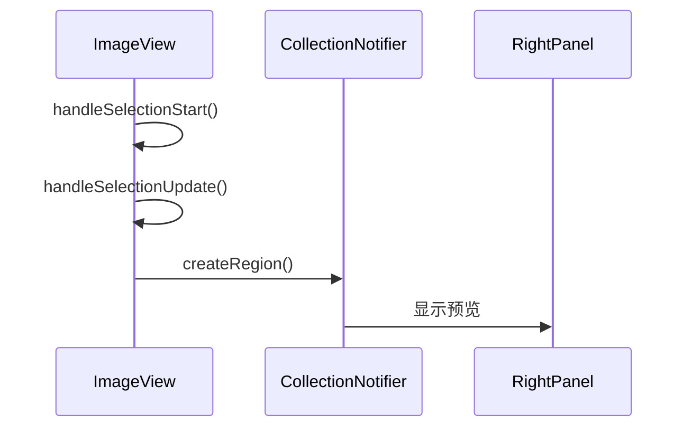

# 框选功能设计

## 1. 功能概述

### 1.1 核心需求

- 在预览区框选字符
- 调整选区大小和位置
- 保存和删除选区
- 实时预览处理效果

### 1.2 设计原则

- 复用现有对象和功能
- 保持交互逻辑一致性
- 确保状态管理稳定

## 2. 现有功能复用

### 2.1 状态管理



### 2.2 UI组件



### 2.3 服务层



## 3. 功能流程设计

### 3.1 页面加载流程



### 3.2 框选流程



### 3.3 选区调整流程

```mermaid
sequenceDiam
    participant IV as ImageView
    participant CN as CollectionNotifier
    participant RP as RightPanel
    
    IV->>CN: updateRegion()
    CN->>RP: 更新预览
```

## 4. 代码结构设计

### 4.1 状态管理

```dart
// 复用现有Notifier
class CharacterCollectionNotifier {
  // 现有方法
  Future<void> loadWorkData(String workId, String pageId);
  Future<void> createRegion(Rect rect);
  Future<void> deleteRegion(String id);
  
  // 新增方法
  void updateSelection(Rect rect);
  void completeSelection();
}
```

### 4.2 UI组件

```dart
// 扩展ImageView
class ImageView {
  // 现有属性
  final TransformationController _controller;
  final List<CharacterRegion> regions;
  
  // 新增属性
  SelectionMode _selectionMode;
  Rect? _currentSelection;
  
  // 现有方法
  void handleSelectionStart(DragStartDetails details);
  void handleSelectionUpdate(DragUpdateDetails details);
  
  // 新增方法
  void handleSelectionComplete(DragEndDetails details);
}
```

### 4.3 绘制组件

```dart
// 扩展SelectionPainter
class SelectionPainter extends CustomPainter {
  // 现有属性
  final List<CharacterRegion> regions;
  final Set<String> selectedIds;
  
  // 新增属性
  final Rect? activeSelection;
  final bool isAdjusting;
  
  // 现有方法
  void drawRegions(Canvas canvas);
  
  // 新增方法
  void drawActiveSelection(Canvas canvas);
  void drawAdjustHandles(Canvas canvas);
}
```

## 5. 实现步骤

### 5.1 阶段一：基础功能

1. 扩展ImageView

- 复用现有的选区交互
- 扩展选区状态管理
- 实现选区调整控制点

2. 增强状态管理

- 复用CharacterCollectionNotifier
- 增加选区临时状态
- 优化状态更新逻辑

### 5.2 阶段二：预览功能

1. 实时预览

- 复用现有处理逻辑
- 优化更新频率
- 添加加载状态

2. 右侧面板

- 复用现有预览组件
- 增加临时状态显示
- 优化交互反馈

### 5.3 阶段三：完善功能

1. 错误处理

- 复用现有错误处理
- 增加状态恢复
- 优化错误提示

2. 性能优化

- 复用现有缓存
- 优化重绘逻辑
- 控制更新频率

## 6. 测试计划

### 6.1 单元测试

```dart
void main() {
  group('CharacterCollectionNotifier Tests', () {
    test('should load regions', () async {
      // 复用现有测试
    });
    
    test('should update selection', () async {
      // 新增测试
    });
  });
}
```

### 6.2 Widget测试

```dart
void main() {
  testWidgets('ImageView selection test', (tester) async {
    // 复用现有测试框架
    await tester.pumpWidget(ImageView());
    
    // 新增测试用例
    await tester.drag(find.byType(ImageView), Offset(10, 10));
    await tester.pumpAndSettle();
  });
}
```

## 7. 注意事项

1. 状态一致性

- 使用现有状态管理模式
- 确保状态同步更新
- 处理临时状态切换

2. 性能优化

- 复用现有缓存机制
- 优化预览更新频率
- 控制重绘范围

3. 错误处理

- 使用现有错误处理模式
- 提供清晰的错误提示
- 支持状态恢复
