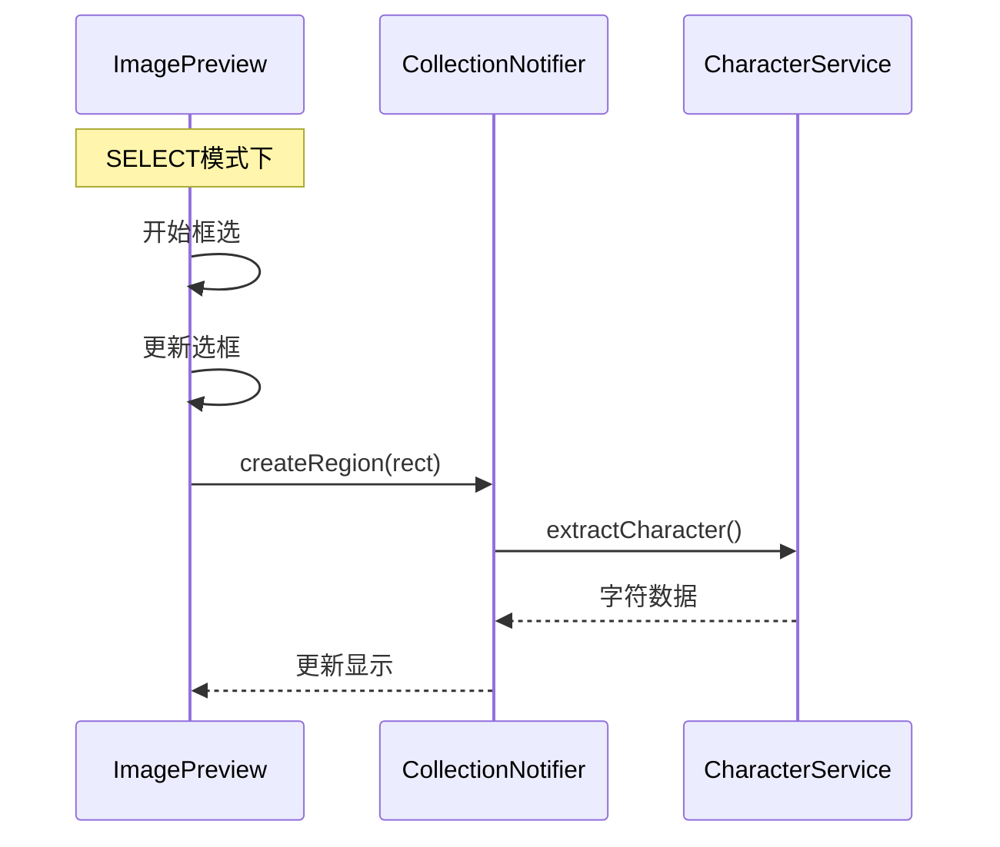
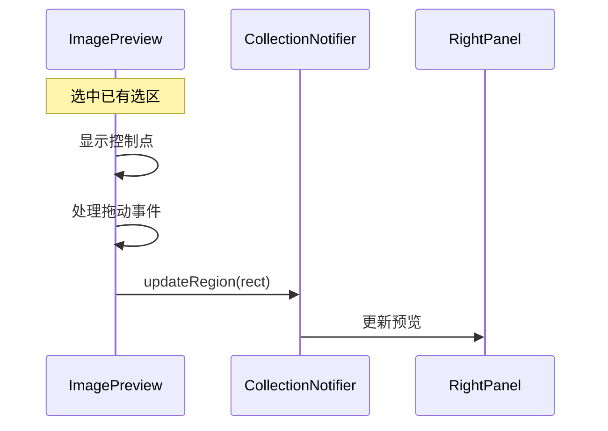

# 框选功能设计

## 1. 功能概述

### 1.1 核心需求

- 在预览区创建和调整字符选区
- 实时预览选区的处理效果
- 保存和删除选区数据
- 提供多选和批量操作

### 1.2 现有功能复用

1. 数据模型

```dart
// 复用CharacterRegion
class CharacterRegion {
  String id;
  String workId;
  String pageId;
  Rect rect;
  String character;
  List<Offset>? erasePoints;
  double? rotation;
  ProcessingOptions options;
}
```

2. 工具模式

```dart
// 复用Tool枚举
enum Tool {
  pan,    // 拖拽和缩放
  select, // 选择和框选
  erase,  // 擦除
}
```

3. 状态管理

```dart
// 复用状态通知器
class CharacterCollectionNotifier {
  List<CharacterRegion> regions;
  String? currentId;
  Set<String> selectedIds;
  List<UndoAction> undoStack;
}
```

## 2. 功能流程设计

### 2.1 创建流程



### 2.2 调整流程



## 3. 实现方案

### 3.1 ImagePreview扩展

```dart
class ImagePreview extends ConsumerWidget {
  // 复用现有属性
  final TransformationController controller;
  final List<CharacterRegion> regions;
  
  // 现有组件
  Widget _buildImageLayer() {...}
  Widget _buildSelectionLayer() {...}
  
  // 扩展选区相关方法
  void _handlePanStart(DragStartDetails details) {
    final tool = ref.read(toolModeProvider);
    if (tool == Tool.select) {
      _startSelection(details.localPosition);
    }
  }
  
  void _handlePanUpdate(DragUpdateDetails details) {
    if (_isSelecting) {
      _updateSelection(details.localPosition);
    }
  }
}
```

### 3.2 RegionsPainter增强

```dart
class RegionsPainter extends CustomPainter {
  // 复用现有属性
  final List<CharacterRegion> regions;
  final Set<String> selectedIds;
  final CoordinateTransformer transformer;
  
  // 扩展绘制方法
  void paint(Canvas canvas, Size size) {
    // 1. 绘制所有已保存选区
    for (final region in regions) {
      _drawRegion(canvas, region, selectedIds.contains(region.id));
    }
    
    // 2. 绘制当前选区
    if (_activeRect != null) {
      _drawActiveRegion(canvas, _activeRect!);
    }
    
    // 3. 绘制控制点
    if (_isAdjusting) {
      _drawControlPoints(canvas);
    }
  }
}
```

### 3.3 状态更新优化

```dart
class CharacterCollectionNotifier {
  // 复用现有方法
  Future<void> createRegion(Rect rect) async {
    // 1. 创建选区
    final region = CharacterRegion.create(
      rect: rect,
      workId: _currentWorkId!,
      pageId: _currentPageId!,
    );
    
    // 2. 添加到列表
    state = state.copyWith(
      regions: [...state.regions, region],
      currentId: region.id,
    );
    
    // 3. 触发预览更新
    _updatePreview(region);
  }
  
  // 优化更新逻辑
  Future<void> updateRegion(String id, Rect newRect) async {
    final index = state.regions.indexWhere((r) => r.id == id);
    if (index < 0) return;
    
    // 1. 更新选区
    final region = state.regions[index];
    final updatedRegion = region.copyWith(rect: newRect);
    
    // 2. 更新状态
    final regions = [...state.regions];
    regions[index] = updatedRegion;
    
    state = state.copyWith(
      regions: regions,
      lastOperation: RegionOperation(
        type: OperationType.update,
        regionId: id,
        oldRect: region.rect,
        newRect: newRect,
      ),
    );
    
    // 3. 触发预览更新
    _updatePreview(updatedRegion);
  }
}
```

## 4. 性能优化

### 4.1 选区渲染优化

1. 使用RepaintBoundary隔离重绘区域

```dart
Widget build(BuildContext context) {
  return Stack(
    children: [
      RepaintBoundary(child: _buildImageLayer()),
      RepaintBoundary(child: _buildSelectionLayer()),
    ],
  );
}
```

2. 缓存选区路径

```dart
class RegionsPainter {
  final Map<String, Path> _pathCache = {};
  
  Path _getRegionPath(CharacterRegion region) {
    return _pathCache.putIfAbsent(region.id, () {
      return Path()..addRect(region.rect);
    });
  }
}
```

### 4.2 预览更新优化

1. 节流处理

```dart
final _previewThrottle = Throttle(
  duration: const Duration(milliseconds: 100),
);

void _updatePreview(CharacterRegion region) {
  _previewThrottle.run(() {
    ref.read(previewProvider.notifier).updatePreview(region);
  });
}
```

2. 取消未完成的处理

```dart
Future<void> updatePreview(CharacterRegion region) async {
  _currentTask?.cancel();
  _currentTask = CancelableOperation.fromFuture(
    _processRegion(region),
  );
  await _currentTask?.value;
}
```

## 5. 错误处理

### 5.1 选区验证

```dart
bool _validateRegion(Rect rect) {
  // 1. 检查大小
  if (rect.width < 20 || rect.height < 20) {
    _showError('选区太小，请重新框选');
    return false;
  }
  
  // 2. 检查位置
  if (!_isWithinBounds(rect)) {
    _showError('选区超出图片范围');
    return false;
  }
  
  return true;
}
```

### 5.2 状态恢复

```dart
void _handleError(dynamic error) {
  // 1. 恢复到上一个状态
  if (state.lastOperation != null) {
    _rollback(state.lastOperation!);
  }
  
  // 2. 显示错误
  _showError(error.toString());
  
  // 3. 清除临时状态
  _clearTemporaryState();
}
```

## 6. 测试要点

### 6.1 功能测试

1. 选区操作

- 创建新选区
- 调整选区大小
- 移动选区位置
- 删除选区

2. 多选操作

- Shift选择多个
- 批量删除
- 清除选择

### 6.2 异常测试

1. 输入验证

- 选区大小限制
- 位置范围检查
- 重叠处理

2. 错误处理

- 加载失败
- 保存失败
- 删除失败

### 6.3 性能测试

1. 渲染性能

- 大量选区显示
- 频繁更新处理
- 内存占用监控

2. 交互响应

- 拖动流畅度
- 预览更新延迟
- 状态同步及时性
