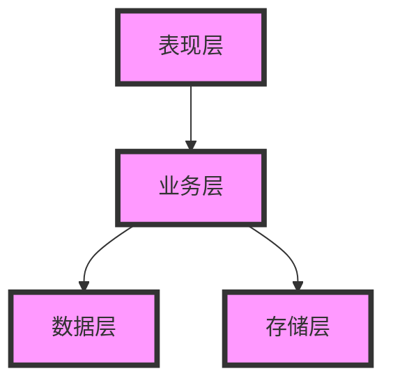
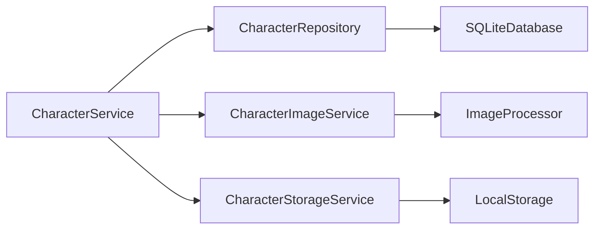
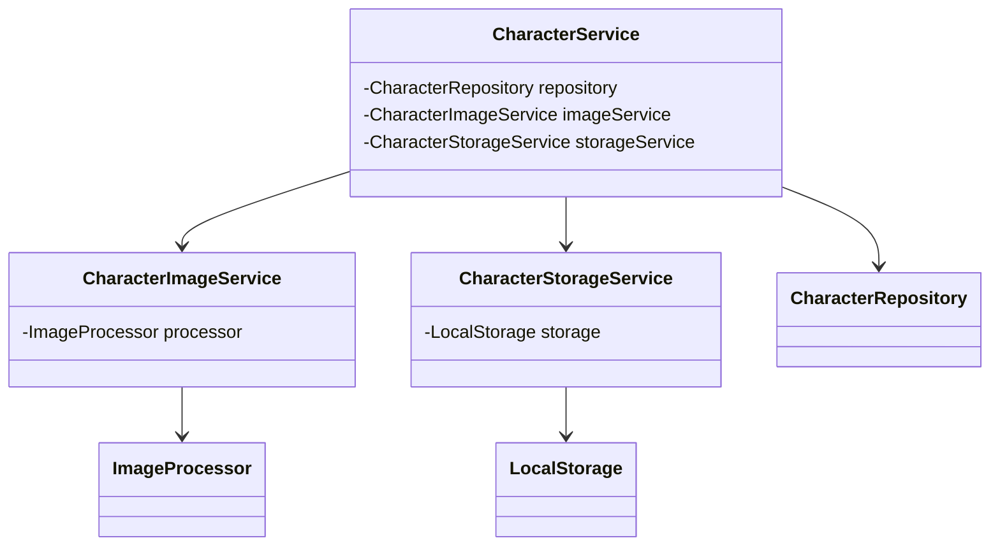

## 1. 整体架构

### 1.1 分层结构



### 1.2 核心组件



### 1.3 代码组织

```text
lib
  /application/services/character/
    character_image_service.dart    // 字符图像服务
    character_service.dart          // 字符服务实现
    character_storage_service.dart  // 字符存储服务
  /application/repositories/      
    character_repository_impl.dart  // 字符仓储实现
  /domain/models/character/
    character_entity.dart          // 字符实体定义
    character_region.dart          // 区域信息定义
  /presentation/
    /pages/character
      character_collection_page.dart    
    /viewmodels
      character_collection_viewmodel.dart
    /providers/character/
      character_collection_provider.dart      // 字符状态管理
    /widgets/character/
      character_grid.dart         // 字符网格组件
      region_selector.dart        // 区域选择组件
```

## 2. 组件职责

### 2.1 业务层组件

#### CharacterService

- 集字业务流程协调
- 字符处理任务调度
- 状态管理和通知

#### CharacterImageService

- 图像处理和转换
- 区域提取处理
- 图像效果应用

#### CharacterStorageService

- 文件存储管理
- 目录结构维护
- 缓存控制

### 2.2 数据层组件

#### CharacterRepository

- 字符数据存取
- 查询和过滤
- 数据完整性维护

### 2.3 基础设施组件

#### ImageProcessor

- 基础图像处理
- 图像格式转换
- 性能优化

#### LocalStorage

- 文件系统操作
- 存储空间管理
- 文件完整性验证

## 3. 依赖关系

### 3.1 组件依赖



### 3.2 接口定义

```dart
class CharacterService {
  final CharacterRepository _repository;
  final CharacterImageService _imageService;
  final CharacterStorageService _storageService;
  
  Future<String> extractCharacter(String pageId, Rect region);
  Future<void> updateCharacter(String id, ProcessingOptions options);
  Future<void> deleteCharacter(String id);
  Future<List<CharacterViewModel>> listCharacters(String pageId);
}
```

## 4. 扩展设计

### 4.1 扩展点

- 图像处理插件机制
- 存储策略定制
- 数据迁移接口

### 4.2 性能考虑

- 图像处理异步化
- 缓存优化策略
- 批量操作支持

### 4.3 组件复用策略

- 复用EnhancedWorkPreview组件代替自实现图像预览组件
- 分离关注点：基础预览功能与选框交互功能解耦
- 使用组合模式而非继承方式扩展功能

## 5. 对象映射关系

为了保持文档的一致性，以下是业务层对象与UI组件之间的映射关系：

| 业务层对象 | UI组件 | 说明 |
|-----------|--------|------|
| CharacterService | CharacterCollectionProvider | 业务服务与状态管理 |
| CharacterImageProcessor | PreviewCanvas | 图像处理与显示组件 |
| EraseManager | EraseLayer | 擦除功能与UI实现 |
| ProcessingOptions | EditToolbar | 处理选项与工具栏 |
| CharacterRepository | CharacterGridView | 数据访问与展示组件 |

### 5.1 图像预览组件

EnhancedWorkPreview是应用中现有的作品预览组件，在集字功能中被复用为基础预览组件，替代了最初设计中的ZoomableImageView。

### 5.2 功能与组件对应

- **图像处理流程**: CharacterImageProcessor → PreviewCanvas → 处理结果展示
- **框选功能**: SelectionTool → SelectionOverlay → CharacterRegion
- **擦除功能**: EraseManager → EraseLayer → 擦除结果应用
- **数据管理**: CharacterRepository → CharacterCollectionProvider → CharacterGridView
