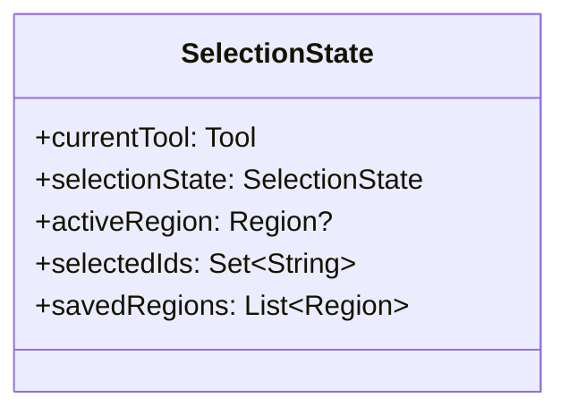
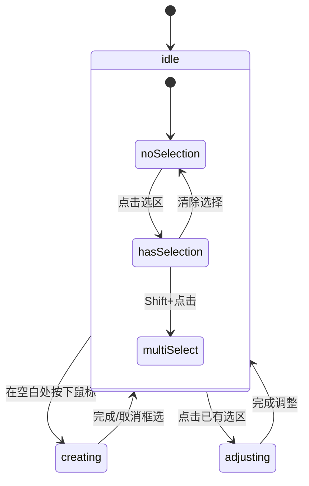

# 选区功能实现方案

## 1. 工具模式设计

### 1.1 基本模式

```dart
enum Tool {
  /// 拖拽和缩放图片
  drag,
  
  /// 选区操作（框选/选择/调整）
  select,
}
```

### 1.2 SELECT模式下的子状态

```dart
enum SelectionState {
  /// 空闲状态，等待用户操作
  idle,
  
  /// 正在框选新区域
  creating,
  
  /// 正在调整选区
  adjusting,
}
```

## 2. 状态管理

### 2.1 主要状态对象



### 2.2 状态转换



## 3. 交互流程

### 3.1 创建新选区

1. SELECT模式下，在空白处按下鼠标
2. 拖动显示预选框
3. 实时在右侧显示预览效果
4. 松开鼠标完成框选
5. 调整控制点可以修改大小
6. 输入对应汉字后保存

### 3.2 修改已有选区

1. SELECT模式下点击选区
2. 显示调整控制点
3. 拖动控制点调整大小
4. 拖动选区内部移动位置
5. 实时更新右侧预览
6. 可以修改原有汉字
7. 确认修改后保存

### 3.3 多选操作

1. 按住Shift点击选区
2. 支持选择多个选区
3. 可以批量删除
4. 暂不支持批量调整

## 4. 对象设计

### 4.1 基础对象

```dart
class SelectionRegion {
    String? id;            // 已保存选区才有ID
    Rect rect;            // 选区位置和大小
    String? character;     // 对应的汉字
    bool isSaved;         // 是否已保存
    
    // 转换为数据库对象
    CharacterRegion toEntity() { ... }
    
    // 从数据库对象创建
    factory fromEntity(CharacterRegion entity) { ... }
}
```

### 4.2 状态管理对象

```dart
class SelectionNotifier extends StateNotifier<SelectionState> {
    // 切换工具
    void setTool(Tool tool) { ... }
    
    // 开始框选
    void startCreating(Offset position) { ... }
    
    // 更新框选
    void updateCreating(Offset position) { ... }
    
    // 完成框选
    void finishCreating() { ... }
    
    // 开始调整
    void startAdjusting(String id) { ... }
    
    // 更新调整
    void updateAdjusting(Rect newRect) { ... }
    
    // 完成调整
    void finishAdjusting() { ... }
    
    // 选择操作
    void toggleSelection(String id) { ... }
    void clearSelection() { ... }
    
    // 保存操作
    Future<void> save(String character) { ... }
}
```

## 5. 文件结构

```
lib/
├── domain/
│   └── models/
│       └── selection/
│           ├── selection_state.dart
│           └── selection_region.dart
├── presentation/
│   ├── providers/
│   │   └── selection/
│   │       └── selection_provider.dart
│   └── widgets/
│       └── character_collection/
│           ├── selection_layer.dart
│           └── selection_handles.dart
└── application/
    └── services/
        └── selection/
            └── selection_service.dart
```

## 6. 实现步骤

1. 基础框架搭建

- 创建基础数据模型
- 实现状态管理器
- 搭建基础UI框架

2. 核心功能实现

- 框选创建功能
- 选区调整功能
- 预览更新功能

3. 界面完善

- 调整控制点
- 视觉反馈
- 保存对话框

4. 性能优化

- 添加重绘边界
- 优化状态更新
- 控制预览频率

## 7. 注意事项

1. 体验优化

- 框选时显示对齐参考线
- 调整时保持宽高比
- 提供合适的光标样式

2. 性能优化

- 避免频繁重建
- 减少不必要的预览
- 优化图片处理

3. 错误处理

- 处理无效选区
- 提供错误提示
- 支持操作回退
