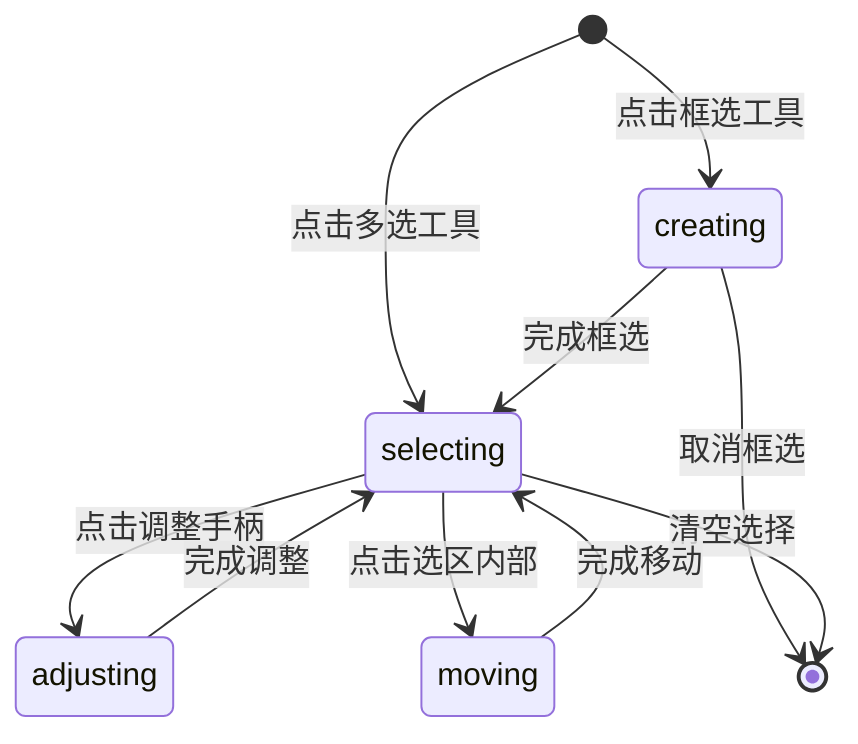

# 选区模式设计

## 1. SelectionMode定义

```dart
/// 选区模式枚举
enum SelectionMode {
  /// 框选模式：创建新字符区域
  creating,
  
  /// 多选模式：选择已有字符区域
  selecting,
  
  /// 调整模式：调整选中区域的大小和角度
  adjusting,
  
  /// 移动模式：移动选中的区域
  moving,
}
```

## 2. 状态管理

```dart
/// 选区模式状态管理器
abstract class SelectionModeState {
  final SelectionMode mode;
  final Set<String> selectedIds;
  final CharacterRegion? activeRegion;
  final bool isAdjusting;
  final bool isMoving;
  
  // ...其他状态属性
}

/// 选区模式Provider
final selectionModeProvider = StateNotifierProvider<SelectionModeNotifier, SelectionModeState>((ref) {
  return SelectionModeNotifier();
});
```

## 3. 状态转换



## 4. 组件交互

### 4.1 与Tool枚举的配合

```dart
// 使用示例
void handleToolChange(Tool tool) {
  switch (tool) {
    case Tool.select:
      // 根据上下文决定是框选还是多选模式
      selectionMode.value = hasSelection 
          ? SelectionMode.selecting 
          : SelectionMode.creating;
      break;
    case Tool.pan:
      // 清空选择并退出选区相关模式
      selectionMode.value = null;
      break;
    // ...其他工具处理
  }
}
```

### 4.2 选区状态转换

```dart
// 模式切换逻辑示例
void handleSelectionModeChange(SelectionMode mode) {
  switch (mode) {
    case SelectionMode.creating:
      clearSelection();
      showCreateUI();
      break;
    case SelectionMode.selecting:
      enableSelectionUI();
      break;
    case SelectionMode.adjusting:
      showAdjustHandles();
      break;
    case SelectionMode.moving:
      showMoveUI();
      break;
  }
}
```

## 5. 选区操作实现

### 5.1 新建选区

```dart
void handleCreateSelection(Offset start, Offset end) {
  if (mode == SelectionMode.creating) {
    final rect = Rect.fromPoints(start, end);
    if (rect.size >= minSize) {
      createNewRegion(rect);
      mode = SelectionMode.selecting;
    }
  }
}
```

### 5.2 选择已有选区

```dart
void handleRegionSelection(String id, {bool isMultiSelect = false}) {
  if (mode == SelectionMode.selecting) {
    if (isMultiSelect) {
      toggleSelection(id);
    } else {
      selectSingle(id);
    }
    updateSelectionUI();
  }
}
```

### 5.3 调整选区

```dart
void handleRegionAdjust(String id, AdjustHandle handle) {
  if (mode == SelectionMode.selecting) {
    setActiveRegion(id);
    mode = SelectionMode.adjusting;
    startAdjusting(handle);
  }
}
```

### 5.4 移动选区

```dart
void handleRegionMove(String id) {
  if (mode == SelectionMode.selecting && selectedIds.contains(id)) {
    mode = SelectionMode.moving;
    startMoving();
  }
}
```

## 6. UI交互反馈

### 6.1 鼠标指针样式

| 模式 | 区域 | 指针样式 |
|-----|------|---------|
| creating | 画布 | crosshair |
| selecting | 选区内部 | pointer |
| selecting | 选区外部 | default |
| adjusting | 调整手柄 | resize-* |
| adjusting | 旋转控制点 | rotate |
| moving | 选区内部 | move |

### 6.2 选区视觉样式

| 状态 | 边框样式 | 颜色 |
|-----|---------|------|
| 正在框选 | 虚线(1.5px) | 蓝色 |
| 已保存 | 实线(1.5px) | 绿色 |
| 已选中 | 实线(2.0px) | 蓝色 |
| 调整中 | 动态虚线(1.5px) | 蓝色 |

## 7. 性能优化

1. 使用RepaintBoundary隔离重绘区域
2. 选区数据变化时局部更新
3. 拖动操作使用节流处理
4. 缓存计算结果减少重复运算

## 8. 注意事项

1. 确保选区操作的精确性和流畅性
2. 提供清晰的视觉反馈
3. 支持键盘快捷键操作
4. 处理好边界情况
5. 保持与现有Tool模式的协调

## 9. 后续扩展

1. 支持更多调整控制点
2. 添加对齐吸附功能
3. 支持选区的复制/粘贴
4. 添加选区的撤销/重做
