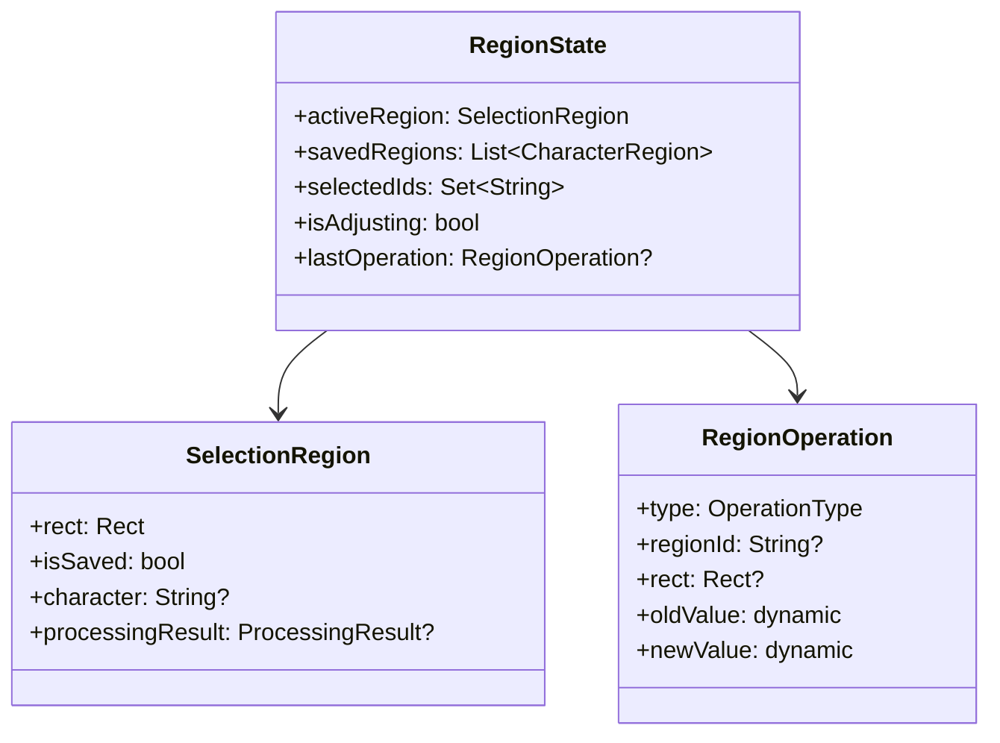
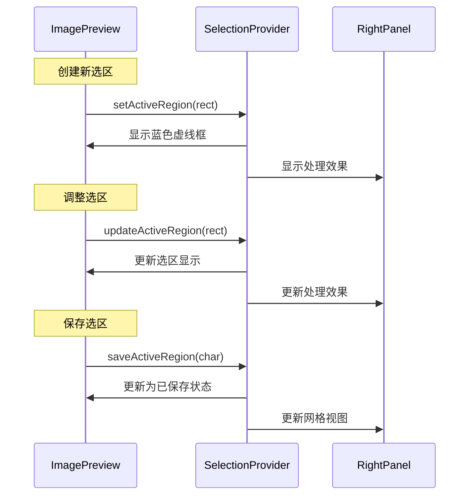

# 选区状态管理设计

## 1. 选区状态类型



## 2. 选区分类与处理

### 2.1 活动选区(activeRegion)

- 无论是新建还是选中已有选区，都存储在activeRegion中
- 在左侧预览区显示选区边框
- 同时在右侧面板显示处理效果
- 根据isSaved状态决定显示样式和行为

### 2.2 新建选区状态

```dart
final activeRegion = SelectionRegion(
  rect: rect,
  isSaved: false,
  character: null,
  processingResult: await processRegion(rect),
);
```

### 2.3 已保存选区状态

```dart
final activeRegion = SelectionRegion(
  rect: existingRegion.rect,
  isSaved: true,
  character: existingRegion.character,
  processingResult: existingRegion.processingResult,
);
```

## 3. 界面联动



## 4. 选区操作实现

### 4.1 选区创建与预览

```dart
Future<void> handleNewSelection(Rect rect) async {
  // 1. 处理选区图像
  final result = await processRegion(rect);
  
  // 2. 更新状态
  state = state.copyWith(
    activeRegion: SelectionRegion(
      rect: rect,
      isSaved: false,
      processingResult: result,
    )
  );
}
```

### 4.2 选区调整

```dart
void handleAdjustment(Rect newRect) async {
  if (state.activeRegion == null) return;
  
  // 1. 处理新位置的图像
  final result = await processRegion(newRect);
  
  // 2. 更新状态
  state = state.copyWith(
    activeRegion: state.activeRegion.copyWith(
      rect: newRect,
      processingResult: result,
    )
  );
  
  // 3. 如果是已保存选区，同步到数据库
  if (state.activeRegion.isSaved) {
    await syncToDatabase();
  }
}
```

### 4.3 选区保存

```dart
Future<void> saveActiveRegion(String character) async {
  if (state.activeRegion == null) return;
  
  try {
    // 1. 创建字符记录
    final region = CharacterRegion.create(
      rect: state.activeRegion.rect,
      character: character,
      processingResult: state.activeRegion.processingResult,
    );
    
    // 2. 保存到数据库
    await saveToDatabase(region);
    
    // 3. 更新状态
    state = state.copyWith(
      activeRegion: state.activeRegion.copyWith(isSaved: true),
      savedRegions: [...state.savedRegions, region],
    );
    
  } catch (e) {
    handleError('保存失败：$e');
  }
}
```

## 5. 性能优化

### 5.1 图像处理优化

1. 缓存处理结果避免重复计算
2. 使用异步处理避免阻塞UI
3. 取消未完成的处理任务

### 5.2 状态更新优化

1. 合并短时间内的状态更新
2. 延迟处理不急需的更新
3. 优化重绘区域计算

## 6. 错误处理

### 6.1 图像处理错误

```dart
void handleProcessingError(dynamic error) {
  // 1. 恢复到上一个有效状态
  state = state.copyWith(
    activeRegion: state.lastValidRegion,
  );
  
  // 2. 显示错误提示
  showErrorMessage('处理失败：$e');
}
```

### 6.2 保存错误

```dart
void handleSaveError(dynamic error) {
  // 1. 保持选区和预览状态
  // 2. 显示错误提示并允许重试
  showErrorDialog(
    message: '保存失败：$e',
    retryAction: () => saveActiveRegion(),
  );
}
```

## 7. 注意事项

1. 状态一致性

- 确保左右两侧面板状态同步
- 处理图像加载失败情况
- 保持UI响应性

2. 用户体验

- 提供及时的视觉反馈
- 支持操作的取消和重试
- 有效管理处理延迟

3. 资源管理

- 及时释放不需要的图像资源
- 取消不再需要的处理任务
- 优化内存使用

4. 扩展性

- 支持新的图像处理选项
- 预留自定义处理接口
- 便于添加新的交互功能
