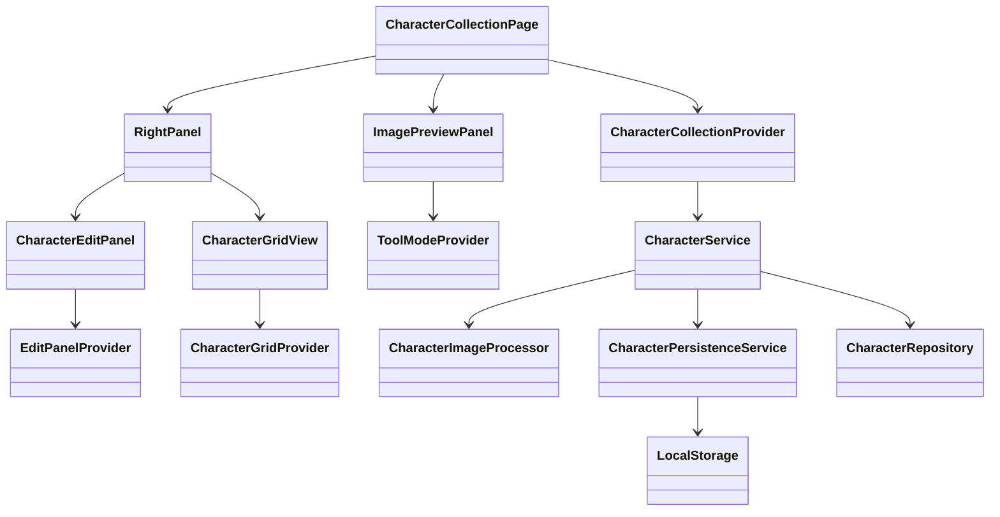
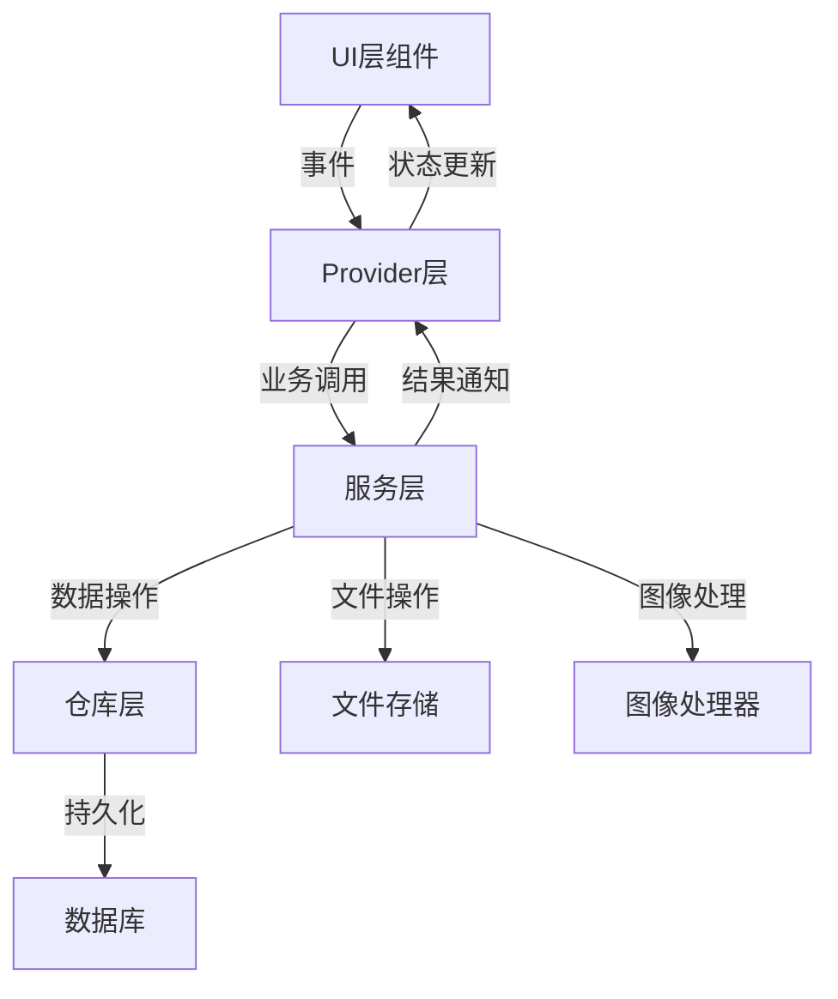

# 集字功能设计文档 - 对象设计与关系

基于现有文档和代码基础，我设计了完整的集字功能对象架构。本文档详细描述所有对象的主要接口、文件分布以及对象间关系，并考虑了对现有对象的复用。

## 1. 领域对象设计

### 1.1 核心领域模型

| 对象名称 | 主要职责 | 文件路径 | 复用/新增 |
|---------|---------|----------|---------|
| CharacterRegion | 表示框选的字符区域，包含位置、大小和旋转角度 | domain/models/character/character_region.dart | 复用并扩展 |
| ProcessingOptions | 图像处理参数选项集合，包括二值化、反转等 | domain/models/character/processing_options.dart | 复用 |
| CharacterImage | 处理后的字符图像及其元数据 | domain/models/character/character_image.dart | 复用并扩展 |
| CharacterViewModel | UI层展示用的字符数据视图模型 | presentation/viewmodels/character_collection_viewmodel.dart | 新增 |

```dart
// domain/models/character/character_region.dart
class CharacterRegion {
  final String id;
  final String pageId;
  final Rect rect;
  final double rotation;
  final String character;
  final DateTime createdAt;
  final DateTime updatedAt;
  final ProcessingOptions options;
  final List<Offset>? erasePoints;
  
  // 方法略...
}

// domain/models/character/processing_options.dart
class ProcessingOptions {
  final bool inverted;
  final bool showContour;
  final double threshold;
  final double noiseReduction;
  
  // 方法略...
}

// presentation/viewmodels/character_collection_viewmodel.dart
class CharacterViewModel {
  final String id;
  final String pageId;
  final String character;
  final Rect rect;
  final String thumbnailPath;
  final DateTime createdAt;
  final DateTime updatedAt;
  final bool isFavorite;
  
  // 方法略...
}
```

### 1.2 辅助领域对象

| 对象名称 | 主要职责 | 文件路径 | 复用/新增 |
|---------|---------|----------|---------|
| DetectedOutline | 检测到的字符轮廓信息 | domain/models/character/detected_outline.dart | 新增 |
| ProcessingResult | 字符图像处理结果 | domain/models/character/processing_result.dart | 新增 |
| Tool | 集字工具枚举 | domain/enums/character_tool.dart | 新增 |
| UndoAction | 表示可撤销的操作 | domain/models/character/undo_action.dart | 新增 |

```dart
// domain/models/character/detected_outline.dart
class DetectedOutline {
  final Rect boundingRect;
  final List<List<Offset>> contourPoints;
  
  // 方法略...
}

// domain/models/character/processing_result.dart
class ProcessingResult {
  final Uint8List originalCrop;
  final Uint8List binaryImage;
  final Uint8List thumbnail;
  final String? svgOutline;
  final Rect boundingBox;
  
  // 方法略...
}

// domain/enums/character_tool.dart
enum Tool {
  pan,
  selection,
  multiSelect,
  erase
}

// domain/models/character/undo_action.dart
class UndoAction {
  final UndoActionType type;
  final dynamic data;
  
  // 方法略...
}

enum UndoActionType {
  create,
  update,
  delete,
  erase,
  batch
}
```

## 2. 仓库层设计

### 2.1 仓库接口

| 对象名称 | 主要职责 | 文件路径 | 复用/新增 |
|---------|---------|----------|---------|
| CharacterRepository | 字符数据存取接口 | domain/repositories/character_repository.dart | 复用并扩展 |

```dart
// domain/repositories/character_repository.dart
abstract class CharacterRepository {
  Future<List<CharacterEntity>> findByWorkId(String workId);
  Future<CharacterEntity?> findById(String id);
  Future<String> create(CharacterEntity entity);
  Future<void> update(CharacterEntity entity);
  Future<void> delete(String id);
  Future<void> deleteBatch(List<String> ids);
  Future<List<CharacterEntity>> search(String query);
  Future<String> getThumbnailPath(String id);
  Future<CharacterEntity> getCharacterDetails(String id);
}
```

### 2.2 仓库实现

| 对象名称 | 主要职责 | 文件路径 | 复用/新增 |
|---------|---------|----------|---------|
| CharacterRepositoryImpl | 字符仓库实现 | application/repositories/character_repository_impl.dart | 复用并扩展 |
| CharacterPersistenceService | 字符持久化服务 | application/services/character/character_persistence_service.dart | 新增 |

```dart
// application/repositories/character_repository_impl.dart
class CharacterRepositoryImpl implements CharacterRepository {
  final Database _database;
  final FileStorage _fileStorage;
  
  // 实现方法略...
}

// application/services/character/character_persistence_service.dart
class CharacterPersistenceService {
  final String _baseStoragePath;
  final Database _db;
  
  Future<String> saveCharacter(CharacterRegion region, ProcessingResult result, String character) async {
    // 实现略...
  }
  
  Future<void> updateCharacter(String id, CharacterRegion region, ProcessingResult? result, String character) async {
    // 实现略...
  }
  
  Future<void> deleteCharacter(String id) async {
    // 实现略...
  }
  
  // 其他方法略...
}
```

## 3. 服务层设计

### 3.1 字符处理服务

| 对象名称 | 主要职责 | 文件路径 | 复用/新增 |
|---------|---------|----------|---------|
| CharacterService | 字符业务处理服务 | application/services/character/character_service.dart | 复用并扩展 |
| CharacterImageProcessor | 字符图像处理 | application/services/image/character_image_processor.dart | 复用并扩展 |
| EraseManager | 擦除操作管理 | application/services/image/erase_manager.dart | 新增 |

```dart
// application/services/character/character_service.dart
class CharacterService {
  final CharacterRepository _repository;
  final CharacterImageProcessor _imageProcessor;
  final CharacterPersistenceService _persistenceService;
  
  Future<String> extractCharacter(String pageId, Rect region, ProcessingOptions options) async {
    // 实现略...
  }
  
  Future<void> updateCharacter(String id, CharacterRegion region, String character) async {
    // 实现略...
  }
  
  // 其他方法略...
}

// application/services/image/character_image_processor.dart
class CharacterImageProcessor {
  final ImageProcessor _processor;
  final CacheManager _cacheManager;
  
  Future<ProcessingResult> processCharacterRegion(
    Uint8List imageData, 
    Rect region, 
    ProcessingOptions options,
    List<Offset>? erasePoints
  ) async {
    // 实现略...
  }
  
  // 单独的处理方法
  Future<Uint8List> cropImage(Uint8List sourceImage, Rect region) async {
    // 实现略...
  }
  
  Future<Uint8List> binarizeImage(Uint8List image, double threshold, bool inverted) async {
    // 实现略...
  }
  
  // 其他方法略...
}

// application/services/image/erase_manager.dart
class EraseManager {
  final List<List<Offset>> _erasePaths = [];
  List<Offset>? _currentPath;
  double _brushSize = 10.0;
  
  void startErase(Offset position) {
    // 实现略...
  }
  
  void continueErase(Offset position) {
    // 实现略...
  }
  
  // 其他方法略...
}
```

### 3.2 缓存与存储服务

| 对象名称 | 主要职责 | 文件路径 | 复用/新增 |
|---------|---------|----------|---------|
| CacheManager | 图像处理缓存管理 | application/services/storage/cache_manager.dart | 新增 |
| CharacterStorageService | 字符文件存储服务 | application/services/storage/character_storage_service.dart | 新增 |

```dart
// application/services/storage/cache_manager.dart
class CacheManager {
  final LruCache<String, Uint8List> _memoryCache;
  final String _cachePath;
  
  Future<Uint8List?> getCached(String key) async {
    // 实现略...
  }
  
  Future<void> putCached(String key, Uint8List data) async {
    // 实现略...
  }
  
  // 其他方法略...
}

// application/services/storage/character_storage_service.dart
class CharacterStorageService {
  final LocalStorage _storage;
  final String _basePath;
  
  Future<String> saveOriginalImage(String characterId, Uint8List imageData) async {
    // 实现略...
  }
  
  Future<String> saveBinaryImage(String characterId, Uint8List imageData) async {
    // 实现略...
  }
  
  // 其他方法略...
}
```

## 4. 状态管理设计

### 4.1 状态提供者

| 对象名称 | 主要职责 | 文件路径 | 复用/新增 |
|---------|---------|----------|---------|
| CharacterCollectionProvider | 集字功能全局状态 | presentation/providers/character_collection_provider.dart | 复用 |
| ToolModeProvider | 工具模式状态 | presentation/providers/character/tool_mode_provider.dart | 新增 |
| EditPanelProvider | 编辑面板状态 | presentation/providers/character/edit_panel_provider.dart | 新增 |
| CharacterGridProvider | 集字网格状态 | presentation/providers/character/character_grid_provider.dart | 新增 |

```dart
// presentation/providers/character/tool_mode_provider.dart
@riverpod
class ToolModeNotifier extends _$ToolModeNotifier {
  @override
  ToolMode build() => ToolMode.pan;
  
  void setMode(ToolMode mode) => state = mode;
}

// presentation/providers/character/edit_panel_provider.dart
@riverpod
class EditPanelNotifier extends _$EditPanelNotifier {
  @override
  EditPanelState build() {
    return EditPanelState(
      isInverted: false,
      showOutline: false,
      isErasing: false,
      zoomLevel: 1.0,
      panOffset: Offset.zero,
    );
  }
  
  void toggleInvert() { /* 实现逻辑 */ }
  void toggleOutline() { /* 实现逻辑 */ }
  // 其他方法略...
}

// presentation/providers/character/character_grid_provider.dart
@riverpod
class CharacterGridNotifier extends _$CharacterGridNotifier {
  @override
  CharacterGridState build() {
    return CharacterGridState(
      characters: [],
      filteredCharacters: [],
      searchTerm: '',
      filterType: FilterType.all,
      selectedIds: {},
      currentPage: 1,
      totalPages: 1,
    );
  }
  
  // 实现各种方法...
}
```

### 4.2 状态类

| 对象名称 | 主要职责 | 文件路径 | 复用/新增 |
|---------|---------|----------|---------|
| CharacterCollectionState | 集字功能状态模型 | presentation/viewmodels/states/character_collection_state.dart | 复用 |
| EditPanelState | 编辑面板状态模型 | presentation/viewmodels/states/edit_panel_state.dart | 新增 |
| CharacterGridState | 集字网格状态模型 | presentation/viewmodels/states/character_grid_state.dart | 新增 |

```dart
// presentation/viewmodels/states/character_collection_state.dart
class CharacterCollectionState {
  final List<CharacterRegion> regions;
  final Set<String> selectedIds;
  final String? currentId;
  final Tool currentTool;
  final ProcessingOptions options;
  final List<UndoAction> undoStack;
  final bool processing;
  final String? error;
  
  // 方法略...
}

// presentation/viewmodels/states/edit_panel_state.dart
class EditPanelState {
  final bool isInverted;
  final bool showOutline;
  final bool isErasing;
  final double zoomLevel;
  final Offset panOffset;
  
  // 方法略...
}

// presentation/viewmodels/states/character_grid_state.dart
class CharacterGridState {
  final List<CharacterViewModel> characters;
  final List<CharacterViewModel> filteredCharacters;
  final String searchTerm;
  final FilterType filterType;
  final Set<String> selectedIds;
  final int currentPage;
  final int totalPages;
  
  // 方法略...
}

enum FilterType {
  all,
  recent,
  modified,
  byStroke,
  custom
}
```

## 5. UI组件设计

### 5.1 页面组件

| 对象名称 | 主要职责 | 文件路径 | 复用/新增 |
|---------|---------|----------|---------|
| CharacterCollectionPage | 集字功能主页面 | presentation/pages/works/character_collection_page.dart | 复用并扩展 |
| NavigationBar | 自定义导航栏 | presentation/widgets/character_collection/navigation_bar.dart | 新增 |

```dart
// presentation/pages/works/character_collection_page.dart
class CharacterCollectionPage extends ConsumerStatefulWidget {
  final String workId;
  
  @override
  ConsumerState<CharacterCollectionPage> createState() => _CharacterCollectionPageState();
}

class _CharacterCollectionPageState extends ConsumerState<CharacterCollectionPage> {
  @override
  void initState() {
    super.initState();
    // 加载作品数据
    ref.read(characterCollectionProvider.notifier).loadWorkData(widget.workId);
  }
  
  @override
  Widget build(BuildContext context) {
    return Scaffold(
      body: Column(
        children: [
          NavigationBar(
            workId: widget.workId,
            onBack: () => _handleBack(),
          ),
          Expanded(
            child: Row(
              children: [
                // 左侧图片预览区
                Expanded(
                  flex: 6,
                  child: ImagePreviewPanel(),
                ),
                // 右侧面板
                Expanded(
                  flex: 4,
                  child: RightPanel(),
                ),
              ],
            ),
          ),
        ],
      ),
    );
  }
  
  // 其他方法略...
}
```

### 5.2 左侧预览区组件

| 对象名称 | 主要职责 | 文件路径 | 复用/新增 |
|---------|---------|----------|---------|
| ImagePreviewPanel | 图片预览区容器 | presentation/widgets/character_collection/image_preview_panel.dart | 复用 |
| PreviewToolbar | 工具栏 | presentation/widgets/character_collection/preview_toolbar.dart | 新增 |
| ImageView | 图片显示 | presentation/widgets/character_collection/image_view.dart | 新增 |
| SelectionOverlay | 选框层 | presentation/widgets/character_collection/selection_overlay.dart | 新增 |
| ThumbnailList | 缩略图列表 | presentation/widgets/character_collection/thumbnail_list.dart | 新增 |

```dart
// presentation/widgets/character_collection/preview_toolbar.dart
class PreviewToolbar extends ConsumerWidget {
  @override
  Widget build(BuildContext context) {
    final toolMode = ref.watch(toolModeProvider);
    
    return Row(
      children: [
        ToolbarActionButton(
          icon: Icons.pan_tool,
          isSelected: toolMode == ToolMode.pan,
          tooltip: '拖拽工具',
          onPressed: () => ref.read(toolModeProvider.notifier).setMode(ToolMode.pan),
        ),
        ToolbarActionButton(
          icon: Icons.crop_square,
          isSelected: toolMode == ToolMode.selection,
          tooltip: '框选工具',
          onPressed: () => ref.read(toolModeProvider.notifier).setMode(ToolMode.selection),
        ),
        // 其他工具按钮...
      ],
    );
  }
}

// presentation/widgets/character_collection/image_view.dart
class ImageView extends ConsumerStatefulWidget {
  @override
  ConsumerState<ImageView> createState() => _ImageViewState();
}

class _ImageViewState extends ConsumerState<ImageView> {
  // 状态变量和方法略...
  
  @override
  Widget build(BuildContext context) {
    final imageData = ref.watch(workImageProvider);
    final toolMode = ref.watch(toolModeProvider);
    
    return GestureDetector(
      onScaleStart: _handleScaleStart,
      onScaleUpdate: _handleScaleUpdate,
      onScaleEnd: _handleScaleEnd,
      child: Stack(
        children: [
          // 图片层
          ZoomableImageView(
            image: imageData,
            // 其他参数...
          ),
          
          // 选框层
          SelectionOverlay(
            toolMode: toolMode,
            regions: regions,
            selectedIds: selectedIds,
          ),
        ],
      ),
    );
  }
}
```

### 5.3 右侧面板组件

| 对象名称 | 主要职责 | 文件路径 | 复用/新增 |
|---------|---------|----------|---------|
| RightPanel | 右侧面板容器 | presentation/widgets/character_collection/right_panel.dart | 新增 |
| CharacterEditPanel | 集字效果预览面板 | presentation/widgets/character_collection/character_edit_panel.dart | 新增 |
| CharacterGridView | 集字结果网格视图 | presentation/widgets/character_collection/character_grid_view.dart | 新增 |
| EditToolbar | 编辑工具栏 | presentation/widgets/character_collection/edit_toolbar.dart | 新增 |
| PreviewCanvas | 预览画布 | presentation/widgets/character_collection/preview_canvas.dart | 新增 |

```dart
// presentation/widgets/character_collection/right_panel.dart
class RightPanel extends StatefulWidget {
  @override
  _RightPanelState createState() => _RightPanelState();
}

class _RightPanelState extends State<RightPanel> with SingleTickerProviderStateMixin {
  late TabController _tabController;
  
  @override
  void initState() {
    super.initState();
    _tabController = TabController(length: 2, vsync: this);
  }
  
  @override
  Widget build(BuildContext context) {
    return Column(
      children: [
        TabBar(
          controller: _tabController,
          tabs: [
            Tab(text: '集字效果预览'),
            Tab(text: '作品集字结果'),
          ],
        ),
        Expanded(
          child: TabBarView(
            controller: _tabController,
            children: [
              CharacterEditPanel(),
              CharacterGridView(),
            ],
          ),
        ),
      ],
    );
  }
}

// presentation/widgets/character_collection/character_edit_panel.dart
class CharacterEditPanel extends ConsumerWidget {
  @override
  Widget build(BuildContext context) {
    final editState = ref.watch(editPanelProvider);
    final selectedRegion = ref.watch(selectedRegionProvider);
    
    // 如果没有选中区域则显示空状态
    if (selectedRegion == null) {
      return EmptyState(
        message: '请选择或框选字符区域',
        actionLabel: '开始框选',
        onAction: () => ref.read(toolModeProvider.notifier).setMode(ToolMode.selection),
      );
    }
    
    return Column(
      children: [
        // 编辑工具栏
        EditToolbar(),
        
        // 预览画布
        Expanded(
          child: PreviewCanvas(
            isInverted: editState.isInverted,
            showOutline: editState.showOutline,
            zoomLevel: editState.zoomLevel,
            panOffset: editState.panOffset,
          ),
        ),
        
        // 缩放控制栏
        ZoomControlBar(
          zoomLevel: editState.zoomLevel,
          onZoomIn: () => ref.read(editPanelProvider.notifier).incrementZoom(),
          onZoomOut: () => ref.read(editPanelProvider.notifier).decrementZoom(),
          onReset: () => ref.read(editPanelProvider.notifier).resetZoom(),
        ),
        
        // 区域信息栏
        RegionInfoBar(
          region: selectedRegion,
          onSizeChanged: (size) => ref.read(selectedRegionProvider.notifier).updateSize(size),
          onAngleChanged: (angle) => ref.read(selectedRegionProvider.notifier).updateAngle(angle),
        ),
        
        // 字符输入
        CharacterInput(
          initialValue: selectedRegion.character,
          onChanged: (value) => ref.read(selectedRegionProvider.notifier).updateCharacter(value),
        ),
        
        // 操作按钮
        ActionButtons(
          onSave: () => ref.read(characterCollectionProvider.notifier).saveCurrentRegion(),
          onCancel: () => ref.read(characterCollectionProvider.notifier).cancelEdit(),
        ),
      ],
    );
  }
}
```

### 5.4 集字结果组件

| 对象名称 | 主要职责 | 文件路径 | 复用/新增 |
|---------|---------|----------|---------|
| CharacterGridView | 集字结果网格视图 | presentation/widgets/character_collection/character_grid_view.dart | 新增 |
| SearchFilterBar | 搜索和筛选栏 | presentation/widgets/character_collection/search_filter_bar.dart | 新增 |
| CharacterTile | 集字图片项 | presentation/widgets/character_collection/character_tile.dart | 新增 |
| BatchActionBar | 批量操作栏 | presentation/widgets/character_collection/batch_action_bar.dart | 新增 |

```dart
// presentation/widgets/character_collection/character_grid_view.dart
class CharacterGridView extends ConsumerWidget {
  @override
  Widget build(BuildContext context) {
    final gridState = ref.watch(characterGridProvider);
    
    // 显示空状态
    if (gridState.filteredCharacters.isEmpty) {
      return EmptyState(
        message: '还没有收集任何字符',
        actionLabel: '开始收集',
        onAction: () => ref.read(toolModeProvider.notifier).setMode(ToolMode.selection),
      );
    }
    
    return Column(
      children: [
        // 搜索筛选栏
        SearchFilterBar(
          searchTerm: gridState.searchTerm,
          filterType: gridState.filterType,
          onSearchChanged: (term) => ref.read(characterGridProvider.notifier).updateSearch(term),
          onFilterChanged: (type) => ref.read(characterGridProvider.notifier).updateFilter(type),
        ),
        
        // 批量操作栏（条件显示）
        if (gridState.selectedIds.isNotEmpty)
          BatchActionBar(
            selectedCount: gridState.selectedIds.length,
            onExport: () => ref.read(characterGridProvider.notifier).exportSelected(),
            onDelete: () => ref.read(characterGridProvider.notifier).deleteSelected(),
            onCancel: () => ref.read(characterGridProvider.notifier).clearSelection(),
          ),
        
        // 字符网格
        Expanded(
          child: GridView.builder(
            gridDelegate: SliverGridDelegateWithFixedCrossAxisCount(
              crossAxisCount: 4,
              childAspectRatio: 1,
              crossAxisSpacing: 8,
              mainAxisSpacing: 8,
            ),
            itemCount: gridState.filteredCharacters.length,
            itemBuilder: (context, index) {
              final character = gridState.filteredCharacters[index];
              return CharacterTile(
                character: character,
                isSelected: gridState.selectedIds.contains(character.id),
                onTap: () => ref.read(characterCollectionProvider.notifier).selectCharacter(character.id),
                onLongPress: () => ref.read(characterGridProvider.notifier).toggleSelection(character.id),
              );
            },
          ),
        ),
        
        // 分页控制
        if (gridState.totalPages > 1)
          PaginationControl(
            currentPage: gridState.currentPage,
            totalPages: gridState.totalPages,
            onPageChanged: (page) => ref.read(characterGridProvider.notifier).setPage(page),
          ),
      ],
    );
  }
}
```

## 6. 对象关系与依赖图

### 6.1 核心对象依赖关系



### 6.2 数据流关系



## 7. 复用与扩展策略

### 7.1 复用现有组件

| 现有组件 | 复用方式 | 扩展点 |
|---------|---------|-------|
| EnhanceWorkPreview | 直接使用 | 添加选择回调和自定义绘制 |
| ToolbarActionButton | 直接使用 | 无需扩展 |
| EmptyState | 直接使用 | 自定义消息和操作 |
| DatabaseImpl | 直接使用 | 无需扩展 |
| ImageProcessor | 直接使用 | 扩展特定的图像处理算法 |

### 7.2 扩展现有模型

| 现有模型 | 扩展内容 | 目的 |
|---------|---------|-----|
| CharacterEntity | 添加erasePoints字段 | 支持擦除功能 |
| CharacterImage | 添加svgOutline字段 | 支持轮廓显示 |
| WorkEntity | 添加characterIds字段 | 跟踪作品中的字符 |

## 8. 文件结构布局

```
lib/
  ├─domain/
  │  ├─models/
  │  │  └─character/
  │  │     ├─character_region.dart [复用并扩展]
  │  │     ├─processing_options.dart [复用]
  │  │     ├─detected_outline.dart [新增]
  │  │     └─processing_result.dart [新增]
  │  │
  │  ├─enums/
  │  │  └─character_tool.dart [新增]
  │  │
  │  └─repositories/
  │     └─character_repository.dart [复用并扩展]
  │
  ├─application/
  │  ├─repositories/
  │  │  └─character_repository_impl.dart [复用并扩展]
  │  │
  │  └─services/
  │     ├─character/
  │     │  ├─character_service.dart [复用并扩展]
  │     │  └─character_persistence_service.dart [新增]
  │     │
  │     ├─image/
  │     │  ├─character_image_processor.dart [复用并扩展]
  │     │  └─erase_manager.dart [新增]
  │     │
  │     └─storage/
  │        ├─cache_manager.dart [新增]
  │        └─character_storage_service.dart [新增]
  │
  └─presentation/
     ├─pages/
     │  └─works/
     │     └─character_collection_page.dart [复用并扩展]
     │
     ├─providers/
     │  ├─character_collection_provider.dart [复用]
     │  └─character/
     │     ├─tool_mode_provider.dart [新增]
     │     ├─edit_panel_provider.dart [新增]
     │     └─character_grid_provider.dart [新增]
     │
     ├─viewmodels/
     │  └─states/
     │     ├─character_collection_state.dart [复用]
     │     ├─edit_panel_state.dart [新增]
     │     └─character_grid_state.dart [新增]
     │
     └─widgets/
        └─character_collection/
           ├─navigation_bar.dart [新增]
           ├─image_preview_panel.dart [复用]
           ├─preview_toolbar.dart [新增]
           ├─image_view.dart [新增]
           ├─selection_overlay.dart [新增]
           ├─thumbnail_list.dart [新增]
           ├─right_panel.dart [新增]
           ├─character_edit_panel.dart [新增]
           ├─edit_toolbar.dart [新增]
           ├─preview_canvas.dart [新增]
           ├─zoom_control_bar.dart [新增]
           ├─region_info_bar.dart [新增]
           ├─character_input.dart [新增]
           ├─action_buttons.dart [新增]
           ├─character_grid_view.dart [新增]
           ├─search_filter_bar.dart [新增]
           ├─character_tile.dart [新增]
           ├─batch_action_bar.dart [新增]
           └─pagination_control.dart [新增]
```

## 9. 实现注意事项

### 9.1 性能考虑

1. **懒加载机制**:
   - 大图片应采用按需加载策略
   - 集字网格应支持分页加载
   - 图像处理结果应缓存防止重复计算

2. **并发处理**:
   - 图像处理应使用Isolate在后台线程执行
   - 批量操作应设计为可中断的异步流程
   - 文件操作应采用非阻塞方式

3. **资源管理**:
   - 大图像使用后及时释放
   - 缓存应设置大小上限和过期策略
   - 实现周期性的垃圾回收

### 9.2 扩展性考虑

1. **模块化设计**:
   - 核心处理逻辑与界面严格分离
   - 通过接口抽象隔离实现细节
   - 使用依赖注入实现松耦合架构

2. **扩展点设计**:
   - 图像处理算法支持插件式扩展
   - UI组件设计为可组合和自定义
   - 数据存储支持多种后端适配

3. **配置化设计**:
   - 处理参数支持配置文件驱动
   - 界面布局支持响应式自适应
   - 性能参数支持运行时调优

### 9.3 异常处理策略

1. **分级处理**:
   - UI层捕获并显示友好错误
   - 业务层实现错误恢复和补偿
   - 数据层保证事务一致性

2. **错误报告**:
   - 记录详细错误日志
   - 提供错误追踪和分析能力
   - 支持开发模式下的详细诊断

3. **状态恢复**:
   - 实现操作历史记录
   - 支持撤销/重做功能
   - 定期自动保存中间状态

## 10. 实现计划

1. **阶段一: 基础设施**
   - 实现字符区域模型和仓库
   - 实现图像处理核心功能
   - 实现基本的缓存和存储功能

2. **阶段二: 核心功能**
   - 实现图片预览及框选功能
   - 实现字符处理和效果预览
   - 实现基本的保存和加载功能

3. **阶段三: 高级功能**
   - 实现批量操作和管理功能
   - 实现擦除和精细调整功能
   - 实现搜索、筛选和导出功能

4. **阶段四: 优化与完善**
   - 性能优化和资源管理
   - 错误处理和异常恢复
   - 用户体验改进和细节完善

## 10. 业务对象与UI组件映射

为确保文档一致性，下面说明业务对象与UI组件的对应关系：

### 10.1 核心映射关系

| 业务对象 | UI组件 | 交互方式 |
|---------|-------|---------|
| CharacterService | CharacterCollectionPage | 通过Provider调用服务方法 |
| CharacterImageProcessor | PreviewCanvas | 服务处理图像，UI展示结果 |
| EraseManager | EraseLayer | 业务逻辑记录擦除点，UI层渲染显示 |
| CharacterRepository | CharacterGridView | 仓库提供数据，UI组件展示 |
| ProcessingOptions | EditToolbar | UI更新处理选项，传递给服务层 |

### 10.2 状态管理映射

| 状态对象 | UI响应组件 | 说明 |
|---------|-----------|------|
| CharacterCollectionState | CharacterCollectionPage | 整体状态管理 |
| ToolModeState | PreviewToolbar | 工具模式状态 |
| EditPanelState | CharacterEditPanel | 编辑面板状态 |
| CharacterGridState | CharacterGridView | 网格视图状态 |

### 10.3 EnhancedWorkPreview说明

本项目复用现有组件EnhancedWorkPreview作为图像预览基础，而不是实现新的ZoomableImageView组件。此组件提供了缩放、平移等基础功能，与选框操作组件(SelectionOverlay)组合使用。
