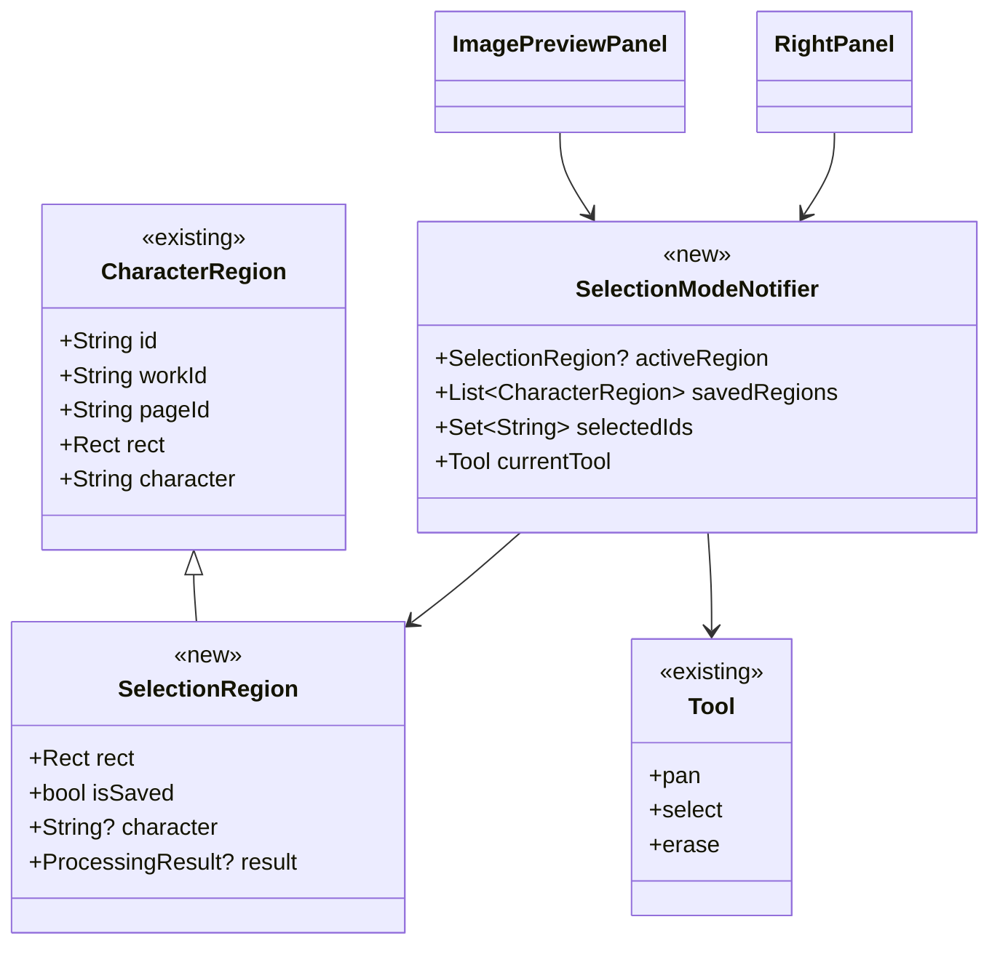
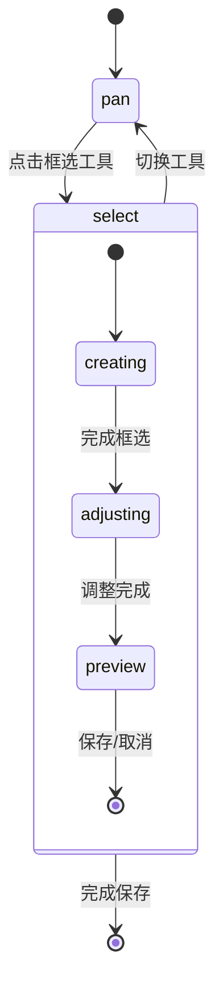

# 预览区选区功能设计

## 1. 功能概述

### 1.1 核心功能

- 在预览区创建和调整字符选区
- 支持选区的选择、移动和删除
- 实时预览选区的字符处理效果
- 保存字符到集字结果

### 1.2 交互方式

- 工具栏切换不同操作模式
- 鼠标拖拽创建和调整选区
- 键盘快捷键支持常用操作
- 实时视觉反馈

## 2. 对象关系



## 3. 文件结构

```
lib/
├── domain/
│   └── models/
│       └── character/
│           └── selection_region.dart    [新增]
├── presentation/
│   ├── providers/
│   │   └── character/
│   │       ├── selection_mode_provider.dart    [新增]
│   │       └── tool_mode_provider.dart         [修改]
│   └── widgets/
│       └── character_collection/
│           ├── image_preview_panel.dart        [修改]
│           ├── selection_layer.dart            [新增]
│           └── selection_handles.dart          [新增]
```

## 4. 状态管理

### 4.1 SelectionModeNotifier

```dart
@riverpod
class SelectionModeNotifier extends _$SelectionModeNotifier {
  // 复用现有的Tool枚举
  Tool get currentTool => state.currentTool;
  
  // 当前活动选区(包括未保存的新选区)
  SelectionRegion? get activeRegion => state.activeRegion;
  
  // 已保存的选区列表(复用CharacterRegion)
  List<CharacterRegion> get savedRegions => state.savedRegions;
  
  // 选中的选区ID集合
  Set<String> get selectedIds => state.selectedIds;
  
  // ... 状态更新方法
}
```

### 4.2 状态流转



## 5. 核心组件实现

### 5.1 SelectionLayer

- 负责渲染选区和控制点
- 处理鼠标事件
- 支持不同工具模式

```dart
class SelectionLayer extends ConsumerWidget {
  final TransformationController controller;
  final Function(Rect) onSelectionCreated;
  final Function(String, Rect) onSelectionUpdated;
  
  @override
  Widget build(BuildContext context, WidgetRef ref) {
    final mode = ref.watch(selectionModeProvider);
    
    return Stack(children: [
      // 渲染所有已保存选区
      for (final region in mode.savedRegions)
        _buildSavedRegion(region),
      
      // 渲染当前活动选区
      if (mode.activeRegion != null)
        _buildActiveRegion(mode.activeRegion!),
        
      // 选区控制点
      if (mode.isAdjusting)
        SelectionHandles(region: mode.activeRegion!),
    ]);
  }
}
```

### 5.2 图像处理预览

- 复用现有的字符处理逻辑
- 支持实时预览
- 优化性能

```dart
Future<void> updatePreview(SelectionRegion region) async {
  // 复用现有的字符处理服务
  final processor = ref.read(characterImageProcessorProvider);
  
  // 处理选区图像
  final result = await processor.processRegion(
    region.rect,
    options: defaultOptions,
  );
  
  // 更新预览
  state = state.copyWith(
    activeRegion: region.copyWith(result: result)
  );
}
```

## 6. 复用策略

### 6.1 现有对象复用

- CharacterRegion: 保存选区的数据模型
- Tool: 工具模式枚举
- ProcessingOptions: 字符处理选项
- CharacterImageProcessor: 字符处理服务

### 6.2 扩展现有功能

- 扩展Tool枚举支持新的工具模式
- 增强CharacterRegion支持选区状态
- 复用图像处理和保存流程

## 7. 实现步骤

1. 基础框架搭建

- 创建SelectionRegion模型
- 实现SelectionModeNotifier
- 搭建SelectionLayer基础结构

2. 核心功能实现

- 框选创建功能
- 选区调整功能
- 预览更新功能

3. 界面完善

- 工具栏整合
- 视觉反馈优化
- 快捷键支持

4. 性能优化

- 选区渲染优化
- 预览更新节流
- 状态更新优化

## 8. 注意事项

1. 状态管理

- 确保状态更新的原子性
- 处理好工具模式切换
- 保持界面状态同步

2. 性能考虑

- 优化选区渲染性能
- 控制预览更新频率
- 合理使用缓存

3. 用户体验

- 提供清晰的视觉反馈
- 支持操作的撤销/重做
- 完善的错误处理

4. 代码组织

- 遵循现有的代码结构
- 做好复用和扩展
- 添加必要的测试
