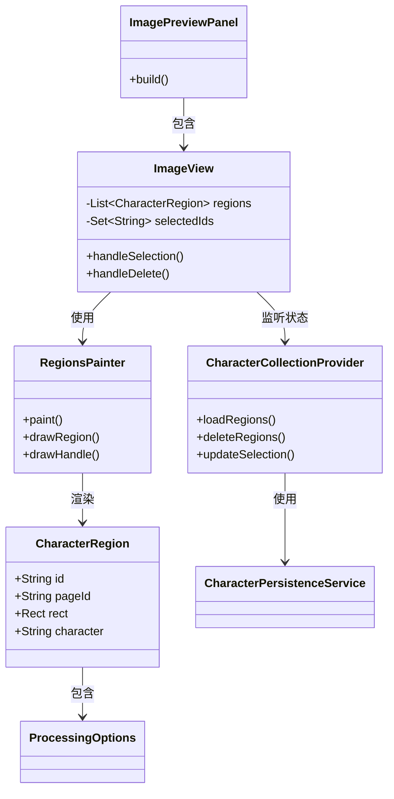
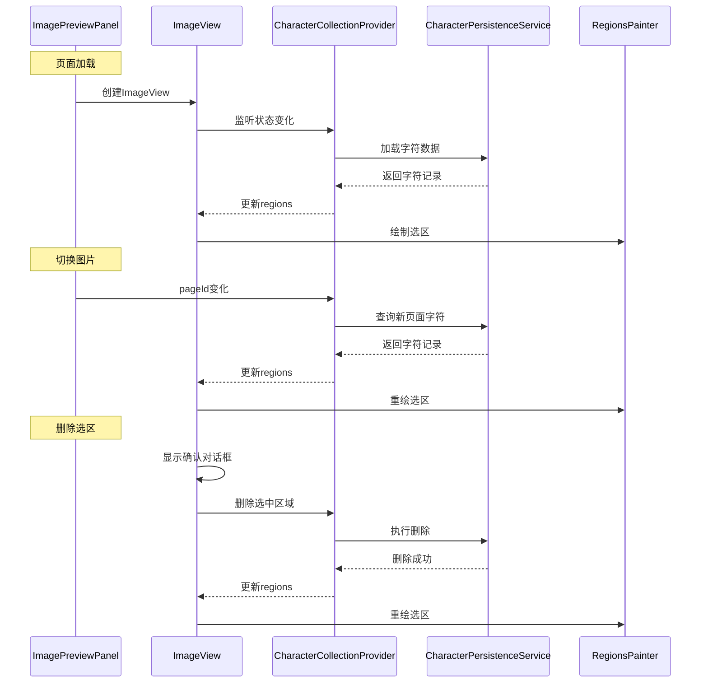

# 预览区选区实现方案

## 1. 对象关系图



## 2. 调用时序图



## 3. 数据流设计

### 3.1 数据模型

- **CharacterRegion**: 字符区域信息
  - id: 唯一标识
  - pageId: 关联的页面ID
  - rect: 选区位置和大小
  - character: 字符内容
  - createTime/updateTime: 时间戳

### 3.2 状态管理

- CharacterCollectionProvider负责管理:
  - regions: 当前页面的所有字符区域
  - selectedIds: 选中的区域ID集合
  - loading: 加载状态标志

### 3.3 数据持久化

- 使用SQLite数据库characters表存储
- region字段存储选区信息
- 通过workId和pageId关联作品和页面

## 4. 功能实现

### 4.1 初始化加载

```dart
// 进入页面时加载数据
void initState() {
  super.initState();
  ref.read(characterCollectionProvider.notifier).loadRegions(
    workId: currentWorkId,
    pageId: currentPageId,
  );
}
```

### 4.2 选区渲染

```dart
// RegionsPainter实现
void paint(Canvas canvas, Size size) {
  for (final region in regions) {
    // 绘制选区边框
    final isSelected = selectedIds.contains(region.id);
    final color = isSelected ? Colors.blue : Colors.green;
    final strokeWidth = isSelected ? 2.0 : 1.5;
    
    canvas.drawRect(
      region.rect,
      Paint()
        ..color = color
        ..style = PaintingStyle.stroke
        ..strokeWidth = strokeWidth,
    );

    // 选中状态绘制控制点
    if (isSelected) {
      drawHandles(canvas, region.rect);
    }
  }
}
```

### 4.3 交互处理

```dart
// 选区选中/取消
void handleTap(Offset position) {
  final region = findRegionAt(position);
  if (region != null) {
    final notifier = ref.read(characterCollectionProvider.notifier);
    notifier.toggleSelection(region.id);
  }
}

// 删除功能
Future<void> handleDelete() async {
  final confirmed = await showDeleteConfirmDialog(context);
  if (confirmed) {
    final notifier = ref.read(characterCollectionProvider.notifier);
    notifier.deleteSelectedRegions();
  }
}
```

## 5. 性能优化

### 5.1 重绘优化

- 使用RepaintBoundary隔离重绘区域
- shouldRepaint方法精确控制重绘条件

### 5.2 状态更新优化

- 选区数据变化时只更新必要部分
- 使用局部刷新避免整体重建

## 6. 错误处理

### 6.1 数据加载异常

- 显示错误提示
- 提供重试机能

### 6.2 删除操作异常

- 回滚删除操作
- 显示错误提示
- 保持UI状态一致性

## 7. 注意事项

1. 保持现有功能不变
2. 确保性能和响应速度
3. 做好错误处理和状态恢复
4. 提供良好的用户体验
