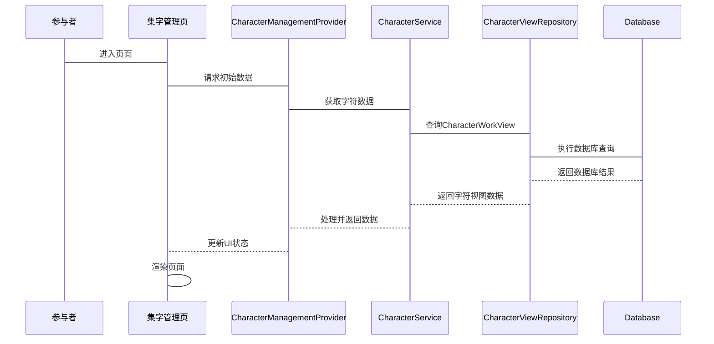
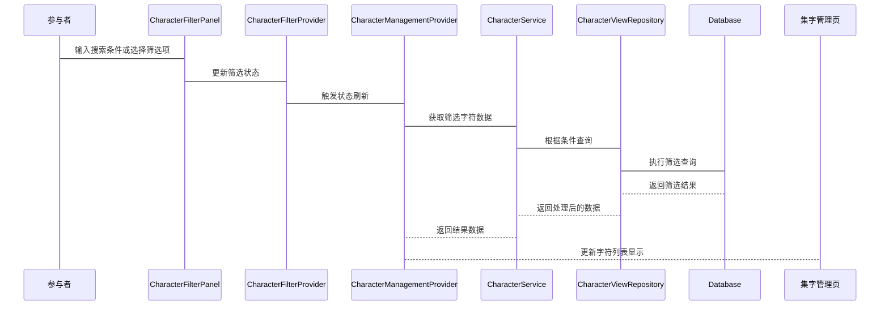
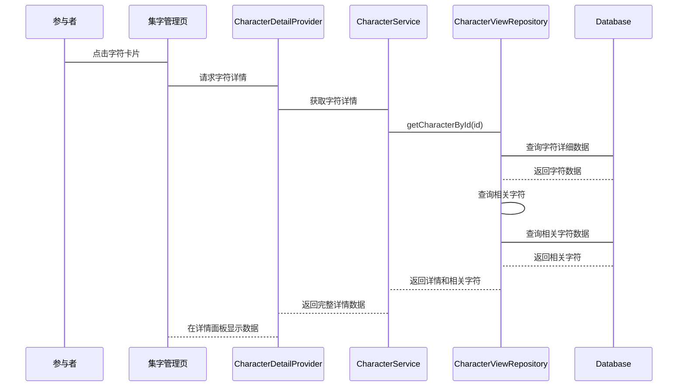
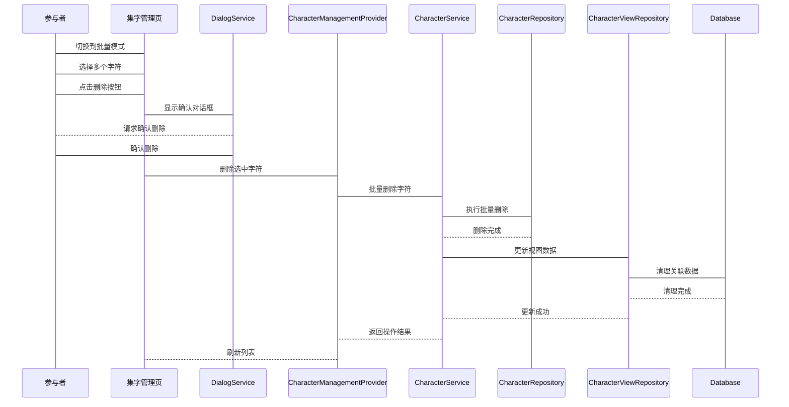
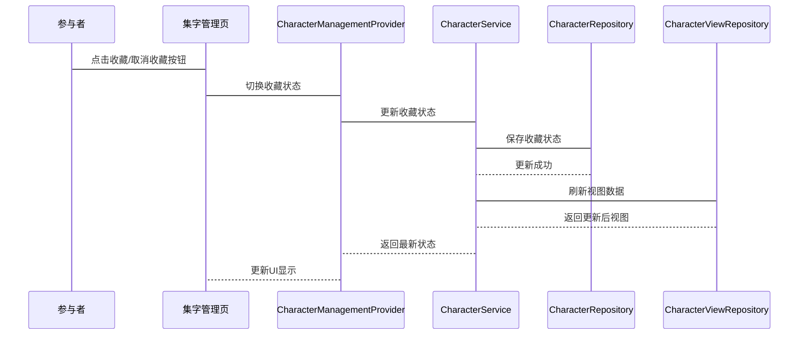
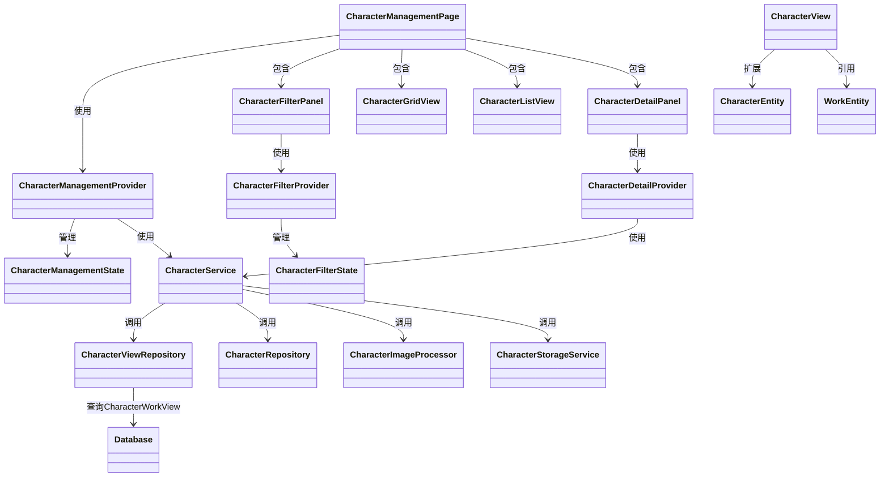
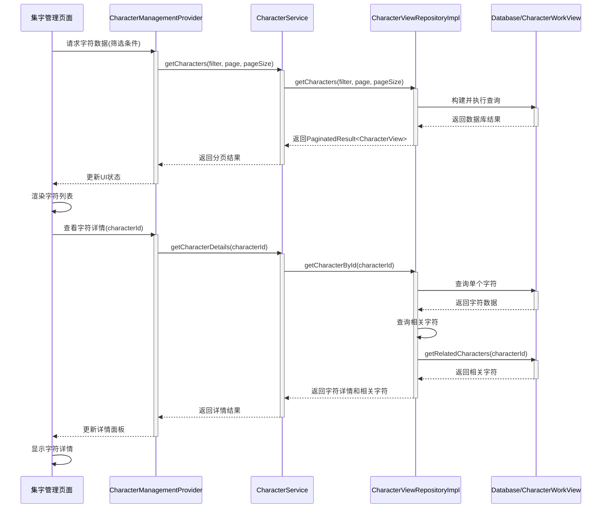

# 集字管理功能设计文档

## 目录

1. 概述
2. 界面设计
3. 交互设计
4. 代码文件结构
5. 对象关系说明
6. 数据说明

## 概述

集字管理功能旨在提供一个集中管理用户收集的汉字的界面，支持查看、筛选、搜索、编辑和删除等操作。该功能将复用现有组件，并与现有系统无缝集成。

### 功能说明

1. **字符浏览与管理**
   - 以网格或列表形式查看所有收集的汉字
   - 支持按多种条件筛选和搜索
   - 支持单个或批量删除汉字
   - 查看字符的详细信息和预览图片

2. **字符操作**
   - 对字符进行收藏/取消收藏
   - 修改字符（跳转到集字功能页面）
   - 添加、删除标签
   - 查看字符来源作品

3. **批量处理**
   - 批量选择多个字符
   - 批量删除选中的字符
   - 批量导出选中的字符（可选功能）

4. **筛选与搜索**
   - 搜索框支持对简体字、作品名称、作者、标签的模糊搜索
   - 筛选面板支持按书写工具、书法风格、创作时间、收集时间等进行筛选
   - 支持按收藏状态筛选
   - 支持多种排序方式

## 界面设计

### 整体布局

```
+------------------------------------------------------+
| 导航工具栏                                            |
+------------------------------------------------------+
|          |                     |                     |
|          |                     |                     |
| 筛选面板 |      列表视图       |     详情面板        |
| (可收起) |                     |     (可收起)        |
|          |                     |                     |
|          |                     |                     |
+------------------------------------------------------+
|                    分页控件                           |
+------------------------------------------------------+
```

### 导航工具栏

```
+------------------------------------------------------+
| [批量处理] [删除(x)]    [视图模式切换]  [搜索框:    ] |
+------------------------------------------------------+
```

- **批量处理按钮**：切换到多选模式
- **删除按钮**：仅在多选模式下显示，括号中显示选中项数量
- **视图模式切换**：在网格视图和列表视图之间切换
- **搜索框**：支持简体字、作品名称、作者、标签的模糊搜索

### 主面板

```
+----------------+---------------------------------------+
|                |  +--------+ +--------+ +--------+     |
| 筛选选项:      |  |        | |        | |        |     |
|                |  |   字   | |   字   | |   字   |     |
|  排序方式      |  |        | |        | |        |     |
|  [▼ 创建时间]  |  | 简体字 | | 简体字 | | 简体字 |     |
|                |  | 作者   | | 作者   | | 作者   |     |
|  □ 仅显示收藏  |  +--------+ +--------+ +--------+     |
|                |                                       |
|  书写工具      |  +--------+ +--------+ +--------+     |
|  □ 毛笔        |  |        | |        | |        |     |
|  □ 硬笔        |  |   字   | |   字   | |   字   |     |
|                |  |        | |        | |        |     |
|  书法风格      |  | 简体字 | | 简体字 | | 简体字 |     |
|  □ 楷书        |  | 作者   | | 作者   | | 作者   |     |
|  □ 行书        |  +--------+ +--------+ +--------+     |
|  □ 草书        |                                       |
|                |                                       |
|  作品创作时间  |                                       |
|  [开始]~[结束] |                                       |
|                |                                       |
|  收集时间      |                                       |
|  [开始]~[结束] |                                       |
|                |                                       |
+----------------+---------------------------------------+
|            << 1 2 3 ... 10 >>                         |
+------------------------------------------------------+
```

#### 视图模式说明

**网格视图**：以卡片形式展示，每张卡片显示：

- 汉字图像
- 简体字
- 作品来源和作者

**列表视图**：以行形式展示，每行显示：

- 汉字图像（小尺寸）
- 简体字
- 作品来源
- 作者
- 收集时间
- 收藏状态（星标图标）
- 操作按钮（详情、修改等）

### 详情面板（右侧可展开）

```
+------------------------------------------------------+
|                  [修改] [收藏/取消收藏]                |
+------------------------------------------------------+
|                                                      |
|                   汉字大图预览区                      |
|                  (支持缩放和平移)                    |
|                                                      |
+------------------------------------------------------+
|                                                      |
|  [缩略图1] [缩略图2] [缩略图3] [缩略图4] [缩略图5]   |
|                                                      |
+------------------------------------------------------+
| 基本信息:                                            |
| 简体字：[字]                                         |
| 收集时间：2025-04-10 14:30                           |
| 作者：王羲之                                         |
| 作品来源：[书法名帖集] (链接到作品详情页)            |
| 作品创作时间：晋朝                                   |
+------------------------------------------------------+
| 标签:                                                |
| [楷书] [行书] [草书] [+]                            |
+------------------------------------------------------+
```

## 交互设计

### 主要交互流程

1. 页面加载流程



2. 筛选和搜索流程



3. 详情查看流程



4. 批量删除流程



5. 收藏状态切换流程



## 代码文件结构

```
lib/
├── presentation/
│   ├── pages/
│   │   └── characters/
│   │       ├── character_management_page.dart           // 集字管理页面
│   │       ├── components/
│   │       │   ├── character_card.dart                 // 字符卡片组件
│   │       │   ├── character_detail_panel.dart         // 详情面板
│   │       │   ├── character_grid_view.dart            // 网格视图
│   │       │   ├── character_list_view.dart            // 列表视图
│   │       │   ├── character_filter_panel.dart         // 筛选面板（复用并扩展WorkFilterPanel）
│   │       │   └── character_toolbar.dart              // 工具栏
│   ├── providers/
│   │   └── character/
│   │       ├── character_management_provider.dart      // 集字管理状态管理
│   │       ├── character_detail_provider.dart          // 字符详情状态管理
│   │       └── character_filter_provider.dart          // 筛选状态管理
│   └── viewmodels/
│       └── states/
│           ├── character_management_state.dart         // 集字管理状态类
│           └── character_filter_state.dart             // 筛选状态类
├── domain/
│   ├── repositories/
│   │   └── character/
│   │       └── character_view_repository.dart          // 字符视图仓库接口
│   └── models/
│       └── character/
│           ├── character_view.dart                     // 字符视图模型（关联字符和作品信息）
│           └── character_filter.dart                   // 筛选条件模型
└── application/
    ├── services/
    │   └── character/
    │       └── character_service.dart                  // 字符服务
    └── repositories/
        └── character_view_repository_impl.dart     // 字符视图仓库实现
```

## 对象关系说明



### 主要组件说明

1. **CharacterManagementPage**：集字管理页面主组件，整合所有子组件
2. **CharacterManagementProvider**：管理集字数据和状态的Provider
3. **CharacterFilterPanel**：提供筛选功能的侧边面板（可收起）
4. **CharacterGridView/ListView**：以网格或列表形式展示字符的组件
5. **CharacterDetailPanel**：展示字符详细信息的面板（可收起）
6. **CharacterService**：提供字符相关的业务逻辑服务，包括查询、修改、删除等操作

## 数据说明

### 数据来源

1. **字符数据**：来自Characters表
2. **作品关联**：通过Works表关联获取
3. **图片存储**：本地文件系统中的字符图片，具体路径如下：

#### 字符图片路径结构

```
{appDataDir}/characters/{characterId}/
├── {id}-original.png          // 原始未处理图像
├── {id}-binary.png            // 二值化图像（黑白）
├── {id}-transparent.png       // 透明背景图像（去背景）
├── {id}-thumbnail.jpg         // 缩略图，用于列表显示
├── {id}-outline.svg           // SVG轮廓
├── {id}-square-binary.png     // 正方形裁剪的二值图像
├── {id}-square-transparent.png // 正方形裁剪的透明图像
└── {id}-square-outline.svg    // 正方形裁剪的SVG轮廓
```

实际存储示例：

- Windows: `C:/Users/{username}/AppData/Roaming/com.example.demo/characters/{characterId}/{id}-transparent.png`
- macOS: `/Users/{username}/Library/Application Support/com.example.demo/characters/{characterId}/{id}-transparent.png`
- Linux: `/home/{username}/.local/share/com.example.demo/characters/{characterId}/{id}-transparent.png`

图片加载过程会根据不同视图类型选择合适的图片：

- 列表/网格视图：优先加载 `{id}-thumbnail.jpg` 以提高性能
- 详情视图：通常加载 `{id}-transparent.png` 以展示高质量图像
- 编辑操作：基于 `{id}-original.png` 进行处理

### 预览缩略图列表

在详情面板中，预览缩略图列表显示的是**同一个字符的不同处理格式**，例如：

- 原始图像
- 二值化图像
- 透明背景图像
- 轮廓图像
- 正方形裁剪版本

用户可以切换查看同一字符的不同表现形式，并选择合适的版本进行导出或使用。

### 主要数据模型

#### CharacterView（字符视图模型）

```dart
class CharacterView {
  final String id;
  final String character;            // 简体字
  final String workId;              // 关联作品ID
  final String workName;            // 作品名称
  final String author;              // 作者
  final DateTime creationTime;      // 作品创作时间
  final DateTime collectionTime;    // 收集时间
  final bool isFavorite;            // 是否收藏
  final List<String> tags;          // 标签列表
  final CharacterRegion region;     // 区域信息
  final String imageFilePath;       // 图片文件路径
  
  // ...构造函数和方法
}
```

## 可复用组件

为了提高开发效率并保持界面一致性，集字管理页面将复用现有代码库中的多个组件。以下是可复用的核心组件及其使用方式：

### 1. ZoomableImageView

现有的 `ZoomableImageView` 组件 (位于 `lib/presentation/widgets/common/zoomable_image_view.dart`) 可直接用于集字预览功能：

```dart
// 集字预览实现示例
class CharacterPreview extends StatelessWidget {
  final CharacterEntity character;
  final bool showGrid;
  
  const CharacterPreview({
    Key? key,
    required this.character,
    this.showGrid = false,
  }) : super(key: key);
  
  @override
  Widget build(BuildContext context) {
    return Stack(
      children: [
        // 复用现有的ZoomableImageView组件
        ZoomableImageView(
          imagePath: character.transparentPngPath,
          enableMouseWheel: true,
          minScale: 0.5,
          maxScale: 4.0,
          showControls: true,
        ),
        
        // 可选：显示参考网格
        if (showGrid) 
          const GridOverlay(),
      ],
    );
  }
}
```

**优势：**

- 已实现鼠标滚轮缩放（按住Ctrl键）
- 支持触控缩放和平移
- 包含图片加载和错误状态处理
- 内置缩放控制按钮
- 代码已经过优化和测试

### 2. SidebarToggle

现有的 `SidebarToggle` 组件 (位于 `lib/presentation/widgets/common/sidebar_toggle.dart`) 可用于折叠/展开信息面板：

```dart
// 信息面板折叠控制
SidebarToggle(
  isOpen: isPanelExpanded,
  onToggle: toggleInfoPanel,
  alignRight: true,  // 信息面板位于右侧
)
```

**优势：**

- 统一的侧边栏切换交互
- 自适应箭头方向
- 可配置左/右对齐

### 3. WorkFilterPanel

作品筛选面板 `WorkFilterPanel` (位于 `lib/presentation/pages/works/components/filter/work_filter_panel.dart`) 可作为模板改造为 `CharacterFilterPanel`：

```dart
// 字符筛选面板实现示例
class CharacterFilterPanel extends StatelessWidget {
  final CharacterFilter filter;
  final ValueChanged<CharacterFilter> onFilterChanged;
  
  // ...构造函数和实现
}
```

**需要改造：**

- 重用现有的筛选组件结构和样式
- 将 `StyleSection` 和 `ToolSection` 适配为字符特有属性
- 保留 `SortSection` 和 `DateSection` 基本逻辑

### 6. ImagePreviewPanel

现有的 `ImagePreviewPanel` (位于 `lib/presentation/widgets/character_collection/image_preview_panel.dart`) 可作为模板改造为集字预览面板：

```dart
// 复用预览面板结构
class CharacterPreviewPanel extends ConsumerWidget {
  // ...构造函数和实现
  
  @override
  Widget build(BuildContext context, WidgetRef ref) {
    // 类似结构，但适配为字符预览
  }
}
```

### 7. ThumbnailStrip

现有的 `ThumbnailStrip` 组件 (位于 `lib/presentation/pages/works/components/thumbnail_strip.dart`) 是一个非常灵活的缩略图条组件，可以直接用于集字管理功能中：

```dart
// 集字格式缩略图条实现示例
class CharacterFormatPreview extends StatelessWidget {
  final CharacterEntity character;
  final int selectedFormatIndex;
  final Function(int) onSelectFormat;
  
  const CharacterFormatPreview({
    Key? key,
    required this.character,
    required this.selectedFormatIndex,
    required this.onSelectFormat,
  }) : super(key: key);
  
  @override
  Widget build(BuildContext context) {
    // 获取不同格式的字符图片路径
    final formatPaths = [
      character.originalPngPath,
      character.binaryPngPath, 
      character.transparentPngPath,
      character.squareBinaryPngPath,
      character.squareTransparentPngPath,
    ];
    
    // 为每种格式生成描述性键
    final formatKeys = [
      'original_${character.id}',
      'binary_${character.id}',
      'transparent_${character.id}',
      'square_binary_${character.id}',
      'square_transparent_${character.id}',
    ];
    
    // 复用ThumbnailStrip组件展示不同格式的字符图像
    return ThumbnailStrip<String>(
      images: formatPaths,
      selectedIndex: selectedFormatIndex,
      onTap: onSelectFormat,
      pathResolver: (path) => path,
      keyResolver: (path) => formatKeys[formatPaths.indexOf(path)],
      isEditable: false, // 字符格式预览不需要重排序
    );
  }
}
```

**优势：**

- 高度可定制的泛型组件，可接受任何类型的数据
- 已实现水平滚动条和鼠标滚轮支持
- 支持文件存在性检查和自动重试机制
- 具备编辑模式（可重排序）和只读模式
- 包含选中状态指示器和序号标签
- 可配置删除按钮功能
- 支持自动滚动到选中项

**在集字管理功能中的应用场景：**

1. **字符格式预览**：在字符详情面板中，用于展示并切换同一字符的不同处理格式（原始、二值化、透明背景等）
2. **批量模式**：在批量选择模式下，用于展示当前已选中的字符，便于用户查看所选内容
3. **相关字符展示**：在字符详情页面底部，可以展示来自同一作品的其他相关字符
4. **格式导出选择**：在导出功能中，用于选择要导出的字符格式

**整合实现示例：**

以下是在字符详情面板中使用此组件的示例：

```dart
class CharacterDetailPanel extends ConsumerWidget {
  @override
  Widget build(BuildContext context, WidgetRef ref) {
    final character = ref.watch(selectedCharacterProvider);
    final selectedFormat = ref.watch(selectedFormatProvider);
    
    if (character == null) return const SizedBox();
    
    return Column(
      children: [
        // 当前格式大图预览
        Expanded(
          child: ZoomableImageView(
            imagePath: _getFormatPath(character, selectedFormat),
            enableMouseWheel: true,
          ),
        ),
        
        // 格式选择缩略图条
        Padding(
          padding: const EdgeInsets.symmetric(vertical: 8.0),
          child: ThumbnailStrip<int>(
            images: List.generate(5, (i) => i), // 5种不同格式的索引
            selectedIndex: selectedFormat,
            onTap: (index) => ref.read(selectedFormatProvider.notifier).state = index,
            pathResolver: (index) => _getFormatPath(character, index),
            keyResolver: (index) => 'format_$index',
            isEditable: false,
          ),
        ),
        
        // 其他字符信息
      ],
    );
  }
  
  String _getFormatPath(CharacterEntity character, int formatIndex) {
    switch (formatIndex) {
      case 0: return character.originalPngPath;
      case 1: return character.binaryPngPath;
      case 2: return character.transparentPngPath;
      case 3: return character.squareBinaryPngPath;
      case 4: return character.squareTransparentPngPath;
      default: return character.transparentPngPath;
    }
  }
}
```

**复用组件的好处：**

1. **一致的用户体验:** 在不同功能间保持交互模式一致性
2. **开发效率提升:** 减少重复编码工作，加快实现速度
3. **代码质量保证:** 复用经过测试的组件减少潜在问题
4. **维护成本降低:** 集中更新核心组件即可提升全局体验

## CharacterFilter 模型设计

为了优化字符筛选功能，我们设计了 `CharacterFilter` 模型，使其与已有的 `WorkFilter` 模式保持一致性。这样的设计使得筛选功能更加结构化、易于扩展和维护。

```dart
/// 字符筛选条件模型 - 用于字符管理页面的筛选
@freezed
class CharacterFilter with _$CharacterFilter {
  const factory CharacterFilter({
    /// 搜索文本（对应简体字、作品名称、作者等）
    String? searchText,
    
    /// 是否仅显示收藏的字符
    bool? isFavorite,
    
    /// 作品ID筛选
    String? workId,
    
    /// 书写工具筛选（如毛笔、硬笔）
    @Default([]) List<String> writingTools,
    
    /// 书法风格筛选（如楷书、行书、草书）
    @Default([]) List<String> calligraphyStyles,
    
    /// 创作时间筛选预设
    @Default(DateRangePreset.all) DateRangePreset datePreset,
    
    /// 创作时间范围（自定义时间段）
    DateRange? dateRange,
    
    /// 收集时间筛选预设
    @Default(DateRangePreset.all) DateRangePreset collectionDatePreset,
    
    /// 收集时间范围（自定义时间段）
    DateRange? collectionDateRange,
    
    /// 标签筛选
    @Default([]) List<String> tags,
    
    /// 排序选项
    @Default(SortOption(field: SortField.collectionTime, descending: true)) 
    SortOption sortOption,
    
  }) = _CharacterFilter;

  /// 从JSON创建模型
  factory CharacterFilter.fromJson(Map<String, dynamic> json) =>
      _$CharacterFilterFromJson(json);
      
  /// 有效的创作时间范围
  DateRange? get effectiveCreationDateRange =>
      datePreset == DateRangePreset.custom ? dateRange : datePreset.toDateRange();
      
  /// 有效的收集时间范围
  DateRange? get effectiveCollectionDateRange =>
      collectionDatePreset == DateRangePreset.custom 
          ? collectionDateRange 
          : collectionDatePreset.toDateRange();
          
  /// 判断筛选条件是否为空（未设置任何筛选）
  bool get isEmpty => 
      searchText == null && 
      isFavorite == null && 
      workId == null &&
      writingTools.isEmpty && 
      calligraphyStyles.isEmpty && 
      datePreset == DateRangePreset.all &&
      collectionDatePreset == DateRangePreset.all &&
      tags.isEmpty;
}
```

### 字符排序字段

```dart
/// 字符排序字段
enum CharacterSortField {
  /// 按字符排序
  character,
  
  /// 按收集时间排序
  collectionTime,
  
  /// 按创作时间排序
  creationTime,
  
  /// 按作品名称排序
  workName,
  
  /// 按作者排序
  author,
}
```

### 字符排序方向

```dart
/// 排序方向枚举
enum SortDirection {
  ascending,        // 升序
  descending,       // 降序
}
```

### CharacterManagementState 更新

使用新设计的 CharacterFilter 替换原有的内嵌筛选字段，使状态管理更加清晰：

```dart
/// 字符管理状态
@freezed
class CharacterManagementState with _$CharacterManagementState {
  const factory CharacterManagementState({
    @Default([]) List<CharacterView> characters,
    @Default([]) List<String> allTags,
    @Default(CharacterFilter()) CharacterFilter filter,
    @Default(false) bool isLoading,
    @Default(false) bool isBatchMode,
    @Default({}) Set<String> selectedCharacters,
    @Default(false) bool isDetailOpen,
    String? errorMessage,
    String? selectedCharacterId,
    @Default(ViewMode.grid) ViewMode viewMode,
    @Default(0) int totalCount,
    @Default(1) int currentPage,
    @Default(20) int pageSize,
  }) = _CharacterManagementState;

  factory CharacterManagementState.fromJson(Map<String, dynamic> json) =>
      _$CharacterManagementStateFromJson(json);

  factory CharacterManagementState.initial() =>
      const CharacterManagementState();
}

/// 视图模式枚举
enum ViewMode {
  /// 网格视图
  grid,
  
  /// 列表视图
  list,
}
```

### 数据视图（从数据库获取的联合视图）

```sql
CREATE VIEW CharacterView AS
SELECT 
  c.id, c.character, c.region, c.createTime as collectionTime, 
  c.updateTime, c.isFavorite, c.tags,
  w.id as workId, w.name as workName, w.author, 
  w.creationTime, w.description
FROM Characters c
LEFT JOIN Works w ON c.workId = w.id;
```

## CharacterViewRepository 设计

### 接口定义

`CharacterViewRepository` 接口用于查询 `CharacterView` 视图，将字符和相关作品信息合并提供给上层组件。

```dart
/// 字符视图仓库接口
abstract class CharacterViewRepository {
  /// 根据筛选条件获取字符视图列表
  Future<PaginatedResult<CharacterView>> getCharacters({
    required CharacterFilter filter,
    required int page,
    required int pageSize,
  });
  
  /// 获取指定ID的字符视图
  Future<CharacterView?> getCharacterById(String id);
  
  /// 获取与指定字符相关的字符（例如同一作品中的字符）
  Future<List<CharacterView>> getRelatedCharacters(String characterId, {int limit = 10});
  
  /// 获取字符的统计数据
  Future<CharacterStats> getCharacterStats();
  
  /// 根据简体字搜索字符
  Future<List<CharacterView>> searchBySimplifiedCharacter(String character, {int limit = 20});
}

/// 分页结果包装类
class PaginatedResult<T> {
  final List<T> items;
  final int totalCount;
  final int currentPage;
  final int pageSize;
  
  PaginatedResult({
    required this.items,
    required this.totalCount,
    required this.currentPage,
    required this.pageSize,
  });
  
  int get totalPages => (totalCount / pageSize).ceil();
  bool get hasNextPage => currentPage < totalPages;
  bool get hasPreviousPage => currentPage > 1;
}

/// 字符统计数据
class CharacterStats {
  final int totalCount;
  final int favoriteCount;
  final Map<String, int> tagCounts;
  final Map<String, int> calligraphyStyleCounts;
  final Map<String, int> writingToolCounts;
  
  CharacterStats({
    required this.totalCount,
    required this.favoriteCount,
    required this.tagCounts,
    required this.calligraphyStyleCounts,
    required this.writingToolCounts,
  });
}
```

### 实现类

`CharacterViewRepositoryImpl` 实现了 `CharacterViewRepository` 接口，用于与数据库交互。

```dart
/// 字符视图仓库实现
class CharacterViewRepositoryImpl implements CharacterViewRepository {
  final Database _database;
  
  CharacterViewRepositoryImpl(this._database);
  
  @override
  Future<PaginatedResult<CharacterView>> getCharacters({
    required CharacterFilter filter,
    required int page,
    required int pageSize,
  }) async {
    // 构建查询条件
    final query = _buildFilterQuery(filter);
    
    // 添加排序条件
    final orderBy = _buildOrderByClause(filter);
    
    // 添加分页条件
    final offset = (page - 1) * pageSize;
    
    // 执行查询获取当前页数据
    final items = await _database.rawQuery(
      'SELECT * FROM CharacterWorkView $query $orderBy LIMIT $pageSize OFFSET $offset',
      filter.parameters,
    );
    
    // 获取总记录数
    final countResult = await _database.rawQuery(
      'SELECT COUNT(*) as count FROM CharacterWorkView $query',
      filter.parameters,
    );
    final totalCount = Sqflite.firstIntValue(countResult) ?? 0;
    
    // 将查询结果转换为领域模型
    final characterViews = items.map((item) => CharacterView.fromMap(item)).toList();
    
    return PaginatedResult<CharacterView>(
      items: characterViews,
      totalCount: totalCount,
      currentPage: page,
      pageSize: pageSize,
    );
  }
  
  @override
  Future<CharacterView?> getCharacterById(String id) async {
    final results = await _database.rawQuery(
      'SELECT * FROM CharacterWorkView WHERE id = ?',
      [id],
    );
    
    if (results.isEmpty) return null;
    
    return CharacterView.fromMap(results.first);
  }
  
  @override
  Future<List<CharacterView>> getRelatedCharacters(String characterId, {int limit = 10}) async {
    // 先获取指定字符所属的作品ID
    final character = await getCharacterById(characterId);
    if (character == null || character.workId == null) return [];
    
    // 查询同一作品的其他字符
    final results = await _database.rawQuery(
      'SELECT * FROM CharacterWorkView WHERE workId = ? AND id != ? LIMIT ?',
      [character.workId, characterId, limit],
    );
    
    return results.map((item) => CharacterView.fromMap(item)).toList();
  }
  
  @override
  Future<CharacterStats> getCharacterStats() async {
    // 获取总数量
    final totalCountResult = await _database.rawQuery('SELECT COUNT(*) as count FROM Characters');
    final totalCount = Sqflite.firstIntValue(totalCountResult) ?? 0;
    
    // 获取收藏数量
    final favoriteCountResult = await _database.rawQuery(
      'SELECT COUNT(*) as count FROM Characters WHERE isFavorite = 1'
    );
    final favoriteCount = Sqflite.firstIntValue(favoriteCountResult) ?? 0;
    
    // 获取标签统计
    final tagCounts = await _getTagStats();
    
    // 获取书法风格统计
    final styleCounts = await _getStyleStats();
    
    // 获取书写工具统计
    final toolCounts = await _getToolStats();
    
    return CharacterStats(
      totalCount: totalCount,
      favoriteCount: favoriteCount,
      tagCounts: tagCounts,
      calligraphyStyleCounts: styleCounts,
      writingToolCounts: toolCounts,
    );
  }
  
  @override
  Future<List<CharacterView>> searchBySimplifiedCharacter(String character, {int limit = 20}) async {
    final results = await _database.rawQuery(
      'SELECT * FROM CharacterWorkView WHERE character LIKE ? LIMIT ?',
      ['%$character%', limit],
    );
    
    return results.map((item) => CharacterView.fromMap(item)).toList();
  }
  
  // 辅助方法：构建筛选查询SQL
  String _buildFilterQuery(CharacterFilter filter) {
    final conditions = <String>[];
    final parameters = <dynamic>[];
    
    if (filter.searchText != null && filter.searchText!.isNotEmpty) {
      conditions.add('(character LIKE ? OR workName LIKE ? OR author LIKE ?)');
      parameters.addAll(['%${filter.searchText}%', '%${filter.searchText}%', '%${filter.searchText}%']);
    }
    
    if (filter.isFavorite != null && filter.isFavorite!) {
      conditions.add('isFavorite = 1');
    }
    
    if (filter.writingTools.isNotEmpty) {
      final placeholders = List.generate(filter.writingTools.length, (index) => '?').join(', ');
      conditions.add('writingTool IN ($placeholders)');
      parameters.addAll(filter.writingTools);
    }
    
    if (filter.calligraphyStyles.isNotEmpty) {
      final placeholders = List.generate(filter.calligraphyStyles.length, (index) => '?').join(', ');
      conditions.add('style IN ($placeholders)');
      parameters.addAll(filter.calligraphyStyles);
    }
    
    if (filter.fromCreationDate != null) {
      conditions.add('creationTime >= ?');
      parameters.add(filter.fromCreationDate!.millisecondsSinceEpoch);
    }
    
    if (filter.toCreationDate != null) {
      conditions.add('creationTime <= ?');
      parameters.add(filter.toCreationDate!.millisecondsSinceEpoch);
    }
    
    if (filter.fromCollectionDate != null) {
      conditions.add('collectionTime >= ?');
      parameters.add(filter.fromCollectionDate!.millisecondsSinceEpoch);
    }
    
    if (filter.toCollectionDate != null) {
      conditions.add('collectionTime <= ?');
      parameters.add(filter.toCollectionDate!.millisecondsSinceEpoch);
    }
    
    if (conditions.isEmpty) return '';
    
    // 将条件组合为一个WHERE子句
    final query = 'WHERE ${conditions.join(' AND ')}';
    filter.parameters = parameters;
    
    return query;
  }
  
  // 辅助方法：构建排序子句
  String _buildOrderByClause(CharacterFilter filter) {
    final field = filter.sortField.name;
    final direction = filter.sortDirection == SortDirection.ascending ? 'ASC' : 'DESC';
    
    return 'ORDER BY $field $direction';
  }
  
  // 辅助方法：获取标签统计
  Future<Map<String, int>> _getTagStats() async {
    // 在实际实现中，这需要一个更复杂的查询来分析JSON存储的标签
    // 这里使用了简化的示例
    final result = <String, int>{};
    final tagResults = await _database.rawQuery(
      'SELECT DISTINCT json_each.value as tag, COUNT(*) as count '
      'FROM Characters, json_each(Characters.tags) '
      'GROUP BY json_each.value'
    );
    
    for (final row in tagResults) {
      final tag = row['tag'] as String;
      final count = row['count'] as int;
      result[tag] = count;
    }
    
    return result;
  }
  
  // 辅助方法：获取书法风格统计
  Future<Map<String, int>> _getStyleStats() async {
    // 同样，这需要根据实际数据库结构调整
    final result = <String, int>{
      '楷书': 0,
      '行书': 0,
      '草书': 0,
    };
    
    final styleResults = await _database.rawQuery(
      'SELECT style, COUNT(*) as count FROM Characters GROUP BY style'
    );
    
    for (final row in styleResults) {
      final style = row['style'] as String;
      final count = row['count'] as int;
      if (result.containsKey(style)) {
        result[style] = count;
      }
    }
    
    return result;
  }
  
  // 辅助方法：获取书写工具统计
  Future<Map<String, int>> _getToolStats() async {
    final result = <String, int>{
      '毛笔': 0,
      '硬笔': 0,
    };
    
    final toolResults = await _database.rawQuery(
      'SELECT writingTool, COUNT(*) as count FROM Characters GROUP BY writingTool'
    );
    
    for (final row in toolResults) {
      final tool = row['writingTool'] as String;
      final count = row['count'] as int;
      if (result.containsKey(tool)) {
        result[tool] = count;
      }
    }
    
    return result;
  }
}
```

### 交互时序图

以下时序图展示了CharacterViewRepository在集字管理功能中的交互流程：



## 改进的字符筛选设计

### CharacterFilterProvider

筛选状态的管理由 `CharacterFilterProvider` 负责，它将负责处理筛选条件的更新并通知依赖组件：

```dart
class CharacterFilterProvider extends ChangeNotifier {
  CharacterFilter _filter = CharacterFilter();
  
  /// 当前筛选条件
  CharacterFilter get filter => _filter;
  
  /// 更新搜索文本
  void updateSearchText(String? text) {
    if (_filter.searchText == text) return;
    _filter = _filter.copyWith(searchText: text);
    notifyListeners();
  }
  
  /// 更新收藏筛选
  void updateFavoriteFilter(bool? isFavorite) {
    if (_filter.isFavorite == isFavorite) return;
    _filter = _filter.copyWith(isFavorite: isFavorite);
    notifyListeners();
  }
  
  /// 更新书写工具筛选
  void updateWritingTools(List<String> tools) {
    if (listEquals(_filter.writingTools, tools)) return;
    _filter = _filter.copyWith(writingTools: tools);
    notifyListeners();
  }
  
  /// 更新书法风格筛选
  void updateCalligraphyStyles(List<String> styles) {
    if (listEquals(_filter.calligraphyStyles, styles)) return;
    _filter = _filter.copyWith(calligraphyStyles: styles);
    notifyListeners();
  }
  
  /// 更新作品创作时间范围
  void updateCreationDateRange(DateTime? from, DateTime? to) {
    if (_filter.fromCreationDate == from && _filter.toCreationDate == to) return;
    _filter = _filter.copyWith(
      fromCreationDate: from,
      toCreationDate: to,
    );
    notifyListeners();
  }
  
  /// 更新字符收集时间范围
  void updateCollectionDateRange(DateTime? from, DateTime? to) {
    if (_filter.fromCollectionDate == from && _filter.toCollectionDate == to) return;
    _filter = _filter.copyWith(
      fromCollectionDate: from,
      toCollectionDate: to,
    );
    notifyListeners();
  }
  
  /// 更新标签筛选
  void updateTags(List<String> tags) {
    if (listEquals(_filter.tags, tags)) return;
    _filter = _filter.copyWith(tags: tags);
    notifyListeners();
  }
  
  /// 更新排序字段和方向
  void updateSort(SortField field, SortDirection direction) {
    if (_filter.sortField == field && _filter.sortDirection == direction) return;
    _filter = _filter.copyWith(
      sortField: field,
      sortDirection: direction,
    );
    notifyListeners();
  }
  
  /// 切换排序方向
  void toggleSortDirection() {
    final newDirection = _filter.sortDirection == SortDirection.ascending
        ? SortDirection.descending
        : SortDirection.ascending;
    updateSort(_filter.sortField, newDirection);
  }
  
  /// 重置所有筛选条件
  void resetFilters() {
    _filter = _filter.clear();
    notifyListeners();
  }
}
```
