# 字帖编辑Canvas系统架构分析

## 1. 系统概述

字帖编辑Canvas系统是本应用的核心组件，采用分层架构设计，提供高性能的图形编辑功能。系统主要由以下几个层次组成：

- **页面层**：用户界面组件
- **控制器层**：业务逻辑控制
- **Canvas核心层**：画布交互处理
- **渲染层**：分层渲染系统
- **数据模型层**：数据结构定义
- **优化层**：性能优化组件

## 1.1 系统架构图

```mermaid
graph TB
    subgraph "字帖编辑页面层"
        M3PracticeEditPage["M3PracticeEditPage<br/>字帖编辑页面"]
        M3PracticeEditCanvas["M3PracticeEditCanvas<br/>画布组件"]
        TopNavBar["M3TopNavigationBar<br/>顶部导航栏"]
        LeftPanel["M3ContentToolsPanel<br/>左侧工具面板"]
        RightPanel["PropertiesPanel<br/>右侧属性面板"]
        PageThumbs["M3PageThumbnailStrip<br/>页面缩略图"]
    end

    subgraph "控制器层"
        PracticeEditController["PracticeEditController<br/>编辑控制器"]
        PracticeEditState["PracticeEditState<br/>编辑状态"]
        UndoRedoManager["UndoRedoManager<br/>撤销重做管理器"]
        StateChangeDispatcher["StateChangeDispatcher<br/>状态变更分发器"]
        BatchUpdateOptions["BatchUpdateOptions<br/>批量更新配置"]
    end

    subgraph "Canvas核心组件"
        CanvasGestureHandler["CanvasGestureHandler<br/>画布手势处理器"]
        SmartCanvasGestureHandler["SmartCanvasGestureHandler<br/>智能手势处理器"]
        SmartGestureDispatcher["SmartGestureDispatcher<br/>智能手势分发器"]
        DragStateManager["DragStateManager<br/>拖拽状态管理器"]
        DragOperationManager["DragOperationManager<br/>拖拽操作管理器"]
        LayerRenderManager["LayerRenderManager<br/>图层渲染管理器"]
        ContentRenderController["ContentRenderController<br/>内容渲染控制器"]
        CanvasControlPoints["CanvasControlPoints<br/>控制点组件"]
        CanvasStructureListener["CanvasStructureListener<br/>画布结构监听器"]
    end

    subgraph "渲染层系统"
        ContentRenderLayer["ContentRenderLayer<br/>内容渲染层"]
        DragPreviewLayer["DragPreviewLayer<br/>拖拽预览层"]
        InteractionLayer["InteractionLayer<br/>交互层"]
        StaticBackgroundLayer["StaticBackgroundLayer<br/>静态背景层"]
        BaseCanvasLayer["BaseCanvasLayer<br/>基础画布层"]
        ManagedContentLayer["ManagedContentLayer<br/>托管内容层"]
    end

    subgraph "元素渲染器"
        ElementRenderer["ElementRenderer<br/>元素渲染器"]
        TextRenderer["TextRenderer<br/>文本渲染器"]
        CollectionPainter["CollectionPainter<br/>集字绘制器"]
        AdvancedCollectionPainter["AdvancedCollectionPainter<br/>高级集字绘制器"]
        ImageRenderer["ImageRenderer<br/>图像渲染器"]
        ElementSnapshot["ElementSnapshot<br/>元素快照"]
    end

    subgraph "性能优化组件"
        PerformanceMonitor["PerformanceMonitor<br/>性能监控器"]
        EnhancedPerformanceTracker["EnhancedPerformanceTracker<br/>增强性能追踪器"]
        PerformanceDashboard["PerformanceDashboard<br/>性能仪表板"]
        SelfAdaptivePerformanceOptimizer["SelfAdaptivePerformanceOptimizer<br/>自适应性能优化器"]
        DevicePerformanceDetector["DevicePerformanceDetector<br/>设备性能检测器"]
        PostProcessingOptimizer["PostProcessingOptimizer<br/>后处理优化器"]
    end

    subgraph "缓存系统"
        AdvancedCacheManager["AdvancedCacheManager<br/>高级缓存管理器"]
        ElementCacheManager["ElementCacheManager<br/>元素缓存管理器"]
        AdaptiveCacheManager["AdaptiveCacheManager<br/>自适应缓存管理器"]
        WeakElementCache["WeakElementCache<br/>弱引用元素缓存"]
        GlobalImageCache["GlobalImageCache<br/>全局图像缓存"]
        ViewportCullingManager["ViewportCullingManager<br/>视口裁剪管理器"]
    end

    subgraph "内存管理"
        MemoryManager["MemoryManager<br/>内存管理器"]
        ResourceDisposalService["ResourceDisposalService<br/>资源释放服务"]
        MemoryEfficientElementRepresentation["MemoryEfficientElementRepresentation<br/>内存高效元素表示"]
        LargeElementHandler["LargeElementHandler<br/>大元素处理器"]
        EnhancedOnDemandResourceLoader["EnhancedOnDemandResourceLoader<br/>增强按需资源加载器"]
    end

    subgraph "优化工具"
        DirtyTracker["DirtyTracker<br/>脏数据追踪器"]
        SelectiveRebuildManager["SelectiveRebuildManager<br/>选择性重建管理器"]
        PerformanceOptimizer["PerformanceOptimizer<br/>性能优化器"]
        BaselineManager["BaselineManager<br/>基线管理器"]
    end

    subgraph "数据模型"
        PracticePage["PracticePage<br/>字帖页面"]
        PracticeLayer["PracticeLayer<br/>字帖图层"]
        PracticeElement["PracticeElement<br/>字帖元素"]
        TextElement["TextElement<br/>文本元素"]
        CollectionElement["CollectionElement<br/>集字元素"]
        ImageElement["ImageElement<br/>图像元素"]
        GroupElement["GroupElement<br/>组合元素"]
        CharacterPosition["CharacterPosition<br/>字符位置"]
    end

    %% 主要关系
    M3PracticeEditPage --> M3PracticeEditCanvas
    M3PracticeEditPage --> PracticeEditController
    PracticeEditController --> PracticeEditState
    PracticeEditController --> UndoRedoManager
    PracticeEditController --> StateChangeDispatcher
    PracticeEditController --> BatchUpdateOptions

    M3PracticeEditCanvas --> SmartCanvasGestureHandler
    M3PracticeEditCanvas --> DragStateManager
    M3PracticeEditCanvas --> DragOperationManager
    M3PracticeEditCanvas --> LayerRenderManager
    M3PracticeEditCanvas --> ContentRenderController
    M3PracticeEditCanvas --> CanvasStructureListener

    SmartCanvasGestureHandler --> SmartGestureDispatcher
    SmartCanvasGestureHandler --> CanvasGestureHandler

    LayerRenderManager --> ContentRenderLayer
    LayerRenderManager --> DragPreviewLayer
    LayerRenderManager --> InteractionLayer
    LayerRenderManager --> StaticBackgroundLayer

    DragOperationManager --> ElementSnapshot
    DragPreviewLayer --> ElementSnapshot

    ContentRenderLayer --> ElementRenderer
    ElementRenderer --> TextRenderer
    ElementRenderer --> CollectionPainter
    ElementRenderer --> AdvancedCollectionPainter

    LayerRenderManager --> ViewportCullingManager
    ContentRenderController --> AdvancedCacheManager
    AdvancedCacheManager --> ElementCacheManager
    AdvancedCacheManager --> WeakElementCache

    M3PracticeEditCanvas --> PerformanceMonitor
    PerformanceMonitor --> EnhancedPerformanceTracker
    PerformanceMonitor --> PerformanceDashboard

    SelfAdaptivePerformanceOptimizer --> DevicePerformanceDetector
    SelfAdaptivePerformanceOptimizer --> PerformanceOptimizer

    MemoryManager --> ResourceDisposalService
    MemoryManager --> LargeElementHandler

    ContentRenderController --> DirtyTracker
    ContentRenderController --> SelectiveRebuildManager

    PracticeEditState --> PracticePage
    PracticePage --> PracticeLayer
    PracticeLayer --> PracticeElement

    %% 样式
    classDef pageClass fill:#e1f5fe,stroke:#01579b,stroke-width:2px
    classDef controllerClass fill:#f3e5f5,stroke:#4a148c,stroke-width:2px
    classDef canvasClass fill:#e8f5e8,stroke:#1b5e20,stroke-width:2px
    classDef renderClass fill:#fff3e0,stroke:#e65100,stroke-width:2px
    classDef performanceClass fill:#f1f8e9,stroke:#33691e,stroke-width:2px
    classDef cacheClass fill:#fce4ec,stroke:#880e4f,stroke-width:2px
    classDef memoryClass fill:#e0f2f1,stroke:#004d40,stroke-width:2px
    classDef modelClass fill:#fff8e1,stroke:#ff6f00,stroke-width:2px

    class M3PracticeEditPage,M3PracticeEditCanvas,TopNavBar,LeftPanel,RightPanel,PageThumbs pageClass
    class PracticeEditController,PracticeEditState,UndoRedoManager,StateChangeDispatcher,BatchUpdateOptions controllerClass
    class CanvasGestureHandler,SmartCanvasGestureHandler,SmartGestureDispatcher,DragStateManager,DragOperationManager,LayerRenderManager,ContentRenderController,CanvasControlPoints,CanvasStructureListener canvasClass
    class ContentRenderLayer,DragPreviewLayer,InteractionLayer,StaticBackgroundLayer,BaseCanvasLayer,ManagedContentLayer,ElementRenderer,TextRenderer,CollectionPainter,AdvancedCollectionPainter,ImageRenderer,ElementSnapshot renderClass
    class PerformanceMonitor,EnhancedPerformanceTracker,PerformanceDashboard,SelfAdaptivePerformanceOptimizer,DevicePerformanceDetector,PostProcessingOptimizer,DirtyTracker,SelectiveRebuildManager,PerformanceOptimizer,BaselineManager performanceClass
    class AdvancedCacheManager,ElementCacheManager,AdaptiveCacheManager,WeakElementCache,GlobalImageCache,ViewportCullingManager cacheClass
    class MemoryManager,ResourceDisposalService,MemoryEfficientElementRepresentation,LargeElementHandler,EnhancedOnDemandResourceLoader memoryClass
    class PracticePage,PracticeLayer,PracticeElement,TextElement,CollectionElement,ImageElement,GroupElement,CharacterPosition modelClass
```



### 架构图说明

上图展示了字帖编辑Canvas系统的完整架构，包含以下几个主要层次：

- **🎨 页面层（蓝色）**：用户界面组件，包括主页面、画布、工具面板等
- **🎛️ 控制器层（紫色）**：业务逻辑控制，负责状态管理和数据操作
- **🖱️ Canvas核心层（绿色）**：画布交互处理，包含手势识别、拖拽管理等
- **🎬 渲染层（橙色）**：分层渲染系统，负责不同类型内容的渲染
- **⚡ 性能优化层（浅绿）**：性能监控、优化工具和智能算法
- **💾 缓存系统（粉色）**：多级缓存管理，提升渲染性能
- **🧠 内存管理（青色）**：内存监控、资源管理和优化
- **📊 数据模型层（黄色）**：数据结构定义，从页面到元素的层次化模型

## 2. 核心组件详细分析

**说明**：本架构分析现已包含工作清单中的性能优化组件，展示完整的系统架构。

### 2.1 页面层组件

#### M3PracticeEditPage（字帖编辑页面）
- **职责**：主页面容器，协调各子组件
- **核心功能**：
  - 管理页面布局和状态
  - 处理键盘快捷键
  - 协调左右面板显示
  - 管理预览模式切换

#### M3PracticeEditCanvas（主画布组件）
- **职责**：核心画布渲染和交互处理
- **核心功能**：
  - 管理多层渲染系统
  - 处理用户交互事件
  - 协调选择框和控制点显示
  - 支持拖拽、缩放、旋转操作

### 2.2 控制器层组件

#### PracticeEditController（编辑控制器）
- **职责**：统一的业务逻辑控制中心
- **核心功能**：
  - 管理字帖数据（页面、图层、元素）
  - 处理元素的增删改查操作
  - 协调撤销/重做系统
  - 处理文件的保存和加载

#### PracticeEditState（编辑状态）
- **职责**：维护编辑器的状态信息
- **主要属性**：
  ```dart
  - List<Map<String, dynamic>> pages; // 页面数据
  - int currentPageIndex; // 当前页面索引
  - String currentTool; // 当前选择的工具
  - List<String> selectedElementIds; // 选中的元素ID列表
  - bool gridVisible; // 网格显示状态
  - double canvasScale; // 画布缩放比例
  ```

### 2.3 Canvas核心组件

#### CanvasGestureHandler（画布手势处理器）
- **职责**：处理基础的画布手势交互
- **核心功能**：
  - 元素选择（单选、多选）
  - 拖拽移动
  - 选择框绘制
  - 右键菜单触发

#### SmartCanvasGestureHandler（智能手势处理器）
- **职责**：提供高级手势识别和处理
- **核心功能**：
  - 智能手势识别
  - 复杂交互逻辑处理
  - 手势冲突解决
  - 性能优化的事件分发

#### DragStateManager（拖拽状态管理器）
- **职责**：统一管理拖拽操作的状态
- **核心功能**：
  - 追踪拖拽开始、进行中、结束状态
  - 管理拖拽预览效果
  - 协调多元素拖拽
  - 提供拖拽性能优化

### 2.4 渲染层系统

#### LayerRenderManager（图层渲染管理器）
- **职责**：协调多层渲染系统
- **渲染层次**：
  1. **StaticBackgroundLayer**：静态背景（网格、页面背景）
  2. **ContentRenderLayer**：内容层（元素渲染）
  3. **DragPreviewLayer**：拖拽预览层
  4. **InteractionLayer**：交互层（选择框、控制点）

#### ContentRenderLayer（内容渲染层）
- **职责**：负责所有元素的渲染
- **渲染流程**：
  ```dart
  1. 按图层顺序遍历
  2. 按元素Z顺序排序
  3. 应用视口裁剪优化
  4. 调用对应元素渲染器
  5. 应用变换矩阵（位置、旋转、缩放）
  ```

### 2.5 元素渲染器系统

#### TextRenderer（文本渲染器）
- **职责**：渲染文本元素
- **支持特性**：
  - 多种字体和字号
  - 文本对齐和换行
  - 颜色和样式设置
  - 书写模式（横排、竖排）

#### CollectionPainter（集字绘制器）
- **职责**：渲染集字元素
- **核心功能**：
  - 汉字字形渲染
  - 字符布局和间距
  - 米字格和田字格
  - 多种书写方向支持

#### ImageRenderer（图像渲染器）
- **职责**：渲染图像元素
- **支持特性**：
  - 多种图像格式
  - 图像缩放和裁剪
  - 透明度处理
  - 内存优化加载

### 2.6 数据模型层

#### 数据模型层次结构
```
PracticePage（字帖页面）
├── PracticeLayer（字帖图层）
│   └── PracticeElement（字帖元素）
│       ├── TextElement（文本元素）
│       ├── CollectionElement（集字元素）
│       ├── ImageElement（图像元素）
│       └── GroupElement（组合元素）
```

#### PracticeElement（元素基类）
- **共同属性**：
  ```dart
  - String id; // 唯一标识符
  - double x, y; // 位置坐标
  - double width, height; // 尺寸大小
  - double rotation; // 旋转角度
  - String layerId; // 所属图层ID
  - double opacity; // 透明度
  - bool isLocked; // 锁定状态
  - bool isHidden; // 隐藏状态
  ```

### 2.7 性能优化组件

#### SelfAdaptivePerformanceOptimizer（自适应性能优化器）
- **职责**：根据设备性能自动调整优化策略
- **核心功能**：
  - 智能帧率控制和节流
  - 设备性能检测和分级
  - 内存压力感知和响应
  - 动态质量调整

#### DevicePerformanceDetector（设备性能检测器）
- **职责**：检测和评估设备性能等级
- **检测维度**：
  - 计算性能评估
  - 渲染性能测试
  - 内存容量检测
  - 自动性能分级

#### PerformanceMonitor（性能监控器）
- **职责**：实时监控系统性能
- **监控指标**：
  - FPS帧率和渲染耗时
  - 内存使用和泄漏检测
  - CPU使用率
  - 缓存命中率

#### EnhancedPerformanceTracker（增强性能追踪器）
- **职责**：详细的性能数据收集和分析
- **功能特性**：
  - 多维度性能数据采集
  - 性能趋势分析
  - 基线数据管理
  - 回归检测

### 2.8 缓存系统

#### AdvancedCacheManager（高级缓存管理器）
- **职责**：统一管理多级缓存系统
- **缓存策略**：
  - 热度图管理
  - LRU缓存淘汰
  - 内存压力自适应
  - 弱引用缓存

#### ElementCacheManager（元素缓存管理器）
- **职责**：专门管理元素级别的缓存
- **优化策略**：
  - 元素渲染结果缓存
  - 变换矩阵缓存
  - 脏数据追踪
  - 智能缓存更新

#### WeakElementCache（弱引用元素缓存）
- **职责**：基于弱引用的缓存实现
- **特性**：
  - 自动内存回收
  - 避免内存泄漏
  - 大量元素场景优化

#### ViewportCullingManager（视口裁剪管理器）
- **职责**：实现视口裁剪优化
- **优化策略**：
  - 只渲染可见区域内的元素
  - 动态计算裁剪边界
  - 支持缩放级别适应

### 2.9 内存管理系统

#### MemoryManager（内存管理器）
- **职责**：统一的内存管理和监控
- **管理功能**：
  - 内存使用监控
  - 压力检测和响应
  - 资源自动清理
  - 内存泄漏检测

#### ResourceDisposalService（资源释放服务）
- **职责**：自动化资源生命周期管理
- **功能**：
  - 定时资源清理
  - 引用计数管理
  - 资源释放调度
  - 垃圾回收优化

#### LargeElementHandler（大元素处理器）
- **职责**：专门处理大尺寸元素的内存优化
- **策略**：
  - 分片渲染
  - 延迟加载
  - 动态分辨率调整
  - 内存占用控制

### 2.10 智能优化工具

#### DirtyTracker（脏数据追踪器）
- **职责**：追踪数据变更，实现精确更新
- **优化效果**：
  - 最小化重绘范围
  - 智能更新策略
  - 变更影响分析

#### SelectiveRebuildManager（选择性重建管理器）
- **职责**：控制Widget的选择性重建
- **策略**：
  - 依赖关系分析
  - 局部更新优化
  - 重建范围控制

#### StateChangeDispatcher（状态变更分发器）
- **职责**：智能的状态变更路由和分发
- **功能**：
  - 状态变更分类
  - 精确组件通知
  - 批量更新合并

## 3. 交互流程分析

### 3.1 元素选择流程
```
用户点击 → CanvasGestureHandler.onTapDown
         → 命中测试(hitTest)
         → PracticeEditController.selectElement
         → 更新选择状态
         → 触发UI重绘
         → 显示控制点
```

### 3.2 元素拖拽流程
```
拖拽开始 → DragStateManager.startDrag
        → 记录初始位置
        → 启用拖拽预览
        
拖拽中  → CanvasGestureHandler.onPanUpdate
        → 计算新位置
        → 更新拖拽预览
        → 实时反馈
        
拖拽结束 → DragStateManager.endDrag
        → 应用最终位置
        → 记录撤销操作
        → 清除预览效果
```

### 3.3 渲染更新流程
```
数据变更 → PracticeEditController.notifyListeners
        → M3PracticeEditCanvas.build
        → LayerRenderManager.buildLayerStack
        → 各层级渲染器执行
        → 合成最终画面
```

## 4. 设计模式应用

### 4.1 观察者模式
- **应用**：PracticeEditController使用ChangeNotifier
- **优势**：数据变更自动触发UI更新

### 4.2 策略模式
- **应用**：不同类型元素使用不同渲染器
- **优势**：易于扩展新的元素类型

### 4.3 命令模式
- **应用**：UndoRedoManager的操作记录
- **优势**：支持撤销/重做功能

### 4.4 组合模式
- **应用**：GroupElement包含子元素
- **优势**：统一处理单个元素和组合元素

## 5. 性能优化策略

### 5.1 渲染优化
- **视口裁剪**：只渲染可见元素
- **分层渲染**：减少不必要的重绘
- **RepaintBoundary**：隔离重绘区域
- **缓存机制**：复用渲染结果

### 5.2 交互优化
- **防抖处理**：避免频繁状态更新
- **异步操作**：避免阻塞UI线程
- **智能重建**：最小化Widget重建

### 5.3 内存优化
- **懒加载**：按需加载资源
- **缓存管理**：自动清理过期缓存
- **对象池**：复用临时对象

## 6. 扩展性设计

### 6.1 新元素类型扩展
1. 继承PracticeElement创建新类型
2. 实现对应的元素渲染器
3. 在ElementRenderer中注册新渲染器
4. 更新控制器的创建逻辑

### 6.2 新工具扩展
1. 在PracticeEditState中添加工具类型
2. 实现对应的手势处理逻辑
3. 添加工具栏UI组件
4. 更新键盘快捷键映射

### 6.3 新渲染层扩展
1. 继承BaseCanvasLayer创建新层
2. 在LayerRenderManager中注册
3. 定义层级优先级
4. 实现层级特定的渲染逻辑

## 7. 关键技术亮点

### 7.1 智能手势识别
- 区分点击、拖拽、缩放等手势
- 支持多点触控操作
- 智能冲突解决机制

### 7.2 高性能渲染
- GPU加速的Canvas渲染
- 多级缓存策略
- 视口自适应优化

### 7.3 实时协作支持
- 状态同步机制
- 冲突解决策略
- 增量更新传输

### 7.4 响应式设计
- 自适应不同屏幕尺寸
- 支持横竖屏切换
- 动态布局调整

## 8. 总结

字帖编辑Canvas系统采用现代化的分层架构设计，通过合理的职责分离和模块化设计，实现了高性能、可扩展的图形编辑功能。系统的核心优势包括：

1. **高性能**：多级优化策略确保流畅的用户体验
2. **可扩展**：清晰的架构设计便于功能扩展
3. **易维护**：模块化设计降低维护成本
4. **用户友好**：丰富的交互功能提升用户体验

该系统为字帖编辑应用提供了坚实的技术基础，支持未来功能的持续演进和性能优化。 