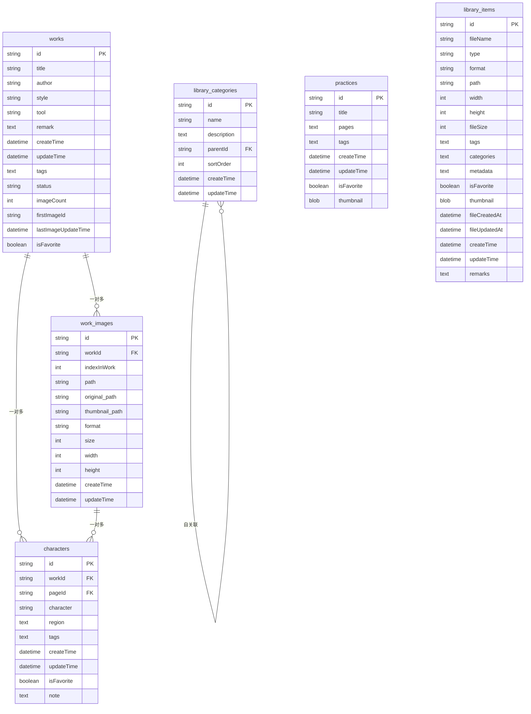
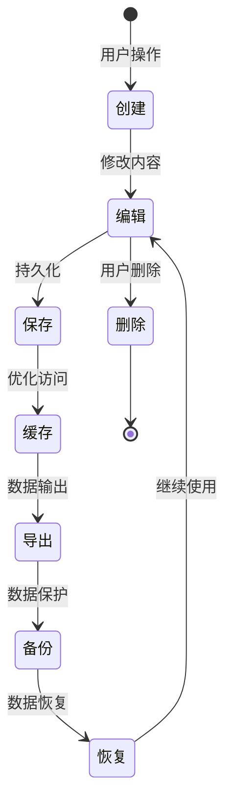

# Flutter书法练习应用 - 数据关系与导出功能实现方案

## 1. 项目概述

### 1.1 应用介绍
Flutter书法练习应用是一个专业的书法学习和创作平台，提供以下核心功能：
- **作品管理**: 创建、编辑、管理书法作品，支持多图片作品
- **集字功能**: 从作品中提取字符，建立字符库，支持字符检索和复用
- **字帖编辑**: 创建练习字帖，支持多种元素类型和排版
- **图库管理**: 管理图片素材，支持分类和标签
- **备份恢复**: 完整的数据备份和恢复机制

### 1.2 技术架构
- **前端框架**: Flutter 3.x
- **状态管理**: Riverpod
- **数据库**: SQLite (本地存储)
- **文件存储**: 本地文件系统 + 分层目录结构
- **架构模式**: 清洁架构 (Clean Architecture)
- **代码生成**: Freezed + JsonAnnotation

## 2. 数据库设计

### 2.1 核心表结构

#### 2.1.1 作品表 (works)
```sql
CREATE TABLE works (
  id TEXT PRIMARY KEY,              -- 作品ID (UUID)
  title TEXT NOT NULL,              -- 标题
  author TEXT,                      -- 作者
  style TEXT,                       -- 书法风格 (楷书/行书/草书等)
  tool TEXT,                        -- 书写工具 (毛笔/硬笔等)
  remark TEXT,                      -- 备注
  createTime TEXT NOT NULL,         -- 创建时间
  updateTime TEXT NOT NULL,         -- 更新时间
  tags TEXT,                        -- 标签 (JSON数组)
  status TEXT NOT NULL DEFAULT 'draft', -- 状态
  imageCount INTEGER DEFAULT 0,    -- 图片数量
  firstImageId TEXT,               -- 首张图片ID
  lastImageUpdateTime TEXT,        -- 图片最后更新时间
  isFavorite INTEGER NOT NULL DEFAULT 0 -- 是否收藏
);
```

#### 2.1.2 作品图片表 (work_images)
```sql
CREATE TABLE work_images (
  id TEXT PRIMARY KEY,              -- 图片ID (UUID)
  workId TEXT NOT NULL,             -- 关联作品ID
  indexInWork INTEGER NOT NULL,    -- 在作品中的索引
  path TEXT NOT NULL,               -- 图片路径
  original_path TEXT,               -- 原始图片路径
  thumbnail_path TEXT,              -- 缩略图路径
  format TEXT NOT NULL,             -- 图片格式
  size INTEGER NOT NULL,            -- 文件大小
  width INTEGER NOT NULL,           -- 图片宽度
  height INTEGER NOT NULL,          -- 图片高度
  createTime TEXT NOT NULL,         -- 创建时间
  updateTime TEXT NOT NULL,         -- 更新时间
  FOREIGN KEY (workId) REFERENCES works (id) ON DELETE CASCADE
);
```

#### 2.1.3 字符表 (characters)
```sql
CREATE TABLE characters (
  id TEXT PRIMARY KEY,              -- 字符ID (UUID)
  workId TEXT NOT NULL,             -- 关联作品ID
  pageId TEXT NOT NULL,             -- 页面ID (对应work_images.id)
  character TEXT NOT NULL,          -- 汉字内容
  region TEXT NOT NULL,             -- 区域信息 (JSON)
  tags TEXT,                        -- 标签
  createTime TEXT NOT NULL,         -- 创建时间
  updateTime TEXT NOT NULL,         -- 更新时间
  isFavorite INTEGER NOT NULL DEFAULT 0, -- 是否收藏
  note TEXT,                        -- 备注
  FOREIGN KEY (workId) REFERENCES works (id) ON DELETE CASCADE
);
```

#### 2.1.4 字帖表 (practices)
```sql
CREATE TABLE practices (
  id TEXT PRIMARY KEY,              -- 字帖ID (UUID)
  title TEXT NOT NULL,              -- 标题
  pages TEXT NOT NULL,              -- 页面数据 (JSON)
  tags TEXT,                        -- 标签
  createTime TEXT NOT NULL,         -- 创建时间
  updateTime TEXT NOT NULL,         -- 更新时间
  isFavorite INTEGER NOT NULL DEFAULT 0, -- 是否收藏
  thumbnail BLOB                    -- 缩略图
);
```

#### 2.1.5 图库表 (library_items)
```sql
CREATE TABLE library_items (
  id TEXT PRIMARY KEY,              -- 项目ID (UUID)
  fileName TEXT NOT NULL,           -- 文件名
  type TEXT NOT NULL,               -- 类型
  format TEXT NOT NULL,             -- 格式
  path TEXT NOT NULL,               -- 文件路径
  width INTEGER NOT NULL,           -- 宽度
  height INTEGER NOT NULL,          -- 高度
  fileSize INTEGER NOT NULL,        -- 文件大小
  tags TEXT,                        -- 标签
  categories TEXT,                  -- 分类
  metadata TEXT,                    -- 元数据 (JSON)
  isFavorite INTEGER DEFAULT 0,     -- 是否收藏
  thumbnail BLOB,                   -- 缩略图
  fileCreatedAt TEXT NOT NULL,      -- 文件创建时间
  fileUpdatedAt TEXT NOT NULL,      -- 文件更新时间
  createTime TEXT NOT NULL,         -- 记录创建时间
  updateTime TEXT NOT NULL,         -- 记录更新时间
  remarks TEXT                      -- 备注
);
```

#### 2.1.6 图库分类表 (library_categories)
```sql
CREATE TABLE library_categories (
  id TEXT PRIMARY KEY,              -- 分类ID (UUID)
  name TEXT NOT NULL,               -- 分类名称
  description TEXT,                 -- 描述
  parentId TEXT,                    -- 父分类ID
  sortOrder INTEGER DEFAULT 0,     -- 排序
  createTime TEXT NOT NULL,         -- 创建时间
  updateTime TEXT NOT NULL          -- 更新时间
);
```

#### 2.1.7 设置表 (settings)
```sql
CREATE TABLE settings (
  key TEXT PRIMARY KEY,             -- 设置键
  value TEXT NOT NULL,              -- 设置值 (JSON)
  updateTime TEXT NOT NULL          -- 更新时间
);
```

### 2.2 视图定义

#### 2.2.1 字符视图 (CharacterView)
```sql
CREATE VIEW CharacterView AS
SELECT 
  c.id,
  c.character,
  c.isFavorite,
  c.createTime AS collectionTime,
  c.updateTime,
  c.pageId,
  c.workId,
  c.tags,
  c.region,
  c.note,
  w.style,
  w.tool,
  w.title,
  w.author
FROM characters c
LEFT JOIN works w ON c.workId = w.id;
```

### 2.3 数据关系图



## 3. 文件存储架构

### 3.1 目录结构设计

```
{应用数据目录}/
├── works/                         # 作品文件目录
│   ├── {workId}/                  # 单个作品目录
│   │   ├── cover/                 # 封面目录
│   │   │   ├── imported.png       # 处理后封面
│   │   │   └── thumbnail.jpg      # 封面缩略图
│   │   ├── images/                # 作品图片目录
│   │   │   ├── {imageId}/         # 单张图片目录
│   │   │   │   ├── original.{ext} # 原始图片
│   │   │   │   ├── imported.png   # 处理后图片
│   │   │   │   └── thumbnail.jpg  # 缩略图
│   │   │   └── ...
│   │   └── metadata.json          # 作品元数据
│   └── ...
├── characters/{workId}/{characterId}/  # 集字文件目录
│   ├── {characterId}-original.png      # 原始图片
│   ├── {characterId}-binary.png        # 二值化图片
│   ├── {characterId}-square-binary.png # 方形二值化图片
│   ├── {characterId}-outline.svg       # SVG轮廓
│   ├── {characterId}-square-outline.svg# 方形SVG轮廓
│   ├── {characterId}-transparent.png   # 透明PNG
│   ├── {characterId}-square-transparent.png # 方形透明PNG
│   └── {characterId}-thumbnail.jpg     # 缩略图
├── practices/{practiceId}/             # 字帖文件目录
│   ├── pages/                          # 页面文件
│   └── thumbnail.jpg                   # 字帖缩略图
├── library/                            # 图库目录
│   ├── items/{itemId}/                 # 图库项目目录
│   │   ├── original.{ext}              # 原始文件
│   │   └── thumbnails/                 # 缩略图目录
│   │       └── thumbnail.jpg           # 缩略图
│   └── categories/                     # 分类相关文件
├── cache/                              # 缓存目录
│   ├── images/                         # 图片缓存
│   └── temp/                           # 临时文件
├── backups/                            # 备份目录
│   └── backup_{timestamp}.zip          # 备份文件
└── exports/                            # 导出目录
    ├── practices/                      # 字帖导出
    ├── works/                          # 作品导出
    └── characters/                     # 集字导出
```

### 3.2 文件命名规范

- **UUID命名**: 所有实体ID使用UUID v4格式
- **时间戳命名**: 备份和临时文件使用`yyyyMMdd_HHmmss`格式
- **扩展名保留**: 原始文件保持原扩展名，处理后文件统一格式
- **缩略图统一**: 所有缩略图使用`.jpg`格式以减小文件大小

## 4. 数据流转机制

### 4.1 数据生命周期



### 4.2 数据同步策略

1. **数据库优先**: 所有结构化数据以数据库为主
2. **文件关联**: 文件系统存储实际资源，数据库存储路径引用
3. **事务一致性**: 数据库和文件操作使用事务保证一致性
4. **异步处理**: 大文件操作采用异步处理机制

## 5. 现有导出功能分析

### 5.1 当前导出能力

#### 5.1.1 字帖导出功能

```dart
// 现有导出服务位置: lib/presentation/widgets/practice/export/
class ExportService {
  // 支持的导出格式
  static Future<List<String>> exportToImages(); // PNG/JPG
  static Future<String?> exportToPdf();         // PDF
}
```

**支持格式**:
- 图片格式: PNG, JPG
- 文档格式: PDF
- 页面范围: 全部/当前/自定义范围
- 质量设置: 像素比例可调

#### 5.1.2 备份与恢复功能

```dart
// 备份服务位置: lib/infrastructure/backup/
class BackupService {
  Future<String> createBackup({String? description});
  Future<bool> restoreFromBackup(String backupPath);
  Future<List<BackupInfo>> getBackups();
  Future<bool> exportBackup(String backupPath, String exportPath);
  Future<bool> importBackup(String importPath);
}
```

**备份内容**:
- 完整数据库备份
- 所有文件资源备份
- 应用配置备份
- ZIP压缩存储

### 5.2 导出功能缺陷分析

1. **功能局限**: 仅支持字帖导出，缺少作品和集字导出
2. **格式单一**: 导出格式有限，不支持结构化数据导出
3. **批量能力不足**: 无法批量导出多个实体
4. **元数据缺失**: 导出文件缺少完整的元数据信息
5. **互操作性差**: 导出格式难以与其他应用交互

## 6. 导出功能实现方案

### 6.1 架构设计

#### 6.1.1 导出服务接口

```dart
// 通用导出接口
abstract class IExportService<T> {
  Future<ExportResult> export({
    required List<T> items,
    required ExportOptions options,
  });
  
  Future<List<ExportFormat>> getSupportedFormats();
  Future<ExportOptions> getDefaultOptions();
}

// 导出结果
class ExportResult {
  final bool success;
  final String? outputPath;
  final List<String> exportedFiles;
  final String? errorMessage;
  final Map<String, dynamic>? metadata;
}

// 导出选项
class ExportOptions {
  final ExportFormat format;
  final String outputPath;
  final Map<String, dynamic> formatOptions;
  final bool includeMetadata;
  final bool compressOutput;
}

// 导出格式枚举
enum ExportFormat {
  json,       // JSON格式
  csv,        // CSV格式
  pdf,        // PDF文档
  images,     // 图片集合
  zip,        // ZIP压缩包
  xml,        // XML格式
  markdown,   // Markdown文档
}
```

#### 6.1.2 导出管理器

```dart
class ExportManager {
  final Map<Type, IExportService> _services;
  
  // 注册导出服务
  void registerService<T>(IExportService<T> service);
  
  // 执行导出
  Future<ExportResult> export<T>({
    required List<T> items,
    required ExportOptions options,
  });
  
  // 批量导出
  Future<List<ExportResult>> exportBatch(
    Map<Type, ExportRequest> requests
  );
}
```

### 6.2 具体导出服务实现

#### 6.2.1 作品导出服务

```dart
class WorkExportService implements IExportService<WorkEntity> {
  final WorkRepository _workRepository;
  final WorkImageRepository _workImageRepository;
  final IStorage _storage;
  
  @override
  Future<ExportResult> export({
    required List<WorkEntity> items,
    required ExportOptions options,
  }) async {
    switch (options.format) {
      case ExportFormat.json:
        return await _exportToJson(items, options);
      case ExportFormat.zip:
        return await _exportToZip(items, options);
      case ExportFormat.csv:
        return await _exportToCsv(items, options);
      default:
        throw UnsupportedError('不支持的导出格式: ${options.format}');
    }
  }
  
  // JSON格式导出
  Future<ExportResult> _exportToJson(
    List<WorkEntity> works,
    ExportOptions options
  ) async {
    final exportData = <String, dynamic>{
      'exportInfo': {
        'timestamp': DateTime.now().toIso8601String(),
        'version': '1.0',
        'itemCount': works.length,
        'exportType': 'works',
      },
      'works': [],
    };
    
    for (final work in works) {
      // 获取作品图片信息
      final images = await _workImageRepository.getByWorkId(work.id);
      
      // 构建作品数据
      final workData = {
        ...work.toJson(),
        'images': images.map((img) => img.toJson()).toList(),
      };
      
      exportData['works'].add(workData);
    }
    
    // 写入JSON文件
    final outputFile = path.join(options.outputPath, 'works_export.json');
    await File(outputFile).writeAsString(
      JsonEncoder.withIndent('  ').convert(exportData)
    );
    
    return ExportResult(
      success: true,
      outputPath: outputFile,
      exportedFiles: [outputFile],
    );
  }
  
  // ZIP格式导出 (包含图片文件)
  Future<ExportResult> _exportToZip(
    List<WorkEntity> works,
    ExportOptions options
  ) async {
    final tempDir = await _storage.createTempDirectory();
    final exportedFiles = <String>[];
    
    try {
      // 创建JSON元数据
      await _exportToJson(works, ExportOptions(
        format: ExportFormat.json,
        outputPath: tempDir.path,
        formatOptions: options.formatOptions,
        includeMetadata: options.includeMetadata,
        compressOutput: false,
      ));
      
      // 复制图片文件
      for (final work in works) {
        final workDir = path.join(tempDir.path, 'works', work.id);
        await Directory(workDir).create(recursive: true);
        
        // 复制作品图片
        final images = await _workImageRepository.getByWorkId(work.id);
        for (final image in images) {
          if (await _storage.fileExists(image.path)) {
            final targetPath = path.join(workDir, path.basename(image.path));
            await _storage.copyFile(image.path, targetPath);
          }
        }
      }
      
      // 创建ZIP文件
      final zipPath = path.join(options.outputPath, 'works_export.zip');
      await _createZipFromDirectory(tempDir.path, zipPath);
      
      return ExportResult(
        success: true,
        outputPath: zipPath,
        exportedFiles: [zipPath],
      );
    } finally {
      // 清理临时目录
      await _storage.deleteDirectory(tempDir.path);
    }
  }
}
```

#### 6.2.2 集字导出服务

```dart
class CharacterExportService implements IExportService<CharacterEntity> {
  @override
  Future<ExportResult> export({
    required List<CharacterEntity> items,
    required ExportOptions options,
  }) async {
    switch (options.format) {
      case ExportFormat.json:
        return await _exportToJson(items, options);
      case ExportFormat.csv:
        return await _exportToCsv(items, options);
      case ExportFormat.images:
        return await _exportToImages(items, options);
      case ExportFormat.zip:
        return await _exportToZip(items, options);
      default:
        throw UnsupportedError('不支持的导出格式: ${options.format}');
    }
  }
  
  // CSV格式导出
  Future<ExportResult> _exportToCsv(
    List<CharacterEntity> characters,
    ExportOptions options
  ) async {
    final csvData = StringBuffer();
    
    // CSV表头
    csvData.writeln('字符,作品ID,作品标题,创建时间,收藏状态,标签');
    
    // CSV数据行
    for (final char in characters) {
      final work = await _getWorkInfo(char.workId);
      csvData.writeln([
        char.character,
        char.workId,
        work?.title ?? '',
        char.createTime.toIso8601String(),
        char.isFavorite ? '是' : '否',
        char.tags.join(';'),
      ].map(_escapeCsvField).join(','));
    }
    
    final outputFile = path.join(options.outputPath, 'characters_export.csv');
    await File(outputFile).writeAsString(csvData.toString());
    
    return ExportResult(
      success: true,
      outputPath: outputFile,
      exportedFiles: [outputFile],
    );
  }
  
  // 图片格式导出
  Future<ExportResult> _exportToImages(
    List<CharacterEntity> characters,
    ExportOptions options
  ) async {
    final exportedFiles = <String>[];
    final imageDir = path.join(options.outputPath, 'character_images');
    await Directory(imageDir).create(recursive: true);
    
    for (final char in characters) {
      // 复制字符图片
      final imagePath = await _getCharacterImagePath(char);
      if (imagePath != null && await File(imagePath).exists()) {
        final targetPath = path.join(imageDir, '${char.character}_${char.id}.png');
        await File(imagePath).copy(targetPath);
        exportedFiles.add(targetPath);
      }
    }
    
    return ExportResult(
      success: true,
      outputPath: imageDir,
      exportedFiles: exportedFiles,
    );
  }
}
```

#### 6.2.3 字帖导出服务 (增强现有功能)

```dart
class PracticeExportService implements IExportService<PracticeEntity> {
  // 扩展现有的ExportService功能
  @override
  Future<ExportResult> export({
    required List<PracticeEntity> items,
    required ExportOptions options,
  }) async {
    switch (options.format) {
      case ExportFormat.json:
        return await _exportToJson(items, options);
      case ExportFormat.pdf:
        return await _exportToPdf(items, options);
      case ExportFormat.images:
        return await _exportToImages(items, options);
      case ExportFormat.zip:
        return await _exportToZip(items, options);
      default:
        throw UnsupportedError('不支持的导出格式: ${options.format}');
    }
  }
  
  // JSON格式导出
  Future<ExportResult> _exportToJson(
    List<PracticeEntity> practices,
    ExportOptions options
  ) async {
    final exportData = {
      'exportInfo': {
        'timestamp': DateTime.now().toIso8601String(),
        'version': '1.0',
        'itemCount': practices.length,
        'exportType': 'practices',
      },
      'practices': practices.map((p) => p.toJson()).toList(),
    };
    
    final outputFile = path.join(options.outputPath, 'practices_export.json');
    await File(outputFile).writeAsString(
      JsonEncoder.withIndent('  ').convert(exportData)
    );
    
    return ExportResult(
      success: true,
      outputPath: outputFile,
      exportedFiles: [outputFile],
    );
  }
}
```

#### 6.2.4 图库导出服务

```dart
class LibraryExportService implements IExportService<LibraryItem> {
  @override
  Future<ExportResult> export({
    required List<LibraryItem> items,
    required ExportOptions options,
  }) async {
    switch (options.format) {
      case ExportFormat.json:
        return await _exportToJson(items, options);
      case ExportFormat.zip:
        return await _exportToZip(items, options);
      default:
        throw UnsupportedError('不支持的导出格式: ${options.format}');
    }
  }
  
  // ZIP格式导出 (包含原始文件)
  Future<ExportResult> _exportToZip(
    List<LibraryItem> items,
    ExportOptions options
  ) async {
    final tempDir = await _storage.createTempDirectory();
    
    try {
      // 创建JSON元数据
      await _exportToJson(items, ExportOptions(
        format: ExportFormat.json,
        outputPath: tempDir.path,
        formatOptions: options.formatOptions,
        includeMetadata: true,
        compressOutput: false,
      ));
      
      // 按分类复制文件
      for (final item in items) {
        final categoryPath = path.join(
          tempDir.path, 
          'library', 
          item.categories.isNotEmpty ? item.categories.first : 'uncategorized'
        );
        await Directory(categoryPath).create(recursive: true);
        
        // 复制原始文件
        if (await _storage.fileExists(item.path)) {
          final targetPath = path.join(categoryPath, item.fileName);
          await _storage.copyFile(item.path, targetPath);
        }
      }
      
      // 创建ZIP文件
      final zipPath = path.join(options.outputPath, 'library_export.zip');
      await _createZipFromDirectory(tempDir.path, zipPath);
      
      return ExportResult(
        success: true,
        outputPath: zipPath,
        exportedFiles: [zipPath],
      );
    } finally {
      await _storage.deleteDirectory(tempDir.path);
    }
  }
}
```

### 6.3 Provider配置

```dart
// 导出服务Provider
final exportManagerProvider = Provider<ExportManager>((ref) {
  final manager = ExportManager();
  
  // 注册各种导出服务
  manager.registerService<WorkEntity>(WorkExportService(
    workRepository: ref.read(workRepositoryProvider),
    workImageRepository: ref.read(workImageRepositoryProvider),
    storage: ref.read(initializedStorageProvider),
  ));
  
  manager.registerService<CharacterEntity>(CharacterExportService(
    characterRepository: ref.read(characterRepositoryProvider),
    storage: ref.read(initializedStorageProvider),
  ));
  
  manager.registerService<PracticeEntity>(PracticeExportService(
    practiceRepository: ref.read(practiceRepositoryProvider),
    storage: ref.read(initializedStorageProvider),
  ));
  
  manager.registerService<LibraryItem>(LibraryExportService(
    libraryRepository: ref.read(libraryRepositoryProvider),
    storage: ref.read(initializedStorageProvider),
  ));
  
  return manager;
});

// 导出状态Provider
final exportStateProvider = StateNotifierProvider<ExportNotifier, ExportState>((ref) {
  return ExportNotifier(ref.read(exportManagerProvider));
});
```

### 6.4 用户界面设计

#### 6.4.1 导出对话框

```dart
class UniversalExportDialog extends ConsumerWidget {
  final List<dynamic> items;
  final String itemType;
  
  @override
  Widget build(BuildContext context, WidgetRef ref) {
    return AlertDialog(
      title: Text('导出$itemType'),
      content: Column(
        mainAxisSize: MainAxisSize.min,
        children: [
          // 导出格式选择
          _buildFormatSelector(),
          
          // 导出选项
          _buildExportOptions(),
          
          // 输出路径选择
          _buildPathSelector(),
        ],
      ),
      actions: [
        TextButton(
          onPressed: () => Navigator.of(context).pop(),
          child: Text('取消'),
        ),
        ElevatedButton(
          onPressed: () => _performExport(ref),
          child: Text('导出'),
        ),
      ],
    );
  }
}
```

#### 6.4.2 批量导出界面

```dart
class BatchExportPage extends ConsumerWidget {
  @override
  Widget build(BuildContext context, WidgetRef ref) {
    final exportState = ref.watch(exportStateProvider);
    
    return Scaffold(
      appBar: AppBar(title: Text('批量导出')),
      body: Column(
        children: [
          // 导出任务列表
          Expanded(
            child: ListView.builder(
              itemCount: exportState.tasks.length,
              itemBuilder: (context, index) {
                final task = exportState.tasks[index];
                return ExportTaskTile(task: task);
              },
            ),
          ),
          
          // 操作按钮
          _buildActionButtons(ref),
        ],
      ),
    );
  }
}
```

## 7. 实施计划

### 7.1 实施阶段

#### 阶段1: 基础架构 (1-2周)
- [ ] 实现导出服务接口和基础类
- [ ] 创建导出管理器
- [ ] 设置Provider配置
- [ ] 实现基本的JSON导出功能

#### 阶段2: 核心导出功能 (2-3周)
- [ ] 实现作品导出服务 (JSON, ZIP格式)
- [ ] 实现集字导出服务 (JSON, CSV, Images格式)
- [ ] 增强字帖导出功能
- [ ] 实现图库导出服务

#### 阶段3: 高级功能 (1-2周)
- [ ] 实现批量导出功能
- [ ] 添加导出进度监控
- [ ] 实现导出历史记录
- [ ] 添加导出任务调度

#### 阶段4: 用户界面 (1-2周)
- [ ] 设计统一的导出对话框
- [ ] 实现批量导出页面
- [ ] 添加导出设置页面
- [ ] 完善用户体验

### 7.2 测试计划

#### 7.2.1 单元测试
- 导出服务接口测试
- 数据格式转换测试
- 文件操作测试
- 错误处理测试

#### 7.2.2 集成测试
- 端到端导出流程测试
- 大数据量导出测试
- 并发导出测试
- 跨平台兼容性测试

#### 7.2.3 性能测试
- 导出速度基准测试
- 内存使用监控
- 磁盘空间使用测试
- 批量操作性能测试

### 7.3 风险控制

#### 7.3.1 技术风险
- **大文件处理**: 实现流式处理和分块导出
- **内存泄漏**: 严格的资源管理和内存监控
- **并发安全**: 使用锁机制和队列管理
- **跨平台兼容**: 充分测试不同平台的文件系统

#### 7.3.2 业务风险
- **数据一致性**: 实现事务性导出操作
- **用户体验**: 提供清晰的进度反馈和错误提示
- **向后兼容**: 保持导出格式的版本兼容性
- **数据安全**: 实现导出权限控制和数据脱敏

## 8. 性能优化建议

### 8.1 导出性能优化
1. **异步处理**: 所有导出操作使用异步模式
2. **流式处理**: 大文件导出采用流式读写
3. **并行处理**: 利用多线程并行处理独立任务
4. **缓存机制**: 缓存频繁访问的数据和文件路径
5. **压缩优化**: 智能选择压缩级别平衡速度和大小

### 8.2 内存管理
1. **分块处理**: 大数据集分块处理避免内存溢出
2. **及时释放**: 及时释放不再使用的资源
3. **弱引用**: 合理使用弱引用避免循环引用
4. **垃圾回收**: 在适当时机主动触发垃圾回收

### 8.3 存储优化
1. **增量导出**: 支持增量导出减少重复操作
2. **压缩存储**: 合理使用压缩减少存储空间
3. **临时文件清理**: 自动清理导出过程中的临时文件
4. **磁盘空间检查**: 导出前检查可用磁盘空间

## 9. 安全性考虑

### 9.1 数据安全
1. **敏感数据处理**: 导出时过滤或脱敏敏感信息
2. **访问权限控制**: 实现基于用户权限的导出限制
3. **数据完整性**: 使用校验和验证导出数据完整性
4. **传输安全**: 支持加密导出文件

### 9.2 文件安全
1. **路径验证**: 严格验证导出路径防止路径遍历攻击
2. **文件权限**: 设置适当的文件权限
3. **病毒扫描**: 集成病毒扫描功能
4. **备份机制**: 导出前自动创建备份

## 10. 扩展性设计

### 10.1 格式扩展
- **插件化设计**: 支持通过插件添加新的导出格式
- **自定义格式**: 允许用户定义自定义导出格式
- **格式转换**: 提供格式间的转换功能
- **外部工具集成**: 支持调用外部工具进行格式转换

### 10.2 云服务集成
- **云存储导出**: 支持直接导出到云存储服务
- **在线协作**: 支持多用户协作导出
- **远程备份**: 自动将导出文件备份到云端
- **跨设备同步**: 支持导出文件在多设备间同步

### 10.3 API接口
- **REST API**: 提供REST API支持程序化导出
- **批量API**: 支持批量导出API调用
- **Webhook**: 支持导出完成后的Webhook通知
- **第三方集成**: 提供SDK便于第三方应用集成

## 11. 总结

本方案为Flutter书法练习应用提供了完整的数据关系分析和导出功能实现方案，具有以下特点：

### 11.1 技术特色
- **架构清晰**: 采用清洁架构和接口抽象，易于维护和扩展
- **功能完整**: 覆盖所有核心数据类型的导出需求
- **性能优化**: 考虑了大数据量和并发处理的性能需求
- **用户友好**: 提供直观的用户界面和良好的用户体验

### 11.2 业务价值
- **数据互通**: 提高数据在不同平台间的流通性
- **备份保护**: 增强数据安全和备份能力
- **协作分享**: 便于用户间的作品分享和协作
- **功能完整**: 补齐应用功能短板，提升竞争力

### 11.3 未来展望
- **AI集成**: 结合AI技术实现智能导出和数据分析
- **区块链**: 利用区块链技术保证导出数据的不可篡改性
- **AR/VR**: 支持导出到AR/VR格式用于沉浸式展示
- **国际化**: 扩展到更多语言和文化市场

通过实施此方案，Flutter书法练习应用将具备完整的数据导出能力，为用户提供更好的数据管理和分享体验。 